**QUECO**

*Système de gestion des files d’attente*

***MANUEL D’UTILISATION***

| **Version**      | 1.0                            |
|------------------|--------------------------------|
| **Public cible** | Super Admins, Managers, Agents |
| **Langue**       | Français                       |
| **Statut**       | Brouillon                      |

**  
**

# Table des matières

[Introduction [6](#introduction)](#introduction)

[1.1 Qu’est-ce que Queco ?
[7](#quest-ce-que-queco)](#quest-ce-que-queco)

[A qui s’adresse ce Manuel ?
[8](#a-qui-sadresse-ce-manuel)](#a-qui-sadresse-ce-manuel)

[1.2 Vue d’ensemble de l’architecture de la plateforme
[8](#vue-densemble-de-larchitecture-de-la-plateforme)](#vue-densemble-de-larchitecture-de-la-plateforme)

[1.3 Concepts clés et terminologie
[9](#concepts-clés-et-terminologie)](#concepts-clés-et-terminologie)

[1.4 Résumé des rôles et des permissions
[10](#résumé-des-rôles-et-des-permissions)](#résumé-des-rôles-et-des-permissions)

[1.5 Configuration requise du système
[10](#configuration-requise-du-système)](#configuration-requise-du-système)

[1.6 Comment utiliser ce manuel
[11](#comment-utiliser-ce-manuel)](#comment-utiliser-ce-manuel)

[Prise en main [12](#prise-en-main)](#prise-en-main)

[2.1 Accéder à la plateforme
[13](#accéder-à-la-plateforme)](#accéder-à-la-plateforme)

[2.1.1 Ce dont vous avez besoin avant de commencer
[13](#ce-dont-vous-avez-besoin-avant-de-commencer)](#ce-dont-vous-avez-besoin-avant-de-commencer)

[2.1.2 Ouvrir la plateforme
[13](#ouvrir-la-plateforme)](#ouvrir-la-plateforme)

[2.2 Se connecter étape par étape
[14](#se-connecter-étape-par-étape)](#se-connecter-étape-par-étape)

[2.2.1 Référence des champs du formulaire de connexion
[15](#référence-des-champs-du-formulaire-de-connexion)](#référence-des-champs-du-formulaire-de-connexion)

[2.3 Erreurs de connexion et résolution des problèmes
[16](#erreurs-de-connexion-et-résolution-des-problèmes)](#erreurs-de-connexion-et-résolution-des-problèmes)

[2.3.1 Procédure de verrouillage liée à l’OTP
[17](#procédure-de-verrouillage-liée-à-lotp)](#procédure-de-verrouillage-liée-à-lotp)

[2.3.2 Réinitialisation de votre mot de passe
[17](#réinitialisation-de-votre-mot-de-passe)](#réinitialisation-de-votre-mot-de-passe)

[2.4 Navigation dans l’interface
[18](#navigation-dans-linterface)](#navigation-dans-linterface)

[2.4.1 Vue d’ensemble de l’interface
[18](#vue-densemble-de-linterface)](#vue-densemble-de-linterface)

[2.4.2 Menu de navigation latéral gauche
[18](#menu-de-navigation-latéral-gauche)](#menu-de-navigation-latéral-gauche)

[2.4.3 Déconnexion [19](#déconnexion)](#déconnexion)

[2.5 Vue d’ensemble du tableau de bord
[20](#vue-densemble-du-tableau-de-bord)](#vue-densemble-du-tableau-de-bord)

[2.5.1 Tableau de bord du Super-administrateur
[20](#tableau-de-bord-du-super-administrateur)](#tableau-de-bord-du-super-administrateur)

[2.5.2 Tableau de bord du Gestionnaire
[22](#tableau-de-bord-du-gestionnaire)](#tableau-de-bord-du-gestionnaire)

[Configuration du Super Admin
[25](#configuration-du-super-admin)](#configuration-du-super-admin)

[3.1 Présentation du Super Administrateur
[26](#présentation-du-super-administrateur)](#présentation-du-super-administrateur)

[3.1.1 Responsabilités du Super Administrateur
[27](#responsabilités-du-super-administrateur)](#responsabilités-du-super-administrateur)

[3.2 Création d’une Agence
[27](#création-dune-agence)](#création-dune-agence)

[3.2.1 Étape par étape : Créer une nouvelle agence
[27](#étape-par-étape-créer-une-nouvelle-agence)](#étape-par-étape-créer-une-nouvelle-agence)

[3.2.2 Référence des champs du formulaire d’agence
[29](#référence-des-champs-du-formulaire-dagence)](#référence-des-champs-du-formulaire-dagence)

[3.3 Managing Agencies [30](#managing-agencies)](#managing-agencies)

[3.1.1 Action disponible sur la page des agences
[30](#action-disponible-sur-la-page-des-agences)](#action-disponible-sur-la-page-des-agences)

[3.4 Création des utilisateurs
[31](#création-des-utilisateurs)](#création-des-utilisateurs)

[3.4.1 Étape par étape : Créer un nouvel utilisateur
[31](#étape-par-étape-créer-un-nouvel-utilisateur)](#étape-par-étape-créer-un-nouvel-utilisateur)

[3.4.2 Référence du formulaire utilisateur
[32](#référence-du-formulaire-utilisateur)](#référence-du-formulaire-utilisateur)

[3.5 Gestion des utilisateurs
[33](#gestion-des-utilisateurs)](#gestion-des-utilisateurs)

[3.5.1 Actions de gestion des utilisateurs
[33](#actions-de-gestion-des-utilisateurs)](#actions-de-gestion-des-utilisateurs)

[3.6 Rôles et permissions
[34](#rôles-et-permissions)](#rôles-et-permissions)

[3.6.1 Comparaison des rôles par défaut
[34](#comparaison-des-rôles-par-défaut)](#comparaison-des-rôles-par-défaut)

[3.6.2 Personnalisation des permissions des rôles
[35](#personnalisation-des-permissions-des-rôles)](#personnalisation-des-permissions-des-rôles)

[3.6.4 Attribution d’un rôle à un utilisateur
[36](#attribution-dun-rôle-à-un-utilisateur)](#attribution-dun-rôle-à-un-utilisateur)

[3.7 Résumé du chapitre [36](#résumé-du-chapitre)](#résumé-du-chapitre)

[Gestion Des [37](#gestion-des)](#gestion-des)

[Guichet [37](#guichet)](#guichet)

[Dans ce chapitre [37](#dans-ce-chapitre)](#dans-ce-chapitre)

[Après ce chapitre, vous serez en mesure de :
[37](#après-ce-chapitre-vous-serez-en-mesure-de)](#après-ce-chapitre-vous-serez-en-mesure-de)

[4.1 Qu'est-ce qu'un guichet ?
[38](#quest-ce-quun-guichet)](#quest-ce-quun-guichet)

[4.1.1 Modèle de statut des guichetss
[38](#modèle-de-statut-des-guichetss)](#modèle-de-statut-des-guichetss)

[4.2 Création d'un guichet
[39](#création-dun-guichet)](#création-dun-guichet)

[4.2.1 Étape par étape : Créer un nouveau guichet
[39](#étape-par-étape-créer-un-nouveau-guichet)](#étape-par-étape-créer-un-nouveau-guichet)

[4.2.2 Référence des champs du formulaire de guichet
[41](#référence-des-champs-du-formulaire-de-guichet)](#référence-des-champs-du-formulaire-de-guichet)

[4.3 Assigner des guichets aux agents
[41](#assigner-des-guichets-aux-agents)](#assigner-des-guichets-aux-agents)

[4.3.1 Assigner ou réassigner un agent après la création
[41](#assigner-ou-réassigner-un-agent-après-la-création)](#assigner-ou-réassigner-un-agent-après-la-création)

[4.3.2 Assigner ou réassigner un agent après la création
[41](#assigner-ou-réassigner-un-agent-après-la-création-1)](#assigner-ou-réassigner-un-agent-après-la-création-1)

[4.3.3 Désassigner un agent
[43](#désassigner-un-agent)](#désassigner-un-agent)

[4.4 Ouverture et fermeture d'un guichet
[43](#ouverture-et-fermeture-dun-guichet)](#ouverture-et-fermeture-dun-guichet)

[4.4.2 Mise en pause d'un guichet
[43](#mise-en-pause-dun-guichet)](#mise-en-pause-dun-guichet)

[4.4.3 Fermeture d'un guichet
[44](#fermeture-dun-guichet)](#fermeture-dun-guichet)

[4.5 Gestion des guichets
[44](#gestion-des-guichets)](#gestion-des-guichets)

[4.5.1 Actions de gestion des guichets
[44](#actions-de-gestion-des-guichets)](#actions-de-gestion-des-guichets)

[4.5.2 Mise à jour des services d'un guichet
[45](#mise-à-jour-des-services-dun-guichet)](#mise-à-jour-des-services-dun-guichet)

[4.6 Bonnes pratiques des guichets
[45](#bonnes-pratiques-des-guichets)](#bonnes-pratiques-des-guichets)

[4.7 Résumé du chapitre
[46](#résumé-du-chapitre-1)](#résumé-du-chapitre-1)

[Services & Operations [47](#services-operations)](#services-operations)

[5.1 Service vs Opérations
[48](#service-vs-opérations)](#service-vs-opérations)

[5.1.1 Exemples concerts [48](#exemples-concerts)](#exemples-concerts)

[5.2 Planification de votre catalogue de services
[49](#planification-de-votre-catalogue-de-services)](#planification-de-votre-catalogue-de-services)

[5.2.1 Liste de contrôle pour la planification du catalogue
[49](#liste-de-contrôle-pour-la-planification-du-catalogue)](#liste-de-contrôle-pour-la-planification-du-catalogue)

[5.2.2 Conventions de nommage
[50](#conventions-de-nommage)](#conventions-de-nommage)

[5.3 Création d'un service
[50](#création-dun-service)](#création-dun-service)

[5.3.1 Étape par étape : Créer un nouveau service
[50](#étape-par-étape-créer-un-nouveau-service)](#étape-par-étape-créer-un-nouveau-service)

[5.3.2 Référence des champs du formulaire de service
[52](#référence-des-champs-du-formulaire-de-service)](#référence-des-champs-du-formulaire-de-service)

[5.4 Création d’une Operation
[52](#création-dune-operation)](#création-dune-operation)

[5.4.1 Étape par étape : Ajouter une opération à un service
[52](#étape-par-étape-ajouter-une-opération-à-un-service)](#étape-par-étape-ajouter-une-opération-à-un-service)

[5.4.2 Référence des champs du formulaire d'opération
[53](#référence-des-champs-du-formulaire-dopération)](#référence-des-champs-du-formulaire-dopération)

[5.5 Activation des services par agence
[54](#activation-des-services-par-agence)](#activation-des-services-par-agence)

[5.5.1 Étape par étape : Activer un service pour une
[54](#étape-par-étape-activer-un-service-pour-une)](#étape-par-étape-activer-un-service-pour-une)

[5.6 Gestion du catalogue de services
[56](#gestion-du-catalogue-de-services)](#gestion-du-catalogue-de-services)

[5.6.1 Actions de gestion des services
[56](#actions-de-gestion-des-services)](#actions-de-gestion-des-services)

[5.6.2 Actions de gestion des opérations
[56](#actions-de-gestion-des-opérations)](#actions-de-gestion-des-opérations)

[5.6.3 Matrice d'impact : Action vs Données
[57](#matrice-dimpact-action-vs-données)](#matrice-dimpact-action-vs-données)

[5.7 Bonnes pratiques du catalogue de services
[58](#bonnes-pratiques-du-catalogue-de-services)](#bonnes-pratiques-du-catalogue-de-services)

[5.8 Résumé du chapitre
[58](#résumé-du-chapitre-2)](#résumé-du-chapitre-2)

[Gestion Des Tickets [60](#gestion-des-tickets)](#gestion-des-tickets)

[6.1 Le cycle de vie d'un ticket
[61](#le-cycle-de-vie-dun-ticket)](#le-cycle-de-vie-dun-ticket)

[6.2 Création d'un ticket (Kiosque)
[61](#création-dun-ticket-kiosque)](#création-dun-ticket-kiosque)

[6.2.1 Étape par étape : Créer un nouveau ticket sur le kiosque
[62](#étape-par-étape-créer-un-nouveau-ticket-sur-le-kiosque)](#étape-par-étape-créer-un-nouveau-ticket-sur-le-kiosque)

[6.3 Appel du prochain ticket
[63](#appel-du-prochain-ticket)](#appel-du-prochain-ticket)

[6.3.1 Étape par étape : Appeler le prochain ticket
[63](#étape-par-étape-appeler-le-prochain-ticket)](#étape-par-étape-appeler-le-prochain-ticket)

[6.3.2 Déclassement d'un ticket
[64](#déclassement-dun-ticket)](#déclassement-dun-ticket)

[6.4 Traitement d'un ticket
[64](#traitement-dun-ticket)](#traitement-dun-ticket)

[6.4.1 La vue du ticket actif
[65](#la-vue-du-ticket-actif)](#la-vue-du-ticket-actif)

[6.5 Clôture d'un ticket [66](#clôture-dun-ticket)](#clôture-dun-ticket)

[6.5.1 Étape par étape : Clôturer un ticket
[66](#étape-par-étape-clôturer-un-ticket)](#étape-par-étape-clôturer-un-ticket)

[6.6 Historique des Tickets
[67](#historique-des-tickets)](#historique-des-tickets)

[6.6.1 Accès à l'historique des tickets
[67](#accès-à-lhistorique-des-tickets)](#accès-à-lhistorique-des-tickets)

[6.7 Résumé du chapitre
[68](#résumé-du-chapitre-3)](#résumé-du-chapitre-3)

[Diffusion d’Ecran & Gestion des Affichages
[69](#diffusion-decran-gestion-des-affichages)](#diffusion-decran-gestion-des-affichages)

[7.1 Qu'est-ce que la Diffusion d'écran ?
[70](#quest-ce-que-la-diffusion-décran)](#quest-ce-que-la-diffusion-décran)

[7.2 Concepts fondamentaux : Écrans, Playlists et Médias
[71](#concepts-fondamentaux-écrans-playlists-et-médias)](#concepts-fondamentaux-écrans-playlists-et-médias)

[7.2.1 La hiérarchie à trois niveaux
[71](#la-hiérarchie-à-trois-niveaux)](#la-hiérarchie-à-trois-niveaux)

[7.2.2 Analogie [72](#analogie)](#analogie)

[7.2.3 Planification [72](#planification)](#planification)

[7.3 Gestion des écrans [72](#gestion-des-écrans)](#gestion-des-écrans)

[7.4.2 Référence des champs du formulaire d'écran
[75](#référence-des-champs-du-formulaire-décran)](#référence-des-champs-du-formulaire-décran)

[7.3.3 Actions de gestion des écrans
[75](#actions-de-gestion-des-écrans)](#actions-de-gestion-des-écrans)

[7.3.4 Signal de l'écran Surveillance de l'état en ligne
[75](#signal-de-lécran-surveillance-de-létat-en-ligne)](#signal-de-lécran-surveillance-de-létat-en-ligne)

[7.5 Gestion des playlists
[77](#gestion-des-playlists)](#gestion-des-playlists)

[7.5.1 Étape par étape : Créer une playlist
[77](#étape-par-étape-créer-une-playlist)](#étape-par-étape-créer-une-playlist)

[7.5.2 Définir la playlist active d'un écran
[78](#définir-la-playlist-active-dun-écran)](#définir-la-playlist-active-dun-écran)

[7.5.3 Réorganiser les playlists sur un écran
[79](#réorganiser-les-playlists-sur-un-écran)](#réorganiser-les-playlists-sur-un-écran)

[7.5.4 Détacher ou supprimer une playlist d'un écran
[79](#détacher-ou-supprimer-une-playlist-dun-écran)](#détacher-ou-supprimer-une-playlist-dun-écran)

[7.6 Gestion des éléments médias
[79](#gestion-des-éléments-médias)](#gestion-des-éléments-médias)

[7.6.1 Étape par étape : Ajouter un élément média à une playlist
[79](#étape-par-étape-ajouter-un-élément-média-à-une-playlist)](#étape-par-étape-ajouter-un-élément-média-à-une-playlist)

[7.6.2 Référence des champs médias
[80](#référence-des-champs-médias)](#référence-des-champs-médias)

[7.6.3 Planifier un élément média
[81](#planifier-un-élément-média)](#planifier-un-élément-média)

[7.6.4 Gestion du statut des éléments médias
[82](#gestion-du-statut-des-éléments-médias)](#gestion-du-statut-des-éléments-médias)

[7.7 Résumé du chapitre
[83](#résumé-du-chapitre-4)](#résumé-du-chapitre-4)

[Analytique & Reports [84](#analytique-reports)](#analytique-reports)

[8.1 Aperçu général [85](#aperçu-général)](#aperçu-général)

[8.1.1 Accès a l’Analytics selon le role
[85](#accès-a-lanalytics-selon-le-role)](#accès-a-lanalytics-selon-le-role)

[8.2 Sélecteur de Période
[86](#sélecteur-de-période)](#sélecteur-de-période)

[8.3 Tableau de bord Analytique Super Admin
[88](#tableau-de-bord-analytique-super-admin)](#tableau-de-bord-analytique-super-admin)

[8.3.1 Cartes KPI récapitulatives
[88](#cartes-kpi-récapitulatives)](#cartes-kpi-récapitulatives)

[8.3.2 Network Performance Panel
[89](#network-performance-panel)](#network-performance-panel)

[8.4 Analyse approfondie du classement des agences
[90](#analyse-approfondie-du-classement-des-agences)](#analyse-approfondie-du-classement-des-agences)

[8.4.1 logique de tri du classement
[90](#logique-de-tri-du-classement)](#logique-de-tri-du-classement)

[8.4.2 Systèmes des médailles
[90](#systèmes-des-médailles)](#systèmes-des-médailles)

[8.4.3 Lecture d’une ligne d’agence
[91](#lecture-dune-ligne-dagence)](#lecture-dune-ligne-dagence)

[8.5 Tableau de bord Analytique Responsable
[92](#tableau-de-bord-analytique-responsable)](#tableau-de-bord-analytique-responsable)

[8.5.1 Carte 1 : Temps d'attente médian (jauge circulaire)
[92](#carte-1-temps-dattente-médian-jauge-circulaire)](#carte-1-temps-dattente-médian-jauge-circulaire)

[8.5.2 Carte 2 : Temps de traitement médian (jauge circulaire)
[93](#carte-2-temps-de-traitement-médian-jauge-circulaire)](#carte-2-temps-de-traitement-médian-jauge-circulaire)

[8.5.3 Carte 3 : Top / Flop Guichet
[93](#carte-3-top-flop-guichet)](#carte-3-top-flop-guichet)

[8.5.4 Panneau de performance de l'agence
[94](#panneau-de-performance-de-lagence)](#panneau-de-performance-de-lagence)

[8.6 Graphiques : Flux Clients & Répartition par Service
[95](#graphiques-flux-clients-répartition-par-service)](#graphiques-flux-clients-répartition-par-service)

[8.6.1 Graphique en barres du Flux Clients
[95](#graphique-en-barres-du-flux-clients)](#graphique-en-barres-du-flux-clients)

[8.6.2 Répartition par Service
[96](#répartition-par-service)](#répartition-par-service)

[8.7 Référence des KPI [97](#référence-des-kpi)](#référence-des-kpi)

[8.7.1 Format d'affichage des durées
[99](#format-daffichage-des-durées)](#format-daffichage-des-durées)

[8.8 Résumé du Chapitre
[99](#résumé-du-chapitre-5)](#résumé-du-chapitre-5)

**  
**

*Chapitre 1*

# Introduction

*Découvrez Queco, son architecture, les principaux concepts de la
plateforme ainsi que les rôles et permissions qui permettent son
fonctionnement*.

<table>
<colgroup>
<col style="width: 50%" />
<col style="width: 50%" />
</colgroup>
<thead>
<tr class="header">
<th>
<strong>Dans ce Chapitre</strong>

<ul>
<li>
1.1 Qu'est-ce que Queco ?
</li>
<li>
1.2 À qui s'adresse ce manuel ?
</li>
<li>
1.3 Vue d'ensemble de l'architecture de la plateforme
</li>
<li>
1.4 Concepts clés et terminologie
</li>
<li>
1.5 Résumé des rôles et permissions
</li>
<li>
1.6 Configuration requise du système
</li>
<li>
1.7 Comment utiliser ce manuel
</li>
</ul></th>
<th>
<strong>Apres ce Chapitre, vous serez en mesure de :</strong>

<ul>
<li>
Comprendre le rôle et les objectifs de Queco.
</li>
<li>
Identifier les différents types d'utilisateurs de la
plateforme
</li>
<li>
Comprendre l'architecture organisationnelle de Queco.
</li>
<li>
Maîtriser les principaux termes et concepts utilisés dans le
système.
</li>
<li>
Connaître les rôles et permissions par défaut.
</li>
<li>
Vérifier que votre environnement répond aux exigences
techniques.
</li>
<li>
Utiliser efficacement ce manuel comme guide de
référence.
</li>
</ul></th>
</tr>
</thead>
<tbody>
</tbody>
</table>

## 1.1 Qu’est-ce que Queco ?

Queco est un système de gestion des files d’attente (QMS) basé sur le
cloud, conçu pour fluidifier le traitement des clients et des demandes
de service à travers un ou plusieurs points de service physiques ou
virtuels. Conçu pour les organisations opérant dans des environnements
multi-agences tels que les administrations publiques, les banques, les
opérateurs de télécommunications et les centres de services, Queco
élimine le suivi manuel des files d’attente, réduit les temps d’attente
et offre aux gestionnaires une visibilité en temps réel sur les
performances des agents et la qualité du service.

**Au cœur de son fonctionnement, Queco permet trois actions essentielles
:**

- **Organiser** : Structurer vos agences, définir les guichets de
  service et configurer les services proposés.

- **Exploiter** : Créer et traiter les tickets de service en temps réel,
  chaque ticket étant orienté vers le guichet et l’agent appropriés.

- **Analyser** : Suivre les taux d’occupation, les volumes de service,
  les temps d’attente et les performances des agents grâce aux outils
  d’analyse intégrés.

<table>
<colgroup>
<col style="width: 100%" />
</colgroup>
<thead>
<tr class="header">
<th>
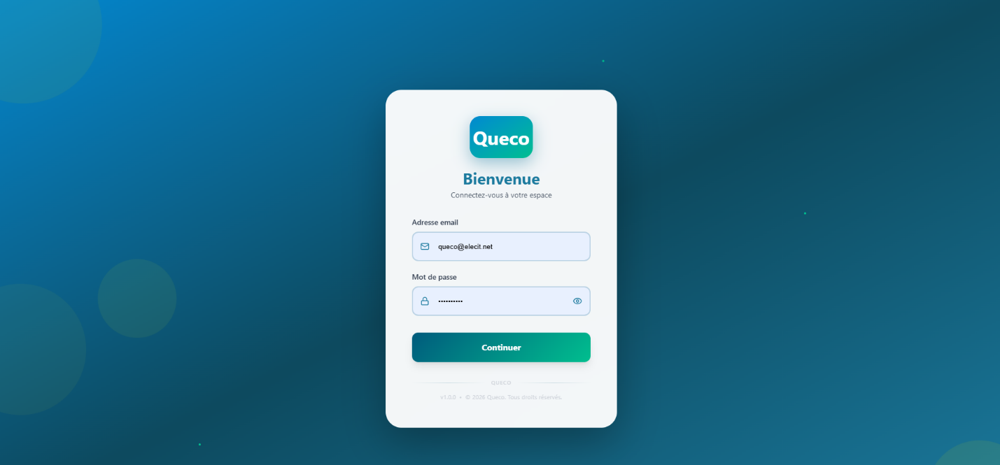

<em>Figure 1.1 Vue d'ensemble de la plateforme Queco / écran de
connexion</em>
</th>
</tr>
</thead>
<tbody>
</tbody>
</table>

##  A qui s’adresse ce Manuel ?

Ce manuel est destiné à l’ensemble du personnel qui utilise la
plateforme Queco. Selon votre rôle, seules certaines sections vous
concerneront. Le tableau ci-dessous indique les chapitres les plus
pertinents pour chaque type d’utilisateur.

| **Rôle**               | **Responsabilités**                                                                 | **Chapitres pertinents** |
|------------------------|-------------------------------------------------------------------------------------|--------------------------|
| **Super Admin**        | Accès complet à la plateforme ; création des agences, des utilisateurs et des rôles | Tous les chapitres       |
| **Gestionnaire**       | Supervise les agents, suit les analyses et gère les services                        | Ch. 3, 5, 6, 7           |
| **Agent (Guichetier)** | Traite quotidiennement les tickets au guichet                                       | Ch. 2, 6                 |

## 1.2 Vue d’ensemble de l’architecture de la plateforme

Queco est conçu autour d’un modèle organisationnel hiérarchique.
Comprendre cette structure est essentiel avant de configurer ou
d’utiliser la plateforme.

> **Plateforme (Globale)** : Environnement de niveau supérieur géré
> exclusivement par le Super-administrateur. Elle contient toutes les
> agences ainsi que leurs données.
>
> → **Agence** : Une unité organisationnelle indépendante (par exemple,
> une agence bancaire, une succursale ou un département). Chaque agence
> dispose de ses propres utilisateurs, guichets et services.
>
> → **Guichet** : Un point de service physique ou virtuel au sein d’une
> agence. Les agents sont affectés à des guichets pour traiter les
> tickets.
>
> → **Service / Opération** : Une catégorie de prestations proposée par
> une agence (par exemple : *Ouverture de compte*). Chaque service
> comprend une ou plusieurs opérations (tâches spécifiques).
>
> → **Ticket** : Une demande de service créée pour un client. Un ticket
> est associé à un service ou à une opération spécifique et est
> automatiquement orienté vers un guichet disponible.

## 1.3 Concepts clés et terminologie

Le glossaire suivant définit les termes utilisés tout au long de ce
manuel. Il est recommandé de vous familiariser avec ces notions avant de
poursuivre la lecture des chapitres suivants.

| **Terme**                       | **Definition**                                                                                                                                                  |
|---------------------------------|-----------------------------------------------------------------------------------------------------------------------------------------------------------------|
| **Agence**                      | Une unité organisationnelle indépendante au sein de Queco. Chaque agence gère ses propres guichets, utilisateurs et services.                                   |
| **Agent / Guichetier**          | Utilisateur de première ligne qui opère à un guichet et traite les tickets des clients.                                                                         |
| **Analytique (Analytics)**      | Module de reporting intégré affichant les données d’activité en temps réel et historiques pour chaque agence.                                                   |
| **Guichet (Counter)**           | Point de service (bureau physique ou canal virtuel) où les tickets sont traités.                                                                                |
| **Tableau de bord (Dashboard)** | Écran principal affiché après connexion, adapté au rôle de l’utilisateur et présentant les informations essentielles ainsi que les actions rapides disponibles. |
| **Gestionnaire (Manager)**      | Utilisateur disposant de droits de supervision sur les agents, les analyses et la configuration des services au sein de son agence.                             |
| **Opération**                   | Action ou tâche spécifique au sein d’un service (par exemple : « Vérification d’identité » dans le cadre du service « Ouverture de compte »).                   |
| **Permission**                  | Droit d’accès spécifique attribué à un rôle, déterminant les actions qu’un utilisateur est autorisé à effectuer.                                                |
| **Rôle**                        | Profil nommé (Super-administrateur, Gestionnaire, Agent) regroupant un ensemble de permissions.                                                                 |
| **Service**                     | Catégorie de prestations proposée aux clients par une agence (par exemple : Paiement, Enregistrement, Inscription).                                             |
| **Session**                     | Période d’authentification active d’un utilisateur. Les sessions expirent après une période d’inactivité pour des raisons de sécurité.                          |
| **Super Admin**                 | Utilisateur de plus haut niveau disposant d’un accès illimité à toutes les fonctionnalités et à toutes les agences de la plateforme.                            |
| **Ticket**                      | Demande de service numérique créée pour un client et suivie tout au long de son cycle de vie, de sa création jusqu’à sa clôture.                                |

## 1.4 Résumé des rôles et des permissions

Queco utilise un modèle de contrôle d’accès basé sur les rôles (**RBAC –
Role-Based Access Control**). Chaque utilisateur se voit attribuer un
rôle unique. Ce rôle détermine les pages, les actions et les données
auxquelles l’utilisateur peut accéder.

| **Feature / Action**                       | **Super Admin** | **Manager** | **Agent** |
|--------------------------------------------|-----------------|-------------|-----------|
| **Créer / gérer les agences**              | ✔               | ✘           | ✘         |
| **Créer / gérer les utilisateurs**         | ✔               | Limited     | ✘         |
| **Attribuer des rôles et des permissions** | ✔               | ✘           | ✘         |
| **Créer / gérer les guichets**             | ✔               | ✔           | ✘         |
| **Définir les services et les opérations** | ✔               | ✔           | ✘         |
| **Créer des tickets**                      | ✔               | ✔           | ✔         |
| **Traiter les tickets au guichet**         | ✔               | ✔           | ✔         |
| **Consulter les analyses et statistiques** | ✔               | ✔           | ✘         |
| **Exporter des rapports**                  | ✔               | ✔           | ✘         |

| **NOTE** | Les permissions peuvent être personnalisées au niveau des rôles par le Super-administrateur. Le tableau ci-dessus reflète les paramètres par défaut. |
|----------|------------------------------------------------------------------------------------------------------------------------------------------------------|

## 1.5 Configuration requise du système

Queco est une plateforme web qui ne nécessite aucune installation
logicielle. Pour une expérience optimale, les exigences minimales
suivantes s’appliquent :

| **Component**            | **Requirements**                                                                                                     |
|--------------------------|----------------------------------------------------------------------------------------------------------------------|
| **Navigateur**           | Google Chrome 110+, Mozilla Firefox 110+, Microsoft Edge 110+ ou Safari 16+                                          |
| **Connexion Internet**   | Connexion haut débit stable (minimum recommandé : 2 Mbps)                                                            |
| **Résolution d’écran**   | 1280 × 720 ou supérieure                                                                                             |
| **JavaScript**           | Doit être activé dans le navigateur                                                                                  |
| **Cookies**              | Les cookies de session doivent être autorisés                                                                        |
| **Compatibilité mobile** | L’interface responsive fonctionne sur les tablettes (largeur ≥ 768 px) ; prise en charge limitée sur les smartphones |

## 1.6 Comment utiliser ce manuel

Ce manuel est structuré pour suivre le flux naturel de configuration et
d’utilisation de Queco. Chaque chapitre s’appuie sur le précédent. Nous
recommandons aux nouveaux utilisateurs de le lire dans l’ordre, tandis
que les utilisateurs expérimentés peuvent accéder directement au
chapitre pertinent à l’aide de la table des matières.

| **Convention**             | **Meaning**                                                                                                                        |
|----------------------------|------------------------------------------------------------------------------------------------------------------------------------|
| **Texte en gras**          | Noms des éléments de l’interface utilisateur, libellés des boutons ou noms des champs (par exemple : cliquez sur **Enregistrer**). |
| **Étapes numérotées**      | Les listes numérotées indiquent des étapes séquentielles qui doivent être suivies dans l’ordre.                                    |
| **Encadrés REMARQUE**      | Les encadrés bleus contiennent des conseils utiles ou des informations complémentaires.                                            |
| **Encadrés AVERTISSEMENT** | Les encadrés jaunes signalent des actions pouvant avoir des conséquences importantes ou irréversibles.                             |
| **\[CAPTURE D’ÉCRAN\]**    | Les encadrés en pointillés indiquent l’emplacement où des captures d’écran seront insérées.                                        |

| **NOTE** | Les captures d’écran de ce manuel ont été réalisées à partir de la version Sprint 1 de la plateforme Queco. L’interface pourra évoluer dans les versions futures, mais les principaux processus de travail resteront cohérents. |
|----------|---------------------------------------------------------------------------------------------------------------------------------------------------------------------------------------------------------------------------------|

*Chapitre 2*

# Prise en main

*Découvrez comment accéder à Queco, vous connecter en toute sécurité,
naviguer dans l’interface et comprendre votre tableau de bord
personnalisé.*

<table>
<colgroup>
<col style="width: 50%" />
<col style="width: 50%" />
</colgroup>
<thead>
<tr class="header">
<th>
<strong>Dans ce chapitre :</strong>

<ul>
<li>
2.1 Accéder à la plateforme
</li>
<li>
2.2 Se connecter étape par étape
</li>
<li>
2.3 Erreurs de connexion et résolution des problèmes
</li>
<li>
2.4 Navigation dans l’interface
</li>
<li>
2.5 Vue d’ensemble de votre tableau de bord
</li>
</ul></th>
<th>
<strong>Apres ce chapitre, vous serez en mesure de</strong>

<ul>
<li>
Ouvrir Queco dans votre navigateur web.
</li>
<li>
Vous connecter à l’aide de vos identifiants.
</li>
<li>
Résoudre les problèmes liés à un échec de connexion.
</li>
<li>
Identifier les principaux éléments de l’interface
utilisateur.
</li>
</ul>
<ul>
<li>
Comprendre et utiliser votre tableau de bord en fonction de votre
rôle.
</li>
</ul></th>
</tr>
</thead>
<tbody>
</tbody>
</table>

## 2.1 Accéder à la plateforme

Queco est une application web qui ne nécessite aucune installation. Vous
y accédez directement depuis votre navigateur web à l’aide de l’URL
fournie par l’administrateur de votre organisation.

### 2.1.1 Ce dont vous avez besoin avant de commencer

Avant de vous connecter, assurez-vous de disposer des éléments suivants
:

| **\#** | **Prerequisite**                         | **Where to Get It**                                                    |
|--------|------------------------------------------|------------------------------------------------------------------------|
| **1**  | URL de la plateforme Queco               | Fournie par votre Super-administrateur                                 |
| **2**  | Votre nom d’utilisateur (adresse e-mail) | Envoyé par le Super-administrateur lors de la création de votre compte |
| **3**  | Votre mot de passe temporaire            | Inclus dans l’e-mail de configuration de votre compte                  |
| **4**  | Un navigateur web compatible             | Chrome 110+, Firefox 110+, Edge 110+ ou Safari 16+                     |
| **5**  | Une connexion Internet stable            | Connexion haut débit recommandée d’au moins 2 Mbps                     |

| **NOTE** | Si vous n’avez pas reçu vos identifiants de connexion, contactez votre Super-administrateur ou l’administrateur système avant de poursuivre. |
|----------|----------------------------------------------------------------------------------------------------------------------------------------------|

### 2.1.2 Ouvrir la plateforme

**Etape 1** : Ouvrez votre navigateur web

*Utilisez un navigateur compatible (chrome, Firefox, Edge ou safari)*

**Etape 2 :** Saisissez l’url de Queco dans la barre d’address puis
appuyez sur Entrée

*Exemple : <https://app.queco.io>*

Votre organisation eut utilisé un sous-domaine personnalisé.

**Etape 3 :** Attendez le chargement de la page de connexion

*Vous devriez voir l’ecran de connexion de Queco avec les champs **Nom
d’utilisateur** et **Mot de passe**.*

## 2.2 Se connecter étape par étape

Le processus de connexion est simple et prend généralement moins de 30
second. Suivez ces étapes chaque fois que vous souhaitez accéder à
Queco.

**Etape 1 :** Saisissez votre nom d’utilisateur

Sur la page de connexion, repérez le champ **Nom d’utilisateur**.

Entre votre adresse e-mail enregistrée exactement telle qu’elle vous a
été fournie par le Super-administrateur.

**Etape 2** : saisissez votre mot de passe

*Clique dans le champ mot de passe, puis entrez votre mot de passe.*

| 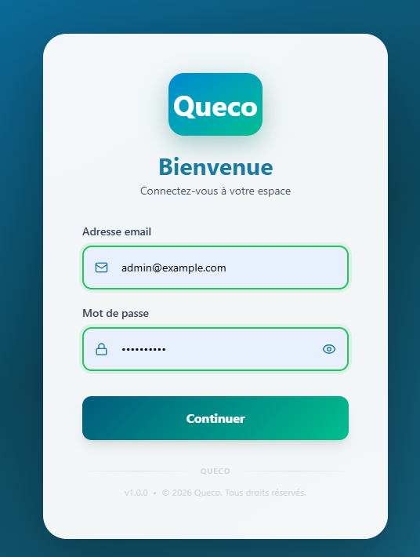 *Figure 2.2 : Formulaire de connexion avec les champs nom d'utilisateur et mot de passe mis en évidence*  |
|------------------------------------------------------------------------------------------------------------------------------------------------------|

**Etape 3 :** cliquez sur le bouton Connexion

Vous pouvez également appuyer sur la touche **Entrée** de votre clavier.

Le système vérifiera vos identifiants de connexion. Cette opération
prend généralement entre **1 et 3 secondes**.

**Etape 4 :** Accédez à votre tableau de bord

Une fois l’authentification réussie, vous serez automatiquement redirigé
vers votre **tableau de bord**.

Le tableau de bord affiché dépend de votre rôle
(**Super-administrateur**, **Gestionnaire** ou **Agent**).

Consultez la **section 2.5** pour une présentation détaillée des
fonctionnalités et informations disponibles sur chaque type de tableau
de bord.

| 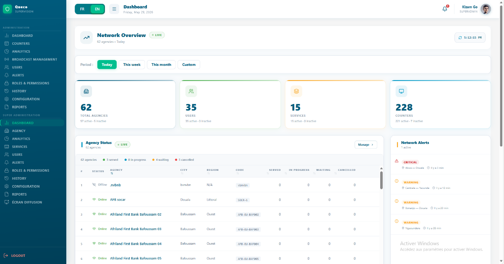*Figure 2.3 — Successful login redirect to Dashboard*  |
|--------------------------------------------------------------------------------------------------|

### 2.2.1 Référence des champs du formulaire de connexion

Le tableau ci -dessous présent un résume de tous les champs disponibles
sur le formulaire de connexion.

| **Field**         | **Description**                                                                                          | **Statut**  |
|-------------------|----------------------------------------------------------------------------------------------------------|-------------|
| **D’utilisateur** | Votre adresse e-mail enregistrée (par exemple : *agent@monagence.com*                                    | Obligatoire |
| **Mot de passe**  | Le mot de passe de votre compte. Masqué par défaut ; cliquez sur l’icône en forme d’œil pour l’afficher. | Obligatoire |

| **WARNING** | Ne partagez jamais votre mot de passe Queco avec vos collègues. Chaque utilisateur doit disposer de son propre compte. L’utilisation d’identifiants partagés compromet la traçabilité des actions (journaux d’audit) et la responsabilité individuelle des utilisateurs. |
|-------------|--------------------------------------------------------------------------------------------------------------------------------------------------------------------------------------------------------------------------------------------------------------------------|

## 2.3 Erreurs de connexion et résolution des problèmes

| **Message d’erreur**                                          | **Cause probable**                                                                                        | **Que faire ?**                                                                                                                                                                                                                      |
|---------------------------------------------------------------|-----------------------------------------------------------------------------------------------------------|--------------------------------------------------------------------------------------------------------------------------------------------------------------------------------------------------------------------------------------|
| *Nom d’utilisateur ou mot de passe invalide.*                 | Les identifiants saisis sont incorrects.                                                                  | Saisissez à nouveau votre adresse e-mail et votre mot de passe avec soin. Vérifiez que la touche Verr. Maj. (Caps Lock) n’est pas activée. Vous pouvez également copier-coller votre mot de passe pour éviter les erreurs de saisie. |
| *Compte verrouillé. Veuillez contacter votre administrateur.* | Trois tentatives de connexion consécutives ont échoué, déclenchant un verrouillage automatique du compte. | Contactez votre Super-administrateur ou votre Gestionnaire pour déverrouiller votre compte. Le verrouillage est automatiquement levé après 30 minutes.                                                                               |
| *Compte inactif.*                                             | Votre compte a été désactivé par un administrateur.                                                       | Contactez votre Super-administrateur afin de réactiver votre compte.                                                                                                                                                                 |
| *Session expirée. Veuillez-vous reconnecter.*                 | Votre session précédente a expiré après une période d’inactivité (30 minutes par défaut).                 | Retournez à la page de connexion et reconnectez-vous. Ce comportement est normal et vise à renforcer la sécurité.                                                                                                                    |
| *Impossible de se connecter au serveur.*                      | Problème réseau ou maintenance du serveur.                                                                | Vérifiez votre connexion Internet. Si le problème persiste, contactez votre équipe de support informatique.                                                                                                                          |

### 2.3.1 Procédure de verrouillage liée à l’OTP

Apres 5 **saisies consécutives incorrectes du code OTP**, celui-ci
expire automatiquement et vous devez recommencer le processus de
connexion.

Apres un échec de validation OTP et un retour à l’écran de connexion, il
ne sera pas possible de demander immédiatement un nouveau code. Un
message indiquant que le **délai d’attente pour le renvoi de l’OTP est
actif** (*OTP resend cool down active*) sera affiché.

**Etape 1** : Attendez 30 secondes

Le délai d’attendre est automatique levé après 30 secondes à 1 minutes
d’inactivité

**Etape 2 :** Reconnectez-vous

Une fois le compte déverrouillé ou le délai écoulé, retournez à la page
de connexion et réessayez avec les identifiants corrects.

| **NOTE** | Tous les événements de verrouillage sont enregistrés dans le journal d’audit de la plateforme et sont visibles par les Super-administrateur. |
|----------|----------------------------------------------------------------------------------------------------------------------------------------------|

### 2.3.2 Réinitialisation de votre mot de passe 

Si vous avez oublié votre mot de passe, sa réinitialisation doit être
effectuée par le **Super-administrateur**.

**Procédure :**

1.  Contactez votre **Super-administrateur**.

2.  Demandez à réinitialisation de votre mot de passe.

3.  Une fois la réinitialisation effectuée, vous recevrez un nouveau mot
    de passe temporaire ou de nouvelles instructions de connexion.

4.  Connectez-vous à Queco en utilisant les informations fournies.

| **NOTE** | Pour des raisons de sécurité, les utilisateurs ne peuvent pas réinitialiser eux-mêmes leur mot de passe. Toute demande de réinitialisation doit être traitée par le Super-administrateur. |
|----------|-------------------------------------------------------------------------------------------------------------------------------------------------------------------------------------------|

## 2.4 Navigation dans l’interface

Apres vous être connecté, vous accéderez à l’interface Queco. La
disposition générale est identique pour tous les rôles d’utilisateurs,
bien que les menus et les fonctionnalités disponibles varient en
fonction de vos permissions.

Cette section décrit les principaux composants de l’interface présents
sur chaque page.

### 2.4.1 Vue d’ensemble de l’interface

| **Élément de l’interface**         | **Description**                                                                                                                                                                     |
|------------------------------------|-------------------------------------------------------------------------------------------------------------------------------------------------------------------------------------|
| **Barre de navigation supérieure** | Barre permanente située en haut de chaque page. Elle contient le logo Queco, le titre de la page en cours, la cloche de notifications et le menu du profil utilisateur.             |
| **Menu latéral gauche**            | Panneau principal de navigation répertoriant toutes les sections accessibles selon votre rôle. Il peut être réduit automatiquement sur les écrans de petite taille.                 |
| **Zone de contenu principale**     | Espace de travail central où sont affichés les données, formulaires et tableaux. Son contenu change en fonction de l’élément sélectionné dans le menu.                              |
| **Boutons d’action**               | Boutons contextuels tels **qu’Ajouter**, **Modifier**, **Supprimer**, **Enregistrer** ou **Annuler**, généralement affichés dans la partie supérieure droite de la zone de contenu. |
| **Cloche de notifications**        | Affiche les alertes en temps réel, notamment les affectations de tickets, les messages système et les notifications administratives.                                                |
| **Menu du profil utilisateur**     | Situé dans le coin supérieur droit. Permet d’accéder aux paramètres du profil, aux préférences utilisateur et aux options de déconnexion.                                           |

### 2.4.2 Menu de navigation latéral gauche

Le menu latéral gauche constitue votre principal outil de navigation.
Les éléments de menu visibles dépendent de votre rôle au sein de la
plateforme.

Le tableau ci-dessous indique les sections disponibles pour chaque type
d’utilisateur.

| **Menu Section**           | **Super Admin** | **Manager** | **Agent** |
|----------------------------|-----------------|-------------|-----------|
| **Tableau de bord**        | ✔               | ✔           | ✔         |
| **Agence**                 | ✔               | ✘           | ✘         |
| **Utilisateur et Roles**   | ✔               | Limite      | ✘         |
| **Counters (Guichets)**    | ✔               | ✔           | ✘         |
| **Services et Operations** | ✔               | ✔           | ✘         |
| **Historique Tickets**     | ✔               | ✔           | ✔         |
| **Analytique**             | ✔               | ✔           | ✘         |
| **Paramètres**             | ✔               | Limite      | ✘         |

| **NOTE** | Les éléments marqués **« Limité »** indiquent un accès restreint ou en lecture seule. Par exemple, un Gestionnaire peut consulter les utilisateurs de son agence, mais ne peut pas créer ou gérer des utilisateurs dans l’ensemble des agences. |
|----------|-------------------------------------------------------------------------------------------------------------------------------------------------------------------------------------------------------------------------------------------------|

### 2.4.3 Déconnexion

Il est recommandé de toujours vous déconnecter de Queco lorsque vous
avez terminé votre travail en particulier si vous utilisez un ordinateur
partagé ou public.

**Pour les Agents**

Dans e tableau de bord de l’Agent, le bouton **Déconnexion** se trouve
dans le coin supérieur droit de l’écran.

1.  Cliquez sur le bouton **Déconnexion**.

2.  Vous serez immédiatement déconnecté et redirigé vers la page de
    connexion.

**Pour les les Super-administrateur et les Gestionnaires d’agence :**

Le bouton **Déconnexion** est situé en bas à gauche du menu latéral.

1.  Cliquez sur le bouton **Déconnexion**.

2.  Vous serez redirigé vers la page de connexion.

| **WARNING** | Les sessions expirent automatiquement après **30 minutes d’inactivité**. |
|-------------|--------------------------------------------------------------------------|

## 2.5 Vue d’ensemble du tableau de bord 

Le **tableau de bord** est la première page affichée après votre
connexion. Il est personnalisé en fonction de votre rôle et fournit un
aperçu en temps réel de l’activité de la plateforme.

Les informations affichées varient considérablement selon le rôle de
l’utilisateur. Par exemple, un **Super-administrateur** dispose d’une
vue globale de la plateforme, tandis qu’un **Agent** voit principalement
les informations liées à ses activités quotidiennes.

### 2.5.1 Tableau de bord du Super-administrateur

Le tableau de bord du **Super-administrateur** fournit une vue globale
de l’ensemble de la plateforme. Il permet de suivre l’activité de toutes
les agences, de surveiller les indicateurs clés de performance et
d’accéder rapidement aux principales fonctions d’administration.

<table>
<colgroup>
<col style="width: 100%" />
</colgroup>
<thead>
<tr class="header">
<th>

<em>Figure 2.6 Super Admin Dashboard</em>
</th>
</tr>
</thead>
<tbody>
</tbody>
</table>

<table>
<colgroup>
<col style="width: 25%" />
<col style="width: 74%" />
</colgroup>
<thead>
<tr class="header">
<th><strong>Élément de l’interface</strong></th>
<th><strong>Description</strong></th>
</tr>
</thead>
<tbody>
<tr class="odd">
<td><strong>Barre de navigation supérieure</strong></td>
<td>En-tête permanent affiché en haut de la plateforme. Contient le
sélecteur de langue (FR/EN), le bouton de bascule du menu, le titre de
la page actuelle (« Vue d’Ensemble »), l’affichage de la date, la cloche
de notifications et les informations du profil de l’utilisateur
connecté.</td>
</tr>
<tr class="even">
<td><strong>Menu latéral gauche</strong></td>
<td><table>
<colgroup>
<col style="width: 100%" />
</colgroup>
<tbody>
</tbody>
</table>

Panneau de navigation vertical situé sur le côté gauche de l’écran.
Donne accès à tous les principaux modules tels que Vue d’Ensemble,
Guichets, Analytics, Diffusion, Utilisateurs, Alertes &amp;
Notifications, Rôles &amp; Permissions, Historique, Configuration et
Rapports. Se réduit sur les écrans plus petits.
</td>
</tr>
<tr class="odd">
<td><strong>Zone de contenu principale</strong></td>
<td>Espace de travail central où toutes les informations du tableau de
bord sont affichées, y compris les cartes de vue d’ensemble, les
statistiques, les tableaux d’état des agences, les alertes et les outils
de gestion. Le contenu se met à jour en fonction du module
sélectionné.</td>
</tr>
<tr class="even">
<td><strong>Cartes de vue d’ensemble</strong></td>
<td>Cartes récapitulatives des statistiques affichées sous la section
d’en-tête. Affichent les principales métriques de la plateforme telles
que le nombre total d’agences, d’utilisateurs, de services et de
guichets, y compris les nombres actifs et inactifs.</td>
</tr>
<tr class="odd">
<td><strong>Boutons de filtre de période</strong></td>
<td>Boutons de filtre contextuel (« Aujourd’hui », « Cette semaine », «
Ce mois », « Personnalisé ») permettant aux utilisateurs de modifier la
période de référence des statistiques et données affichées.</td>
</tr>
<tr class="even">
<td><strong>Cloche de notifications</strong></td>
<td>Située dans le coin supérieur droit. Affiche en temps réel les
notifications non lues et les alertes système.</td>
</tr>
<tr class="odd">
<td><strong>Menu du profil utilisateur</strong></td>
<td><table>
<colgroup>
<col style="width: 100%" />
</colgroup>
<thead>
<tr class="header">
<th>Situé dans le coin supérieur droit à côté de la cloche de
notifications. Affiche le nom de l’utilisateur connecté, son rôle et son
avatar de profil, avec accès aux actions liées au compte.</th>
</tr>
</thead>
<tbody>
</tbody>
</table>
<table>
<colgroup>
<col style="width: 100%" />
</colgroup>
<tbody>
</tbody>
</table></td>
</tr>
<tr class="even">
<td><strong>Tableau d’état des agences</strong></td>
<td><table>
<colgroup>
<col style="width: 100%" />
</colgroup>
<tbody>
</tbody>
</table>
<table>
<colgroup>
<col style="width: 100%" />
</colgroup>
<thead>
<tr class="header">
<th>Tableau de suivi en temps réel affichant les agences, leur statut
opérationnel, leur ville, leur région, leur code et les statistiques de
traitement des tickets telles que les tickets servis, en attente, en
cours de traitement et annulés.</th>
</tr>
</thead>
<tbody>
</tbody>
</table></td>
</tr>
<tr class="odd">
<td><strong>Boutons d’action</strong></td>
<td>Boutons contextuels tels que « Gérer » affichés dans les sections du
tableau de bord, permettant un accès rapide aux actions de configuration
et de gestion.</td>
</tr>
</tbody>
</table>

### 2.5.2 Tableau de bord du Gestionnaire

Le tableau de bord du Gestionnaire est limité à l’agence ou aux agences
dont il assure la supervision.

| 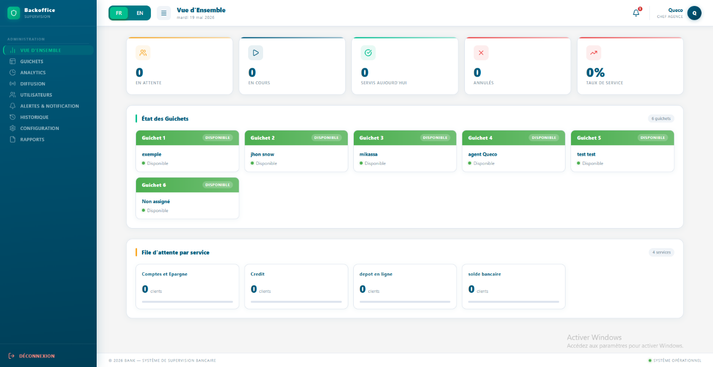*Figure 2.7 — Dashboard chef D’argence* |
|--------------------------------------------------------------------------------------------------------------|

<table>
<colgroup>
<col style="width: 29%" />
<col style="width: 70%" />
</colgroup>
<thead>
<tr class="header">
<th><strong>Widget / Section</strong></th>
<th><strong>Ce qu’il affiche</strong></th>
</tr>
</thead>
<tbody>
<tr class="odd">
<td><strong>Cartes de vue d’ensemble des statistiques</strong></td>
<td><table>
<colgroup>
<col style="width: 100%" />
</colgroup>
<thead>
<tr class="header">
<th>Cartes récapitulatives affichées en haut du tableau de bord
présentant les principaux indicateurs de la file d’attente, notamment
les tickets en attente, les tickets en cours de traitement, les clients
servis aujourd’hui, les tickets annulés et le pourcentage du taux de
service.</th>
</tr>
</thead>
<tbody>
</tbody>
</table>
<table>
<colgroup>
<col style="width: 100%" />
</colgroup>
<tbody>
</tbody>
</table></td>
</tr>
<tr class="even">
<td><strong>Panneau d’état des guichets</strong></td>
<td><table>
<colgroup>
<col style="width: 100%" />
</colgroup>
<thead>
<tr class="header">
<th>Section de suivi opérationnel affichant en temps réel le statut de
chaque guichet, l’agent affecté et son état de disponibilité. Chaque
carte indique si le guichet est actuellement disponible ou occupé.</th>
</tr>
</thead>
<tbody>
</tbody>
</table>
<table>
<colgroup>
<col style="width: 100%" />
</colgroup>
<tbody>
</tbody>
</table></td>
</tr>
<tr class="odd">
<td><strong>Section des files d’attente par service</strong></td>
<td><table>
<colgroup>
<col style="width: 100%" />
</colgroup>
<thead>
<tr class="header">
<th>Affiche les statistiques des files d’attente regroupées par
catégorie de service, telles que les comptes d’épargne, le crédit, le
dépôt en ligne et les demandes de solde de compte, y compris le nombre
de clients actuellement en attente.</th>
</tr>
</thead>
<tbody>
</tbody>
</table>
<table>
<colgroup>
<col style="width: 100%" />
</colgroup>
<tbody>
</tbody>
</table></td>
</tr>
<tr class="even">
<td><strong>Bouton de déconnexion</strong></td>
<td><table>
<colgroup>
<col style="width: 100%" />
</colgroup>
<thead>
<tr class="header">
<th>Situé en bas à gauche de la barre latérale. Permet à l’utilisateur
actuel de se déconnecter de manière sécurisée de la plateforme.</th>
</tr>
</thead>
<tbody>
</tbody>
</table>
<table>
<colgroup>
<col style="width: 100%" />
</colgroup>
<tbody>
</tbody>
</table></td>
</tr>
</tbody>
</table>

1.  **Tableau de bord de l’Agent (Guichetier)**

Le tableau de bord de l’Agent est ciblé et minimaliste ; il affiche
exactement ce dont un agent a besoin pour commencer à travailler.

| *Figure 2.8: Agent Dashboard* |
|----------------------------------------------------------------------------------------------------|

| **Widget / Section**          | **Ce qu’il affiche**                                                                                                                                                                                                                                       |
|-------------------------------|------------------------------------------------------------------------------------------------------------------------------------------------------------------------------------------------------------------------------------------------------------|
| **En-tête de l’agent**        | Affiche le nom de l’agent connecté (par exemple : « Agent : mikassa »), le sélecteur de langue (FR/EN), la cloche de notifications, les icônes de pause et de déconnexion ainsi que l’heure actuelle.                                                      |
| **Panneau du client actuel**  | Panneau de gauche affichant le client actuellement pris en charge. Lorsqu’aucun client n’est en cours de traitement, affiche « Aucun client actif / Appuyez sur Appeler le suivant » comme texte de remplacement.                                          |
| **Panneau de file d’attente** | Panneau de droite affichant tous les tickets en attente pour le guichet de cet agent. Affiche le nombre de tickets dans la file (par exemple : « File d’attente 0 en attente ») ainsi que l’étiquette du service actif (par exemple : « solde bancaire »). |
| **Barre de recherche**        | Située dans le panneau de file d’attente ; permet à l’agent de rechercher des tickets en attente par numéro de ticket ou par nom de service.                                                                                                               |
| **Boutons d’action**          | Three buttons at the bottom of the Current Client panel: **Finish** (green), **Cancel** (red/pink), and **Downgrade** (yellow) for resolving the current ticket.                                                                                           |
| **Bouton Appeler le suivant** | Bouton principal situé en bas du panneau de file d’attente permettant d’appeler le prochain ticket en attente vers ce guichet. Grisé lorsque la file d’attente est vide.                                                                                   |
| **État de file vide**         | Affiché lorsqu’aucun client n’est en attente ; présente une icône de validation accompagnée du message « File d’attente vide / Aucun client en attente ».                                                                                                  |

*Chapitre 3*

# Configuration du Super Admin

*Comment le Super Administrateur configure la plateforme : création des
agences, gestion des utilisateurs et définition des rôles et
permissions.*

<table>
<colgroup>
<col style="width: 50%" />
<col style="width: 50%" />
</colgroup>
<tbody>
<tr class="odd">
<td>
<strong>Dans ce chapitre</strong>

• 3.1 Présentation du Super Administrateur 
• 3.2 Création d’une agence 
• 3.3 Gestion des agences 
• 3.4 Création des utilisateurs 
• 3.5 Gestion des utilisateurs 
• 3.6 Rôles et permissions 
• 3.7 Analytique
</td>
<td>
<strong>Apres ce chapitre, vous serez en mesure de</strong>

• Configurer une nouvelle agence à partir de zéro 
• Configurer les paramètres d’une agence 
• Créer et gérer des comptes utilisateurs 
• Affecter des utilisateurs à des agences 
• Comprendre le contrôle d’accès basé sur les rôles 
• Personnaliser les permissions par rôle
</td>
</tr>
</tbody>
</table>

## 3.1 Présentation du Super Administrateur

Le Super Administrateur est le compte disposant du niveau de privilège
le plus élevé dans Queco. Généralement, le rôle de Super Administrateur
peut être attribué à toute personne ; celle-ci disposera alors d’un
accès complet à la plateforme et pourra effectuer toutes les actions
disponibles.

Toute la configuration globale de la plateforme création des agences,
provisionnement des utilisateurs et définition des règles d’accès est
réalisée à partir du compte Super Administrateur.

Lorsque le Super Administrateur se connecte, il accède à un tableau de
bord centralisé offrant une vue d’ensemble de toute la plateforme :
toutes les agences, le nombre d’utilisateurs, le nombre d’utilisateurs
actifs, les guichets actifs et les volumes de tickets en temps réel.

<table>
<colgroup>
<col style="width: 100%" />
</colgroup>
<tbody>
<tr class="odd">
<td>
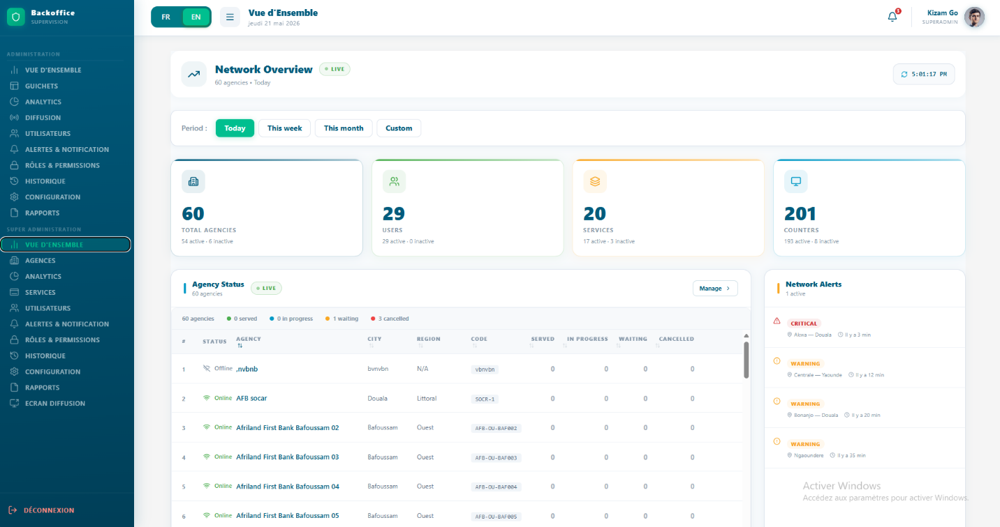

<em>Figure 3.1 —</em> Tableau de bord Super Admin avec cartes
récapitulatives de la plateforme et boutons d'action rapide
</td>
</tr>
</tbody>
</table>

### 3.1.1 Responsabilités du Super Administrateur

| **Responsabilité**                   | **Description**                                                                                                |
|--------------------------------------|----------------------------------------------------------------------------------------------------------------|
| **Configuration des agences**        | Créer et configurer toutes les agences opérant sur la plateforme.                                              |
| **Provisionnement des utilisateurs** | Créer les comptes utilisateurs et les affecter à l’agence et au rôle appropriés.                               |
| **Gestion des rôles**                | Définir et personnaliser les rôles (Gestionnaire, Agent) avec des permissions granulaires.                     |
| **Catalogue des services**           | Créer et maintenir la liste principale des services et des opérations.                                         |
| **Supervision de la plateforme**     | Surveiller l’état général de la plateforme, les volumes de tickets et l’activité des agences.                  |
| **Contrôle d’accès**                 | Activer, désactiver ou supprimer des utilisateurs et des agences en fonction des changements organisationnels. |

|             |                                                                                                                                                                                                                                               |
|-------------|-----------------------------------------------------------------------------------------------------------------------------------------------------------------------------------------------------------------------------------------------|
| **WARNING** | Les identifiants du Super Administrateur doivent être conservés en toute sécurité. Activez l’authentification à deux facteurs si elle est disponible et ne partagez jamais le compte Super Administrateur avec d’autres membres du personnel. |

## 3.2 Création d’une Agence

Les agences sont les principales unités organisationnelles de Queco.
Chaque utilisateur, guichet et service appartient à une agence. Vous
devez créer au moins une agence avant de pouvoir ajouter des
utilisateurs, des guichets, des services et des opérations, ainsi
qu’affecter un utilisateur à une agence et à un guichet.

Considérez une agence comme une succursale, un département ou un bureau
de votre organisation.

### 3.2.1 Étape par étape : Créer une nouvelle agence

> **Étape 1 :** Dans la barre latérale, cliquez sur **Agences**.
>
> **Étape 2 :** Cliquez sur le bouton **Ajouter une agence** située dans
> le coin supérieur droit de la page des agences.
>
> **Étape 3 :** La fenêtre modale **Nouvelle agence** s’ouvre avec le
> formulaire. Remplissez tous les champs obligatoires.
>
> **Étape 4 :** Vérifiez attentivement toutes les informations saisies,
> puis cliquez sur **Enregistrer**.
>
> *L’agence est enregistrée avec le statut **Actif** par défaut.*
>
> **Étape 5 :** Pour activer ou désactiver l’agence créée, cliquez
> simplement sur l’icône de statut (icône jaune) sur la carte de
> l’agence.
>
> Seules les agences **actives** peuvent traiter des tickets et
> apparaître dans les tableaux de bord des utilisateurs.
>
> **Étape 6 :** Confirmez l’activation en vérifiant sa présence dans la
> liste des agences avec un bouton vert.

<table>
<colgroup>
<col style="width: 100%" />
</colgroup>
<tbody>
<tr class="odd">
<td>
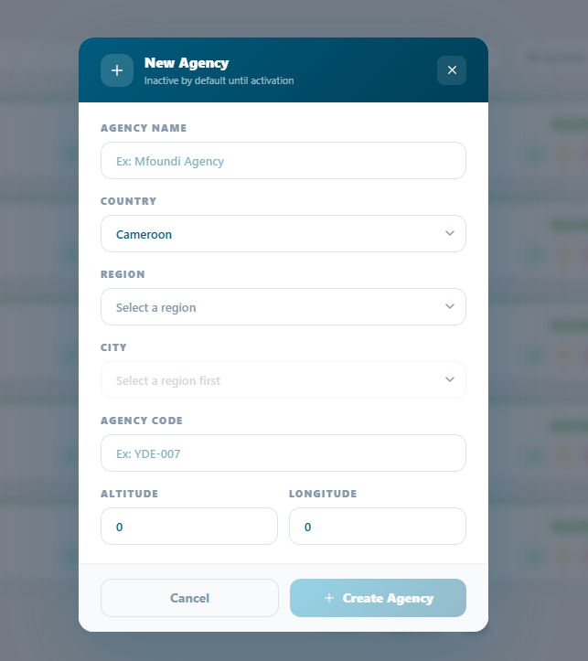

<em>Figure 3.2 — Formulaire de création d’une nouvelle agence avec
tous les champs visibles</em>
</td>
</tr>
</tbody>
</table>

|         |                                                                                                                                                                                                               |
|---------|---------------------------------------------------------------------------------------------------------------------------------------------------------------------------------------------------------------|
| **TIP** | Créez toutes vos agences avant d’ajouter des utilisateurs. Ainsi, vous pourrez affecter chaque utilisateur à son agence correcte lors de la création de son compte, sans avoir à les modifier ultérieurement. |

### 3.2.2 Référence des champs du formulaire d’agence

| **Field**            | **Description**                                                                                                                 | **Statut**      |
|----------------------|---------------------------------------------------------------------------------------------------------------------------------|-----------------|
| **Nom de l’agence**  | Nom complet légal ou opérationnel de l’agence (par exemple : « Agence de Mfoundi »). Affiché sur toute la plateforme.           | **Obligatoire** |
| **Pays de l’agence** | Pays dans lequel l’agence est située (Cameroun).                                                                                | **Obligatoire** |
| **Région**           | Région administrative ou province dans laquelle l’agence opère. Doit être sélectionnée avant de pouvoir choisir une ville.      | **Obligatoire** |
| **City**             | Ville dans laquelle l’agence est située. Disponible uniquement après la sélection d’une région.                                 | **Obligatoire** |
| **Code de l’agence** | Identifiant court unique de l’agence (par exemple : « YDE-007 »). Utilisé pour les références internes et les intégrations API. | **Obligatoire** |
| **Altitude**         | Altitude géographique de la localisation de l’agence. Valeur par défaut : 0.                                                    | Optionnel       |
| **Longitudes**       | Coordonnée géographique de la longitude de la localisation de l’agence. Valeur par défaut : 0.                                  | **Optionnel**   |

|          |                                                                                                                                                                                                         |
|----------|---------------------------------------------------------------------------------------------------------------------------------------------------------------------------------------------------------|
| **NOTE** | Le code de l’agence ne peut pas être modifié après le traitement du premier ticket dans cette agence, car il est intégré dans les numéros de tickets. Choisissez-le avec soin lors de la configuration. |

## 3.3 Managing Agencies

Après la création des agences, vous pouvez modifier leurs informations,
changer leur statut ou les supprimer entièrement depuis la page
**Agences**. Utilisez la barre de recherche située en haut de la liste
pour trouver rapidement une agence par son nom ou son code.

### 3.1.1 Action disponible sur la page des agences 

| **Action**                             | **Comment l’effectuer**                                                                                                                                           |
|----------------------------------------|-------------------------------------------------------------------------------------------------------------------------------------------------------------------|
| **Voir les détails**                   | Cliquez sur la carte de l’agence pour ouvrir son profil complet, incluant les guichets, les utilisateurs et les statistiques des services.                        |
| **Modifier**                           | Cliquez sur l’icône verte en forme de stylo. Le formulaire modal apparaîtra pour permettre les modifications.                                                     |
| **Activer**                            | Toutes les agences désactivées se trouvent dans la liste des agences désactivées. Allez-y puis activez l’agence en changeant son statut.                          |
| **Désactiver**                         | Cliquez sur l’icône de statut → **Désactiver**. L’agence est suspendue ; aucun nouveau ticket ne peut être créé. Les tickets ouverts existants sont mis en pause. |
| **Supprimer**                          | Cliquez sur l’icône rouge. Une fenêtre modale apparaîtra pour confirmer le code de l’agence, puis le bouton de suppression sera activé.                           |
| **Voir les statistiques de l’agence**  | Cliquez sur l’onglet de l’agence et toutes les statistiques seront affichées.                                                                                     |
| **Gérer les utilisateurs de l’agence** | Dans une agence, l’utilisateur est affecté à un guichet de cette agence. Ainsi, dans chaque guichet, vous verrez l’agent qui lui est affecté.                     |

|             |                                                                                                                                                                                                                                                                                                  |
|-------------|--------------------------------------------------------------------------------------------------------------------------------------------------------------------------------------------------------------------------------------------------------------------------------------------------|
| **WARNING** | La suppression d’une agence entraîne la suppression définitive de tous ses utilisateurs, guichets, services et de l’historique de ses tickets. Cette action est irréversible. Désactivez une agence au lieu de la supprimer, sauf si vous êtes certain que ses données ne sont plus nécessaires. |

<table>
<colgroup>
<col style="width: 100%" />
</colgroup>
<tbody>
<tr class="odd">
<td>

<em>Figure 3.3 — Liste des agences avec les options du menu
d’actions</em>
</td>
</tr>
</tbody>
</table>

## 3.4 Création des utilisateurs

Chaque personne qui accède à Queco doit disposer d’un compte utilisateur
unique. Les comptes sont créés par le Super Administrateur puis affectés
à une agence et à un rôle. L’agent fournit l’adresse e-mail qui sera
utilisée pour la connexion, sur laquelle il/elle recevra un OTP lors de
la connexion. Tous les mots de passe sont créés et gérés par le Super
Administrateur**. L’agent ne peut pas réinitialiser son mot de passe
pour le moment.**

### 3.4.1 Étape par étape : Créer un nouvel utilisateur

**Étape 1 :** Dans la barre latérale gauche, cliquez sur
**Utilisateurs**.

**Étape 2 :** Cliquez sur le bouton **Nouvel utilisateur** situé dans le
coin supérieur droit.

**Étape 3 :** Le formulaire **Nouvel utilisateur** s’ouvre. Remplissez
tous les champs obligatoires puis cliquez sur **Créer et continuer**.

<table>
<colgroup>
<col style="width: 100%" />
</colgroup>
<tbody>
<tr class="odd">
<td>
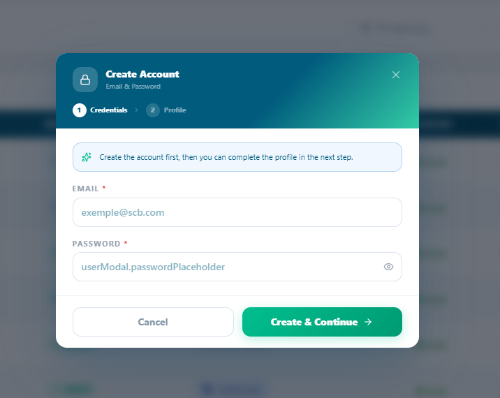

<em>Figure 3.4 — Formulaire de création d’un nouvel
utilisateur</em>
</td>
</tr>
</tbody>
</table>

|          |                                                                                                                                                                                      |
|----------|--------------------------------------------------------------------------------------------------------------------------------------------------------------------------------------|
| **NOTE** | L’adresse e-mail du nouvel utilisateur devient son identifiant de connexion et ne peut pas être modifiée après la création du compte. Vérifiez-la attentivement avant d’enregistrer. |

### 3.4.2 Référence du formulaire utilisateur

| **Field**                     | **Description**                                                                                                             | **Status**   |
|-------------------------------|-----------------------------------------------------------------------------------------------------------------------------|--------------|
| **Adresse e-mail**            | Champ texte obligatoire pour l’adresse e-mail de l’utilisateur. Un exemple de format est affiché (par ex. : exemple@scb.com | **Required** |
| **Mot de passe**              | Champ mot de passe obligatoire avec une icône de visibilité (œil) permettant d’afficher ou de masquer la saisie.            | **Required** |
| **Bouton Annuler**            | Bouton contour permettant de fermer la fenêtre modale sans enregistrer les données.                                         |              |
| **Bouton Créer et continuer** | Bouton principal (vert) qui valide les identifiants et passe à l’étape 2 (Profil).                                          |              |

## 3.5 Gestion des utilisateurs

La gestion des utilisateurs couvre l’ensemble du cycle de vie d’un
compte utilisateur : de sa création à son administration quotidienne,
jusqu’à sa désactivation ou sa suppression. Toutes les actions de
gestion des utilisateurs sont effectuées depuis **Utilisateurs & Rôles →
Utilisateurs**.

### 3.5.1 Actions de gestion des utilisateurs

| **Action**                      | **Comment l’effectuer**                                                                                                                                            |
|---------------------------------|--------------------------------------------------------------------------------------------------------------------------------------------------------------------|
| Modifier le profil              | Cliquez sur le nom de l’utilisateur pour ouvrir son profil, cliquez sur **Modifier**, effectuez les changements puis cliquez sur **Enregistrer**.                  |
| Désactiver                      | Ouvrez le profil utilisateur → basculez le **Statut** sur **Inactif**. L’utilisateur est immédiatement déconnecté et ne peut plus se reconnecter.                  |
| Réactiver                       | Ouvrez le profil utilisateur → remettez le **Statut** sur **Actif**. L’utilisateur peut se reconnecter immédiatement.                                              |
| Changer le rôle                 | Ouvrez le profil utilisateur → modifiez le champ **Rôle** → enregistrez. Les nouvelles permissions s’appliqueront lors de la prochaine connexion de l’utilisateur. |
| Affecter à une autre agence     | Ouvrez le profil utilisateur → modifiez le champ **Agence** → enregistrez. L’utilisateur perd l’accès à l’agence précédente.                                       |
| Supprimer                       | Cliquez sur **Supprimer** dans la liste des utilisateurs. L’utilisateur et son journal d’activité sont supprimés définitivement.                                   |
| Consulter le journal d’activité | Ouvrez le profil utilisateur → cliquez sur l’onglet **Activité** pour voir la piste d’audit complète de toutes les actions effectuées par cet utilisateur.         |

|             |                                                                                                                                                                                                                                                    |
|-------------|----------------------------------------------------------------------------------------------------------------------------------------------------------------------------------------------------------------------------------------------------|
| **WARNING** | La suppression d’un utilisateur est définitive et le retire de tous les journaux d’audit. Désactivez les comptes au lieu de les supprimer, sauf si vous êtes certain que les données ne sont plus nécessaires à des fins de conformité ou d’audit. |

## 3.6 Rôles et permissions

Queco utilise le contrôle d’accès basé sur les rôles (RBAC). Chaque
utilisateur se voit attribuer exactement un rôle. Le rôle est un
ensemble nommé de permissions qui contrôle les pages, les actions et les
données auxquelles l’utilisateur peut accéder. Queco est fourni avec
trois rôles par défaut : Super Administrateur, Gestionnaire et Agent.

### 3.6.1 Comparaison des rôles par défaut

| **Fonctionnalité / Action**               | **Super Administrateur** | **Gestionnaire** | **Agent** |
|-------------------------------------------|--------------------------|------------------|-----------|
| **Créer / gérer les agences**             | **✔**                    | **✘**            | **✘**     |
| **Créer / gérer les utilisateurs**        | **✔**                    | Limited          | **✘**     |
| **Attribuer les rôles et permissions**    | **✔**                    | **✘**            | **✘**     |
| **Créer / gérer les guichets**            | **✔**                    | **✔**            | **✘**     |
| **Définir les services et opérations**    | **✔**                    | **✔**            | **✘**     |
| **Activer les services par agence**       | **✔**                    | **✔**            | **✘**     |
| **Créer des tickets**                     | **✔**                    | **✔**            | **✔**     |
| **Traiter les tickets au guichet**        | **✔**                    | **✔**            | **✔**     |
| **Transférer les tickets**                | **✔**                    | **✔**            | **✔**     |
| **Consulter les analyses**                | **✔**                    | **✔**            | **✘**     |
| **Exporter les rapports**                 | **✔**                    | **✔**            | **✘**     |
| **Voir toutes les agences (global)**      | **✔**                    | **✘**            | **✘**     |
| **Gérer les paramètres de la plateforme** | **✔**                    | **✘**            | **✘**     |

|          |                                                                                                                                                                                                                        |
|----------|------------------------------------------------------------------------------------------------------------------------------------------------------------------------------------------------------------------------|
| **NOTE** | Limité » signifie que le Gestionnaire peut effectuer cette action uniquement au sein de l’agence qui lui est attribuée (par exemple, voir les utilisateurs de sa propre agence, mais pas ceux de toute la plateforme). |

### 3.6.2 Personnalisation des permissions des rôles

Le Super Administrateur peut personnaliser les permissions par défaut
des rôles Gestionnaire et Agent. Ces personnalisations s’appliquent à
l’ensemble de la plateforme pour tous les utilisateurs possédant ce
rôle.

**Étape 1 :** Dans la barre latérale, allez dans **Rôles &
permissions**, puis **Rôles**.

**Étape 2 :** Cliquez sur le rôle souhaité ou créez un nouveau rôle en
cliquant sur le bouton **« Nouveau rôle »** situé dans le coin supérieur
droit, puis attribuez les permissions souhaitées.

**Étape 3 :** Le rôle sera mis en évidence avec sa couleur unique, tout
comme la section des permissions. Vous pourrez ensuite lui attribuer les
permissions souhaitées et une barre de pourcentage sera affichée.

**Étape 4 :** Cliquez sur **Attribuer** pour chaque permission que vous
souhaitez accorder au rôle concerné.

Les permissions attribuées sont affichées en vert ; celles non
attribuées en rouge.

**Etape 5** : les modifications sont enregistrées automatiquement

Le role personnalisé est désormais disponible dans le champ **Rôle**
lors de la création ou de la modification d’utilisateurs.

<table>
<colgroup>
<col style="width: 100%" />
</colgroup>
<tbody>
<tr class="odd">
<td>

<em>Figure 3.6 Panneau des permissions des rôles avec interrupteurs
de fonctionnalités</em>
</td>
</tr>
</tbody>
</table>

|         |                                                                                                                                                                                                                                                         |
|---------|---------------------------------------------------------------------------------------------------------------------------------------------------------------------------------------------------------------------------------------------------------|
| **TIP** | Commencez par le rôle Agent comme base et ajoutez uniquement les permissions supplémentaires nécessaires. Cela respecte le principe du moindre privilège : les utilisateurs ne reçoivent que les accès dont ils ont besoin pour accomplir leur travail. |

### 3.6.4 Attribution d’un rôle à un utilisateur

Les rôles sont attribués à chaque utilisateur lors de la création du
compte ou à tout moment via le profil de l’utilisateur. Il n’y a aucune
limite au nombre d’utilisateurs pouvant partager le même rôle.

|          |                                                                                                                                                                                                                                                                                            |
|----------|--------------------------------------------------------------------------------------------------------------------------------------------------------------------------------------------------------------------------------------------------------------------------------------------|
| **NOTE** | La modification du rôle d’un utilisateur prend effet lors de sa prochaine connexion ou après l’actualisation de la page. Si un utilisateur est connecté au moment où son rôle est modifié, il peut rencontrer un comportement inattendu jusqu’à ce qu’il se déconnecte puis se reconnecte. |

## 3.7 Résumé du chapitre

Ce chapitre a couvert l’ensemble du processus de configuration du Super
Administrateur. À présent, vous devriez avoir :

1.  Créé une ou plusieurs agences avec tous les champs de configuration
    requis.

2.  Activé les agences afin qu’elles puissent commencer à accepter des
    tickets.

3.  Créé des comptes utilisateurs pour tous les Gestionnaires et Agents
    de chaque agence.

4.  Affecte chaque utilisateur à l’agence et au rôle appropriés.

5.  Vérifié et, si nécessaire personnalisé les permissions des rôles
    pour votre organisation

*Chapitre 4*

# Gestion Des

# Guichet

*Comment créer, configurer, attribuer et exploiter les guichets, les
points de service de première ligne où les agents traitent les tickets
des clients.*

<table>
<colgroup>
<col style="width: 50%" />
<col style="width: 50%" />
</colgroup>
<tbody>
<tr class="odd">
<td><h3 id="dans-ce-chapitre">Dans ce chapitre</h3>

• 4.1 Qu’est-ce qu’un guichet ? 
• 4.2 Création d’un guichet 
• 4.3 Attribution des guichets aux agents 
• 4.4 Ouverture et fermeture d’un guichet 
• 4.5 Gestion des guichets 
• 4.6 Bonnes pratiques des guichets
</td>
<td><h3 id="après-ce-chapitre-vous-serez-en-mesure-de">Après ce
chapitre, vous serez en mesure de :</h3>

• Comprendre le rôle du guichet dans Queco 
• Créer un nouveau guichet dans une agence 
• Attribuer un agent à un guichet 
• Ouvrir et fermer un guichet pour les opérations quotidiennes 
• Modifier, désactiver et supprimer des guichets 
• Appliquer les bonnes pratiques pour optimiser le flux des files
d’attente
</td>
</tr>
</tbody>
</table>

## 4.1 Qu'est-ce qu'un guichet ?

Un guichet est un point de service désigné au sein d'une agence où les
tickets des clients sont reçus et traités. Dans un bureau physique, un
guichet correspond à un bureau ou à une fenêtre de service. Dans un
environnement virtuel ou hybride, il représente un canal de service
numérique attribué à un agent spécifique.

Les guichets constituent le cœur opérationnel de Queco. Chaque ticket
qui entre dans le système est finalement acheminé vers un guichet, où il
est appelé, traité et clôturé par l'agent assigné. Sans au moins un
guichet ouvert, aucun ticket ne peut être pris en charge.

### **4.1.1 Modèle de statut des guichetss**

Chaque guichet dans Queco possède l'un des quatre statuts à tout moment.
Comprendre ces statuts est essentiel aussi bien pour les agents gérant
leur poste de travail que pour les responsables supervisant le flux des
files d'attente.

| **Statut** | **Indicateur de couleur** | **Signification**                                                                                                                    |
|------------|---------------------------|--------------------------------------------------------------------------------------------------------------------------------------|
| **Ouvert** | Vert                      | Le guichet est actif et disponible. Les tickets y sont acheminés. L'agent est connecté et prêt.                                      |
| **Pause**  | Amber                     | Le guichet est temporairement en pause (ex. : déjeuner). Aucun nouveau ticket ne lui est acheminé. Il peut être rouvert par l'agent. |
| **Close**  | Gris                      | Le guichet est hors ligne. Aucun ticket ne peut lui être acheminé. Typique en fin de service ou lorsqu'un guichet est désaffecté.    |

NB : *L'ouverture ou la fermeture de tous les guichets d'une agence est
effectuée par le super administrateur ou par toute personne ayant le
rôle de gestion des guichets.*

|                                                                                                                                                               |
|---------------------------------------------------------------------------------------------------------------------------------------------------------------|
| *Figure 4.1 — Grille des statuts des guichets sur le tableau de bord du responsable (code couleur Ouvert / Fermé)*  |

## 4.2 Création d'un guichet

Les guichets doivent être créés avant que les agents puissent commencer
à traiter les tickets. Seuls les super administrateurs et les
responsables peuvent créer et attribuer des guichets à un utilisateur
particulier dans une agence. Chaque guichet appartient à exactement une
agence et un utilisateur, et peut prendre en charge un ou plusieurs
services.

### 4.2.1 Étape par étape : Créer un nouveau guichet

**Étape 1 :** Depuis la barre latérale gauche, cliquez sur « Agence »

*La liste des agences actives s'affichera.*

**Étape 2 :** Choisissez l'agence spécifique dans laquelle vous
souhaitez créer un guichet et cliquez dessus.

**Étape 3 :** Accédez à la gestion des guichets et cliquez sur le bouton
vert « +Ajouter » situer dans le coin supérieur de la carte.

**Étape 4 :** Un formulaire contextuel apparaîtra, remplissez tous les
champs requis.

**Étape 5 :** Dans la section Services, sélectionnez tous les services
que ce guichet est autorisé à traiter.

*Un guichet doit être lié à au moins un service pour recevoir
l'acheminement des tickets.*

**Étape 6 :** Assignez éventuellement un agent dans le champ «
Utilisateur assigné »

*Vous pouvez également assigner l'agent ultérieurement.*

**Étape 7 :** Cliquez sur Enregistrer.

*Le guichet est créé avec le statut Fermé. Il ne recevra aucun ticket
tant qu'un administrateur ne l'aura pas ouvert.*

<table>
<colgroup>
<col style="width: 100%" />
</colgroup>
<tbody>
<tr class="odd">
<td><blockquote>

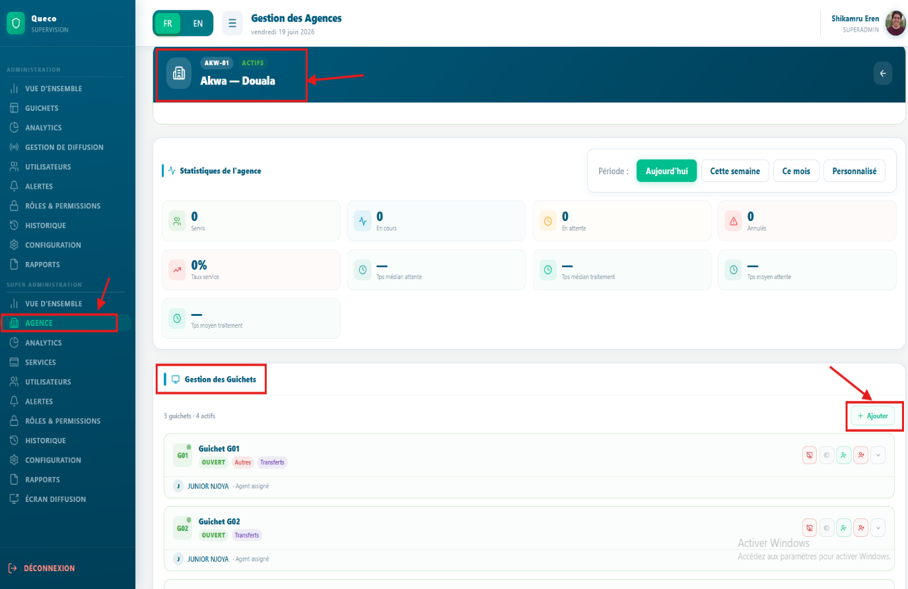

</blockquote></td>
</tr>
</tbody>
</table>

|         |                                                                                                                                                                                                                                                                |
|---------|----------------------------------------------------------------------------------------------------------------------------------------------------------------------------------------------------------------------------------------------------------------|
| **TIP** | Nommez vos guichets de manière claire et cohérente (ex. : « Guichet A », « Fenêtre 3 », « Bureau Paiements »). Les agents voient le nom de leur guichet sur leur tableau de bord chaque jour un bon nommage réduit la confusion pendant les périodes chargées. |

### 4.2.2 Référence des champs du formulaire de guichet

| **Champ**               | **Description**                                                                                         | **Statut**      |
|-------------------------|---------------------------------------------------------------------------------------------------------|-----------------|
| **Nom du guichet**      | Nom affiché aux agents sur leur tableau de bord et sur les écrans d'affichage clients.                  | **Obligatoire** |
| **Utilisateur assigne** | L'agent responsable de ce guichet. Peut être laissé vider et assigné ultérieurement.                    | **Optionnel**   |
| **Services**            | Un ou plusieurs services que ce guichet peut traiter. Seuls les services liés y acheminent les tickets. | **Obligatoire** |

|             |                                                                                                                          |
|-------------|--------------------------------------------------------------------------------------------------------------------------|
| **WARNING** | Si vous créez et assignez un guichet à la mauvaise agence, vous devez le supprimer et le recréer dans l'agence correcte. |

## 4.3 Assigner des guichets aux agents

Chaque guichet doit être assigné à un agent. L'agent assigné voit le
guichet sur son tableau de bord et est responsable de son ouverture au
début de son service. Un agent ne peut être assigné qu'à un seul guichet
à la fois.

### 4.3.1 Assigner ou réassigner un agent après la création

Lors du processus de création du guichet (Section 4.2.1, Étape 6), vous
pouvez sélectionner un agent dans le menu déroulant « Utilisateur
assigné ». Seuls les utilisateurs ayant le rôle d'Agent dans la même
agence apparaissent dans cette liste.

### 4.3.2 Assigner ou réassigner un agent après la création

**Étape 1 :** Depuis la barre latérale, cliquez sur « Agences » et
choisissez l'agence dans laquelle vous avez créé le guichet.

**Étape 2 :** Accédez à la gestion des guichets et localisez le guichet
créé.

**Étape 3 :** Sur le guichet créé, cliquez sur le bouton « personnes
vertes » et un formulaire apparaîtra avec un menu déroulant des
utilisateurs assignés à cette même agence.

Seuls les agents de la même agence sont affichés. Si aucun agent
n'apparaît, vérifiez que des comptes agents ont été créés pour cette
agence (Chapitre 3 Section 3.4).

**Étape 4 :** Cliquez sur Enregistrer.

Les modifications prennent effet à la prochaine connexion de l'agent ou
au prochain rafraîchissement du tableau de bord.

|          |                                                                                                                                                                                                                                        |
|----------|----------------------------------------------------------------------------------------------------------------------------------------------------------------------------------------------------------------------------------------|
| **NOTE** | Si aucun agent n'est affecté à un guichet, celui-ci reste au statut « Fermé » et n'accepte aucun ticket. Assurez-vous toujours que chaque guichet actif dispose d'un agent affecté avant le début du service (ou du quart de travail). |

<table>
<colgroup>
<col style="width: 100%" />
</colgroup>
<tbody>
<tr class="odd">
<td>
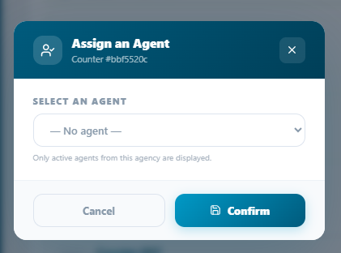

<em>Figure 4.3 Vue d'édition du profil du guichet affichant le menu
déroulant Utilisateur assigné</em>
</td>
</tr>
</tbody>
</table>

### 4.3.3 Désassigner un agent

Pour retirer temporairement un agent d'un guichet sans supprimer le
guichet :

**Étape 1 :** Accédez à la gestion des guichets, localisez le guichet
créé et cliquez sur le bouton « icône personnes rouge ».

**Étape 2 :** Cliquez sur Supprimer. Les modifications prennent effet
immédiatement.

|         |                                                                                                                                                                                                                             |
|---------|-----------------------------------------------------------------------------------------------------------------------------------------------------------------------------------------------------------------------------|
| **TIP** | Utilisez la désassignation plutôt que la désactivation lorsqu'un agent est temporairement absent (congé maladie, vacances). Cela permet de conserver le guichet intact et de le réassigner rapidement au retour de l'agent. |

## 4.4 Ouverture et fermeture d'un guichet

L'ouverture d'un guichet marque le début d'une session de service. Les
tickets commencent à être acheminés vers le guichet uniquement après son
ouverture. La fermeture d'un guichet met fin à la session et arrête tout
nouvel acheminement de tickets. Il s'agit d'un flux de travail quotidien
effectué par l'agent assigné, bien que les responsables puissent
également effectuer cette action à distance. Seul l'administrateur ayant
le rôle d'ouverture ou de fermeture d'un guichet peut effectuer cette
action.

**4.4.1 Ouverture d'un guichet fermé (Agent)**

**Étape 1 :** Connectez-vous à Queco en tant que super administrateur.

**Étape 2 :** Sur votre tableau de bord administrateur, localisez le
widget Agence et repérez le guichet fermé dans l'agence concernée.

Il affiche le numéro du guichet avec la mention FERMÉ en surbrillance
grise.

**Étape 3 :** Cliquez sur l'icône verte ressemblant à une icône d'écran
pour Ouvrir le guichet.

**Étape 4 :** Une boîte de dialogue de confirmation apparaît, cliquez
sur Ouvrir pour continuer.

Le statut du guichet passe à Ouvert (vert). Les tickets de la file
d'attente sont désormais acheminés vers votre guichet.

### 4.4.2 Mise en pause d'un guichet

Utilisez la fonction pause pour les courtes pauses (ex. : déjeuner,
etc.)

**Étape 1 :** Connectez-vous en tant qu'agent.

**Étape 2 :** Dans la barre supérieure du guichet, localisez le bouton
pause/lecture et cliquez dessus. Le guichet sera mis en pause et le
minuteur de pause s'activera automatiquement.

Ceci est pratique pour les pauses.

|          |                                                                                                                                                                                                    |
|----------|----------------------------------------------------------------------------------------------------------------------------------------------------------------------------------------------------|
| **NOTE** | Les guichets en pause sont exclus du calcul du temps d'attente moyen pendant la période de pause. Cela évite d'augmenter artificiellement les temps d'attente lorsqu'aucun agent n'est disponible. |

### 4.4.3 Fermeture d'un guichet

Les responsables peuvent ouvrir ou fermer n'importe quel guichet de leur
agence à distance, ce qui est utile lorsqu'un agent est absent de
manière inattendue ou ne répond pas. Pour les étapes suivantes, veuillez
consulter la section 4.4.1.

Suivez les mêmes étapes, identifiez le guichet ouvert que vous souhaitez
fermer, cliquez sur l'icône d'écran rouge sur la barre du guichet et
confirmez la boîte de dialogue.

|          |                                                                                                                                                                                                      |
|----------|------------------------------------------------------------------------------------------------------------------------------------------------------------------------------------------------------|
| **NOTE** | Lorsqu'un guichet est fermé, l'agent se connectera mais ne verra pas ses guichets et un message l'informera de contacter l'administrateur ou lui indiquera qu'une action administrative est requise. |

## 4.5 Gestion des guichets

Toute la gestion des guichets est effectuée par le super administrateur
et l'administrateur, ou par toute personne disposant du rôle et des
permissions nécessaires. Tous les guichets sont gérés en correspondance
avec leur agence spécifique, c'est-à-dire que chaque guichet appartient
à une agence particulière. Ainsi, pour gérer un guichet ou effectuer
toute action spécifique sur un guichet, vous devez d'abord localiser son
agence avant le guichet.

### 4.5.1 Actions de gestion des guichets

| **Action**                       | **Comment l'effectuer**                                                                                                                                                                                     |
|----------------------------------|-------------------------------------------------------------------------------------------------------------------------------------------------------------------------------------------------------------|
| Modifier le nom du guichet       | Cliquez sur le nom du guichet → cliquez sur Modifier → modifiez les champs → cliquez sur Enregistrer.                                                                                                       |
| Réassigner un agent              | Ouvrez le guichet → Modifier → changez l'Utilisateur assigné → Enregistrer. Voir Section 4.3.2.                                                                                                             |
| Ajouter / Supprimer des services | Localisez le guichet → cliquez sur le menu déroulant du guichet → cliquez sur Ajouter pour ajouter un service attribué à ce guichet.                                                                        |
| Désactiver                       | Sur le guichet → cliquez sur le bouton icône d'écran rouge et confirmez la boîte de dialogue. Le guichet passe en statut Fermé et est masqué des tableaux de bord des agents. Réactivez de la même manière. |

### 4.5.2 Mise à jour des services d'un guichet

Si votre agence élargit son offre de services, vous devrez peut-être
ajouter de nouveaux services aux guichets existants. La suppression d'un
service d'un guichet empêche les nouveaux tickets de ce type d'y être
acheminés, mais n'affecte pas les tickets déjà en file d'attente.

**Étape 1 :** Localisez le guichet et cliquez sur le menu déroulant du
guichet.

L'administrateur devra assigner ou allouer un service particulier à un
guichet avant de pouvoir l'ajouter et l'activer.

**Étape 2 :** Dans la section services, activez ou désactivez un service
à l'aide de la case à cocher.

|         |                                                                                                           |
|---------|-----------------------------------------------------------------------------------------------------------|
| **TIP** | Un guichet peut traiter plusieurs services, qui ne peuvent être assignés que par le super administrateur. |

## 4.6 Bonnes pratiques des guichets

Le respect de ces pratiques contribuera à garantir un fonctionnement
quotidien fluide et une qualité de service cohérente dans toutes vos
agences.

> **Pour les responsables**

- Créez au moins deux guichets par service actif afin que si un agent
  est absent, le service puisse continuer sans interruption.

- Consultez la grille des statuts des guichets sur le tableau de bord du
  responsable au début de chaque journée pour vérifier que tous les
  guichets sont correctement ouverts.

- Surveillez les guichets présentant des taux d'occupation élevés, car
  cela peut indiquer la nécessité d'un guichet supplémentaire pour ce
  service.

- Définissez une taille maximale de file d'attente sur les guichets pour
  éviter les files d'attente incontrôlées pendant les heures de pointe.
  Lorsque le plafond est atteint, les nouveaux tickets sont maintenus
  dans un pool général jusqu'à ce que la capacité se libère.

> **Pour les agents**

- Terminez toujours le ticket En cours du client actuel avant de mettre
  en pause ou de vous déconnecter de votre guichet.

- Si vous constatez que votre file d'attente s'allonge plus vite que
  vous ne pouvez la traiter, alertez votre responsable via la
  notification de la plateforme ou par message direct n’ignorez pas
  simplement la file d'attente.

- Déconnectez-vous toujours correctement ne fermez jamais simplement
  l'onglet du navigateur. Le délai de fermeture automatique peut
  entraîner des lacunes dans l'acheminement des tickets.

## 4.7 Résumé du chapitre

Ce chapitre a couvert le cycle de vie complet d'un guichet dans Queco,
de la création à l'exploitation quotidienne jusqu'à la gestion à long
terme. À présent, vous devriez être en mesure de :

1.  Créer des guichets avec les valeurs de champs correctes et les
    assignations de services appropriées.

2.  Assigner des agents aux guichet et les réassigner en fonction des
    changements de personnel.

3.  Ouvrir, mettre en pause et fermer les guichets en suivant la
    procédure correcte.

4.  Appliquer les bonnes pratiques pour maintenir les guichets en
    fonctionnement efficace.

*Chapter 5*

# Services & Operations

*Comment construire et gérer le catalogue de services définissant ce que
votre agence propose, structurer les opérations au sein de chaque
service et les activer pour chaque agence.*

<table>
<colgroup>
<col style="width: 50%" />
<col style="width: 50%" />
</colgroup>
<thead>
<tr class="header">
<th>
<strong>Dans ce Chapitre :</strong>

<ul>
<li>
5.1 Services vs. Opérations
</li>
<li>
5.2 Planification de votre catalogue de services
</li>
<li>
5.3 Création d’un service
</li>
<li>
5.4 Création des opérations
</li>
<li>
5.5 Activation des services par agence
</li>
<li>
5.6 Gestion du catalogue de services
</li>
<li>
5.7 Bonnes pratiques pour la gestion du catalogue de
services
</li>
</ul></th>
<th><blockquote>

<strong>A l’issue de ce chapitre, vous serez capable
de :</strong>

</blockquote>
<ul>
<li>
Distinguer les services des opérations
</li>
<li>
Planifier un catalogue de services logique et cohérent
</li>
<li>
Créer des services avec tous les champs requis
</li>
<li>
Ajouter des opérations à un service
</li>
<li>
Activer des services pour des agences spécifiques
</li>
<li>
Modifier, désactiver et réorganiser les services
</li>
<li>
Appliquer les bonnes pratiques pour maintenir un catalogue de
services clair et bien structuré.
</li>
</ul></th>
</tr>
</thead>
<tbody>
</tbody>
</table>

## 5.1 Service vs Opérations

Avant de construire votre catalogue de services, il est essentiel de
comprendre la distinction entre un Service et une Opération. Ces deux
éléments fonctionnent ensemble pour décrire ce que votre agence propose
et comment chaque demande client est catégorisée lors de la création
d'un ticket.

| **Concept**   | **Definition**                                                     | **Example**                                                                     |
|---------------|--------------------------------------------------------------------|---------------------------------------------------------------------------------|
| **Service**   | Une large catégorie de travail offerte aux clients par une agence. | Gestion de compte                                                               |
| **Operation** | Une tâche spécifique et précise effectuée au sein d'un service.    | Ouvrir un compte, Fermer un compte, Mettre à jour les informations personnelles |
| **Ticket**    | Une demande client liée exactement à un Service et une Opération.  | Ticket pour « Gestion de compte → Ouvrir un compte »                            |

Considérez un service comme un dossier et une opération comme un fichier
à l'intérieur. Lorsqu'un agent crée un ticket, il sélectionne d'abord le
service, puis choisit l'opération spécifique effectuée. Cette structure
à deux niveaux permet aux analyses de Queco de rendre compte non
seulement des services les plus demandés, mais aussi des tâches
spécifiques qui consomment le plus de temps.

| **NOTE** | Un service peut contenir autant d'opérations que nécessaire. Cependant, chaque service doit avoir au moins une opération avant de pouvoir être activé pour une agence. |
|----------|------------------------------------------------------------------------------------------------------------------------------------------------------------------------|

### 5.1.1 Exemples concerts 

| **Industry**        | **Exemple Service**      | **Opérations qu'il contient**                                                               |
|---------------------|--------------------------|---------------------------------------------------------------------------------------------|
| **Banque**          | Services de prêt         | Nouvelle demande de prêt, Remboursement de prêt, Consultation du solde, Clôture anticipée   |
| **Administration**  | État civil               | Acte de naissance, Acte de décès, Acte de mariage, Changement de nom                        |
| **Telecom**         | Services carte SIM       | Activation nouvelle SIM, Remplacement SIM, Blocage SIM, Mise à niveau du forfait            |
| **Clinique**        | Services de consultation | Consultation générale, Visite de suivi, Collecte des résultats, Renouvellement d'ordonnance |
| **Bureau de Poste** | Services colis           | Envoyer un colis, Suivre un colis, Collecter un colis, Retourner un colis                   |

## 5.2 Planification de votre catalogue de services

Prendre le temps de planifier votre catalogue de services avant de le
configurer dans Queco permettra d'éviter des retouches importantes
ultérieurement. Un catalogue bien structuré améliore la précision du
routage des tickets, rend les analyses plus pertinentes et réduit la
confusion pour les agents lors de la création des tickets.

### 5.2.1 Liste de contrôle pour la planification du catalogue

1.  Listez tous les services orientés clients que votre organisation
    fournit.

2.  Pour chaque service, listez chaque tâche distincte qu'un agent
    pourrait effectuer pour un client.

3.  Regroupez les tâches qui se recoupent si deux tâches sont
    essentiellement identiques, fusionnez-les en une seule opération.

4.  Estimez le temps moyen nécessaire pour accomplir chaque opération.
    Cette valeur alimente l'estimateur de temps d'attente.

5.  Identifiez quelles agences proposent quels services toutes les
    agences n'ont pas besoin du catalogue complet.

6.  Convenez de conventions de nommage cohérentes avant de saisir quoi
    que ce soit dans Queco (ex. : utilisez des verbes : « Ouvrir un
    compte », et non « Ouverture de compte »).

| **TIP** | Préparez d'abord votre catalogue de services dans un tableur (Nom du service, Code du service, Opérations, Durée estimée, Agences). Examinez-le avec votre équipe avant de créer quoi que ce soit dans Queco. Renommer des services après que des tickets ont été traités peut affecter les rapports historiques. |
|---------|-------------------------------------------------------------------------------------------------------------------------------------------------------------------------------------------------------------------------------------------------------------------------------------------------------------------|

### 5.2.2 Conventions de nommage

Un nommage cohérent dans votre catalogue de services facilite
l'utilisation de la plateforme pour tous les rôles. Suivez ces
recommandations :

| **Element**             | **Recommended Style**                                | **Example**                             |
|-------------------------|------------------------------------------------------|-----------------------------------------|
| **Nom du service**      | Première lettre en majuscule, basé sur un nom        | Gestion de compte, Services de prêt     |
| **Code du Service**     | Majuscules, séparé par des tirets, 3 à 6 caractères  | ACC-MGT, LOAN-SVC, REG-DOC              |
| **Nom de l’opération**  | Première lettre en majuscule, verbe d'action + objet | Ouvrir un compte, Soumettre une demande |
| **Code de l’opération** | Majuscules, court, sans espaces                      | OPEN-ACC, SUBMT-APP                     |

## 5.3 Création d'un service

Les services sont créés au niveau de la plateforme par le Super
Administrateur ou un Responsable. Une fois créés, ils existent dans le
catalogue principal et peuvent ensuite être activés de manière sélective
pour chaque agence. Un service sans opération ne peut pas être activé.

### 5.3.1 Étape par étape : Créer un nouveau service

**Étape 1 :** Depuis la barre latérale gauche, cliquez sur « Services ».

**Étape 2 :** Cliquez sur « Ajouter un service » dans le coin supérieur
droit de la page des services.

**Étape 3 :** Remplissez tous les champs obligatoires dans le formulaire
du nouveau service.

Vous pouvez également définir la couleur d'apparence de votre choix.

| *Figure 5.1 — Couleur d'apparence du service*  |
|-----------------------------------------------------------------------------------------|

| *Figure 5.1 — Formulaire de création d'un nouveau service*  |
|-------------------------------------------------------------------------------------------------------|

| **NOTE** | Un service nouvellement créé est invisible pour tous les agents et guichets jusqu'à ce qu'il soit (1) doté d'au moins une opération, et (2) explicitement activé pour une agence. Voir Sections 5.4 et 5.5. |
|----------|-------------------------------------------------------------------------------------------------------------------------------------------------------------------------------------------------------------|

### 5.3.2 Référence des champs du formulaire de service

| **Field**             | **Description**                                                 | **Statut**      |
|-----------------------|-----------------------------------------------------------------|-----------------|
| **Nom Services (FR)** | Nom lisible affiché aux agents et dans les rapports en français | **Obligatoire** |
| **Nom Services (EN)** | Nom lisible affiché aux agents et dans les rapports en anglais  | **Obligatoire** |

## 5.4 Création d’une Operation

Les opérations sont les tâches individuelles au sein d'un service. Elles
doivent être créées après l'existence du service parent. Vous pouvez
ajouter plusieurs opérations à un service à tout moment, même après que
le service est déjà actif et utilisé.

### 5.4.1 Étape par étape : Ajouter une opération à un service

**Étape 1 :** Cliquez sur « Services », cliquez sur le nom du service
auquel vous souhaitez ajouter des opérations, ou identifiez le service
et cliquez sur le bouton « Détails » de la carte du service.

**Étape 2 :** Créez une nouvelle opération en cliquant sur le bouton «
+Ajouter » dans le coin supérieur droit et remplissez les champs requis.

| *Figure 5.2 Service Detail page showing the Operations section and 'Add Operation' button*  |
|---------------------------------------------------------------------------------------------------------------------------------------|

| **TIP** | Ajoutez toutes les opérations d'un service avant de l'activer pour les agences. L'ajout d'opérations à un service déjà actif fonctionne bien, mais les agents utilisant le service à ce moment-là ne verront pas la nouvelle opération avant leur prochain rafraîchissement de page. De plus, vous pouvez activer et désactiver une opération dans un service particulier. |
|---------|----------------------------------------------------------------------------------------------------------------------------------------------------------------------------------------------------------------------------------------------------------------------------------------------------------------------------------------------------------------------------|

### 5.4.2 Référence des champs du formulaire d'opération

| **Field**              | **Description**                                                                                                                        | **Statut**      |
|------------------------|----------------------------------------------------------------------------------------------------------------------------------------|-----------------|
| **Nom de l’opération** | Nom avec verbe d'action que les agents voient lors de la création d'un ticket (ex. : « Ouvrir un compte »). En anglais et en français. | **Obligatoire** |

<table>
<colgroup>
<col style="width: 100%" />
</colgroup>
<thead>
<tr class="header">
<th>

<em>Figure 5.2 Operation form field</em>
</th>
</tr>
</thead>
<tbody>
</tbody>
</table>

## 5.5 Activation des services par agence

La création d'un service dans le catalogue principal ne le rend pas
automatiquement disponible pour une agence. Chaque service doit être
explicitement activé pour chaque agence qui en a besoin. Cette
conception permet à différentes agences de proposer différents
catalogues de services à partir de la même liste principale par exemple,
une agence principale peut proposer tous les 12 services tandis qu'un
bureau satellite n'en propose que 4.

###  5.5.1 Étape par étape : Activer un service pour une

**Étape 1 :** Depuis la barre latérale, cliquez sur « Services ».

**Étape 2 :** Dans le coin supérieur droit, à côté du bouton « Nouveau
service », se trouve une barre de recherche avec un menu déroulant de
toutes les agences créées. Sélectionnez simplement l'agence pour
laquelle vous souhaitez activer le service.

**Étape 3 :** Après la sélection, le catalogue de tous les services
apparaîtra en état désactivé.

**Étape 4 :** Cliquez sur le service concerné et une barre latérale
apparaîtra depuis la droite.

**Étape 5 :** Dans la barre latérale, cliquez sur le bouton vert «
Activer pour cette agence » qui deviendra ensuite rouge.

| *Figure 5.4 — Page de détail montrant comment activer un service avec son opération*  |
|---------------------------------------------------------------------------------------------------------------------------------|

**Étape 6 :** En haut, vous pouvez également activer l'opération dans ce
service pour cette agence si vous le souhaitez.

| *Figure 5.4 Agency Services tab showing master catalogue with activated and deactivated service for an agency (ex. Mankon)* |
|----------------------------------------------------------------------------------------------------------------------------------------------------------------------------------------------------|

| **NOTE** | Si un service n'a pas d'opérations, ou si son opération est désactivée, activez d'abord le service puis activez l'opération ultérieurement. Et si un service n'a pas d'opération, vous pourrez en créer une plus tard. |
|----------|------------------------------------------------------------------------------------------------------------------------------------------------------------------------------------------------------------------------|

| **TIP** | Après avoir activé les services pour une agence, vérifiez qu'au moins un guichet de cette agence a été lié à chaque service activé. Si aucun guichet ne gère un service, les tickets pour ce service entreront dans la file d'attente mais ne seront jamais acheminés vers un agent. |
|---------|--------------------------------------------------------------------------------------------------------------------------------------------------------------------------------------------------------------------------------------------------------------------------------------|

## 5.6 Gestion du catalogue de services

Les services et les opérations peuvent être modifiés, désactivés ou
archivés à tout moment. Il est important de comprendre l'impact de
chaque action sur les données en cours avant d'apporter des
modifications à un catalogue de services actif.

### 5.6.1 Actions de gestion des services

| **Action**              | **Comment L’effectuer**                                                                                                                                  |
|-------------------------|----------------------------------------------------------------------------------------------------------------------------------------------------------|
| **Modifier un Service** | Aller dans Services → cliquer sur le nom du service → cliquer sur Modifier → modifier les champs → Enregistrer.                                          |
| Désactiver un service   | Aller dans Services → cliquer sur le nom du service → cliquer sur Désactiver → cliquer sur Confirmer.                                                    |
| Réactiver un service    | Aller dans Services → cliquer sur le nom du service → cliquer sur Activer → cliquer sur Confirmer.                                                       |
| Supprimer un service    | Aller dans Services → cliquer sur le nom du service → cliquer sur Archiver le service → saisir le nom du service → cliquer sur Confirmer la suppression. |

### 5.6.2 Actions de gestion des opérations

| **Action**                 | **Comment L’effecteur**                                                                                                                                                                 |
|----------------------------|-----------------------------------------------------------------------------------------------------------------------------------------------------------------------------------------|
| Modifier une opération     | Ouvrir le service → cliquer sur l'opération → cliquer sur Modifier → modifier → Enregistrer.                                                                                            |
| Désactiver une opération   | Ouvrir le service → basculer le statut de l'opération sur Désactivé. Les agents ne la voient plus dans le formulaire de création de ticket. Les tickets existants ne sont pas affectés. |
| Réactiver une opération    | Basculer le statut de l'opération sur Activé. Elle réapparaît immédiatement pour les agents.                                                                                            |
| Supprimer une opération    | Ouvrir le service → cliquer sur (⋮) sur l'opération → Supprimer → confirmer. Action permanente. Les tickets historiques conservent le libellé « Opération supprimée ».                  |
| Réorganiser les opérations | Faire glisser les lignes d'opération par l'icône de poignée au sein d'un service. Contrôle l'ordre d'affichage dans le formulaire de ticket.                                            |

| **WARNING** | La suppression d'un service ou d’une opération associée à des tickets ouverts (non résolus) entraînera l'affichage d'informations incomplètes sur ces tickets. Vérifiez toujours l'existence de tickets ouverts avant de supprimer. En cas de doute, désactivez plutôt que de supprimer. |
|-------------|------------------------------------------------------------------------------------------------------------------------------------------------------------------------------------------------------------------------------------------------------------------------------------------|

### 5.6.3 Matrice d'impact : Action vs Données

Utilisez ce tableau pour comprendre l'effet de chaque action de gestion
sur les données en cours avant de procéder.

| **Action**                   | **Tickets ouverts**                       | **Tickets historiques**          | **Disponibilité agence**                              |
|------------------------------|-------------------------------------------|----------------------------------|-------------------------------------------------------|
| **Désactiver un service**    | Aucun nouveau ticket créé                 | Entièrement intacts              | Retiré de toutes les agences                          |
| **Réactiver un service**     | Reprend normalement                       | Entièrement intacts              | Restauré dans toutes les agences précédemment actives |
| **Supprimer un service**     | Marqués comme incomplets                  | Libellés « Service supprimé »    | Supprimé définitivement                               |
| **Désactiver une opération** | Aucun nouveau ticket pour cette opération | Entièrement intacts              | Opération masquée dans le formulaire de ticket        |
| **Supprimer une opération**  | Marqués comme incomplets                  | Libellés « Opération supprimée » | Supprimé définitivement                               |

## 5.7 Bonnes pratiques du catalogue de services

Un catalogue de services bien entretenu est le fondement d'analyses
précises et d'une gestion efficace des files d'attente. Suivez ces
pratiques pour maintenir le catalogue propre et efficace.

> **Conception du catalogue**

- Gardez les services larges et les opérations spécifiques. Visez 3 à 8
  opérations par service. Si un service compte plus de 10 opérations,
  envisagez de le diviser en 2 services.

- Évitez de créer des opérations en double entre les catégories de
  services.

> **Maintenance Continue**

- Examinez le catalogue de services une fois par trimestre. Supprimez ou
  désactivez les opérations qui ne sont plus en vigueur.

- Lorsqu'un service change significativement (ex. : introduction d'un
  nouveau processus), mettez à jour le champ instructions afin que les
  agents disposent toujours des directives actuelles.

- Surveillez le rapport d'utilisation des services dans les analyses
  pour identifier les opérations à très faibles volumes.

- Ne supprimez jamais un service ou une opération pendant qu'une
  initiative active est en cours. Planifiez les suppressions pendant les
  heures creuses et annoncez-les aux agents à l'avance.

## 5.8 Résumé du chapitre

Ce chapitre couvre l'ensemble du flux de travail du catalogue de
services dans Queco, de la planification et des conventions de nommage
jusqu'à la création, l'activation et la gestion continue. À présent,
vous devriez être en mesure de :

- Distinguer les services des opérations et expliquer leur relation avec
  les tickets.

- Planifier et documenter un catalogue de services avant de le
  configurer dans Queco.

- Créer des services avec tous les champs requis et des conventions de
  nommage cohérentes.

- Ajouter et gérer des opérations au sein de chaque service.

- Activer des services pour des agences individuelles et des opérations
  spécifiques au sein de celles-ci.

*Chapitre 6*

# Gestion Des Tickets

*Le flux de travail quotidien principal : comment créer, appeler,
traiter, mettre en attente, transférer et clôturer les tickets de
service du début à la fin.*

<table>
<colgroup>
<col style="width: 50%" />
<col style="width: 50%" />
</colgroup>
<thead>
<tr class="header">
<th>
<strong>Dans ce Chapitre</strong>

• 6.1 Le cycle de vie d’un ticket 
• 6.2 Création d’un ticket 
• 6.3 Appeler le ticket suivant 
• 6.4 Traitement d’un ticket 
• 6.5 Mettre un ticket en attente 
• 6.6 Transférer un ticket 
• 6.7 Clôturer un ticket 
• 6.8 Historique et recherche des tickets
</th>
<th>
<strong>Apres ce Chapitre, Vous serez en mesure de</strong>

<blockquote>

• Comprendre chaque étape du cycle de vie d’un ticket 
• Créer correctement un nouveau ticket de service 
• Appeler le prochain client dans la file d’attente 
• Traiter et mettre à jour un ticket en temps réel 
• Mettre un ticket en attente et le reprendre 
• Transférer un ticket vers un autre guichet ou un autre agent 
• Clôturer un ticket avec des notes de résolution appropriées 
• Rechercher et consulter les tickets historiques

</blockquote></th>
</tr>
</thead>
<tbody>
</tbody>
</table>

## 6.1 Le cycle de vie d'un ticket

Chaque demande de service client dans Queco suit un cycle de vie défini.
Comprendre chaque étape aide à traiter les tickets correctement et
permet aux responsables d'identifier les retards ou problèmes dans la
file d'attente.

| **\#** | **Status** | **Description**                                                                               |
|--------|------------|-----------------------------------------------------------------------------------------------|
| **1**  | Créé       | A new ticket has been issued. It has a unique number and is waiting in the agency queue.      |
| **2**  | En attente | The ticket is in line and waiting to be called by an available agent at the relevant counter. |
| **3**  | Appelé     | An agent has called the ticket number. The customer is being summoned to the counter.         |
| **4**  | En cours   | The agent is actively processing the customer's request at the counter.                       |
| **5**  | Annulé     | The ticket was voided before processing (e.g., customer left, duplicate entry).               |
| **6**  | Déclassé   | The ticket is added back at the end of the queue list                                         |

| **NOTE** | Un ticket peut passer entre les statuts En attente, Appelé, En cours, Terminé ou Annulé. Chaque changement de statut est enregistré dans l'historique d'activité du ticket pour une traçabilité complète. |
|----------|-----------------------------------------------------------------------------------------------------------------------------------------------------------------------------------------------------------|

## 6.2 Création d'un ticket (Kiosque)

Les tickets représentent des demandes de service client individuelles.
Ils peuvent être créés par les Super Administrateurs, les Responsables
et les Agents. Dans la plupart des déploiements, les agents au bureau
d'accueil créent les tickets au nom du client à son arrivée.

### 6.2.1 Étape par étape : Créer un nouveau ticket sur le kiosque

**Étape 1 :** Lorsque le client arrive dans une agence, il rencontrera
l'agent au bureau qui l'aidera à créer le ticket sur le kiosque.

*Les Super Administrateurs voient toutes les agences. Les Responsables
et Agents ne voient que leur agence assignée.*

**Étape 2 :** Sélectionnez le service dont le client a besoin.

*Seuls les services activés pour cette agence sont affichés. Voir
Chapitre 5 Section 5.5 si un service est manquant.*

**Étape 3 :** Sélectionnez l'opération, c'est-à-dire la tâche spécifique
au sein du service.

*Exemple : Sous « Gestion de compte », sélectionnez « Ouvrir un compte
».*

**Étape 4 :** Saisissez le numéro de téléphone mobile du client.

*Le numéro de téléphone du client est obligatoire.*

**Étape 5 :** Après que le client a saisi son numéro, cliquez sur «
Passer ».

*Un numéro de ticket unique est généré (ex. : ACC-0042) et le ticket
rejoint immédiatement la file d'attente.*

| *Figure 6.2 — New Ticket creation form with all fields*  |
|----------------------------------------------------------------------------------------------------|

| **NOTE** | Si aucun service n'apparaît dans le menu déroulant des services, l'agence n'a pas de services activés. Un Responsable ou Super Administrateur doit d'abord activer les services pour cette agence (Chapitre 5 Section 5.5). |
|----------|-----------------------------------------------------------------------------------------------------------------------------------------------------------------------------------------------------------------------------|

## 6.3 Appel du prochain ticket

Une fois votre guichet ouvert, vous pouvez commencer à appeler les
tickets de la file d'attente. Le système sert automatiquement les
tickets. Le ticket le plus ancien est servi en premier (FIFO).

### 6.3.1 Étape par étape : Appeler le prochain ticket

**Étape 1 :** Assurez-vous que votre guichet est Ouvert.

Si votre guichet affiche Fermé ou un message de non-assignation,
signalez-le à l'administrateur ou au super administrateur.

**Étape 2 :** Lorsqu'un client crée un nouveau ticket sur le kiosque, le
ticket est automatiquement assigné à la liste d'attente de ce service
dans cette agence.

Le numéro du ticket s'affiche automatiquement dans la liste d'attente
d'un guichet gérant ce service.

**Étape 3 :** Dans la liste d'attente, le statut du ticket est
EN_ATTENTE et lorsqu'il est appelé en session active, il passe à APPELÉ
puis EN_COURS, et le chronomètre du guichet démarre immédiatement.

Le client est censé se présenter à votre guichet lorsqu'il est appelé.

<table>
<colgroup>
<col style="width: 100%" />
</colgroup>
<thead>
<tr class="header">
<th>

<em>Figure 6.3 — Tableau de bord de l'agent affichant les boutons
d'action du ticket actif, la liste d'attente avec les tickets en attente
et le bouton Appeler le suivant</em>
</th>
</tr>
</thead>
<tbody>
</tbody>
</table>

### 6.3.2 Déclassement d'un ticket

Si un ticket est en cours d'appel et que l'agent a attendu au moins une
minute sans que le client ne se présente, le ticket est déclassé et
replacé en fin de liste d'attente pour être rappelé une seconde fois.

**Étape 1 :** Dans la vue du ticket actif, cliquez sur le bouton «
Déclasser ».

Le ticket est replacé dans la liste d'attente. Le système remet le
ticket en file (donnant au client une autre chance) ou l'annule
automatiquement. Un ticket ne peut être déclassé qu'une seule fois une
fois rappelé, le bouton de déclassement devient inactif, ne laissant que
les options « Terminer » ou « Annuler ».

## 6.4 Traitement d'un ticket

Une fois le ticket en cours, l'agent traite la demande du client. Cela
peut impliquer l'utilisation d'autres systèmes internes ou l'exécution
de différentes opérations dans Queco. Le ticket reste en cours jusqu'à
ce qu'il soit Terminé, Annulé ou Déclassé.

### 6.4.1 La vue du ticket actif

Lorsqu'un ticket est en cours, l'agent voit le panneau du ticket actif
sur son tableau de bord. Ce panneau contient toutes les informations
nécessaires au traitement de la demande.

| **Élément du panneau**  | **Ce qu'il affiche**                                                                          |
|-------------------------|-----------------------------------------------------------------------------------------------|
| **Numéro du ticket**    | Le numéro appelé afficher en évidence (ex. : S162)                                            |
| **Service & Opération** | Le type de service demandé par le client (ex. : solde de compte)                              |
| **Temps écoulé**        | Chronomètre en direct indiquant depuis combien de temps le ticket est en cours (ex. : 0m 13s) |
| **Boutons d'action**    | Terminer, Annuler, Déclasser les trois actions clés disponibles pendant le traitement         |
| **Téléphone**           | Le numéro de téléphone du client (ex. : 652333666)                                            |

| *Figure 6.4 — Panneau du ticket actif avec tous les éléments étiquetés*  |
|-------------------------------------------------------------------------------------------------------------------|

## 6.5 Clôture d'un ticket

Clôturez un ticket une fois que la demande du client a été entièrement
traitée. La clôture est l'étape finale du cycle de vie du ticket. Elle
enregistre la résolution, arrête le chronomètre de traitement et rend le
ticket disponible dans l'archive historique à des fins de rapport et
d'audit.

### 6.5.1 Étape par étape : Clôturer un ticket

Nous pouvons clôturer un ticket depuis la vue active en effectuant 3
actions :

1.  **Terminer un Ticket**

**Étape 1 :** Dans le panneau du ticket actif, cliquez sur le bouton «
Terminer ». Le ticket se termine instantanément, le chronomètre s'arrête
et l'action est enregistrée dans la section historique.

2.  **Déclasser un ticket**

**Étape 1 :** Dans le panneau du ticket actif, cliquez sur le bouton «
Terminer ». Le ticket se termine instantanément, le chronomètre s'arrête
et l'action est enregistrée dans la section historique.

3.  **Annuler un ticket**

**Étape 1 :** Cliquez sur le bouton jaune « Annuler ».

**Étape 2 :** La boîte de dialogue d'annulation apparaît à l'écran.

**Étape 3 :** Cliquez sur « Confirmer » pour annuler définitivement le
ticket, qui sera également enregistré dans la section historique.

*Un ticket annulé n'a jamais été entièrement traité. Il est annulé avant
ou pendant le processus.*

| **Scenario**                                                            | **Action Corrective**                                                         |
|-------------------------------------------------------------------------|-------------------------------------------------------------------------------|
| **Le client est parti avant d'être appelé.**                            | Utilisez le bouton **Annuler** au niveau du guichet.                          |
| **Le client a changé d'avis en cours de traitement.**                   | Annulez le ticket ayant le statut **En cours de traitement** (*In Progress*). |
| **Un mauvais service a été sélectionné lors de la création du ticket.** | Annulez le ticket puis créez-en un nouveau avec le service correct.           |

| **WARNING** | L'annulation est définitive et ne peut pas être annulée. Les tickets annulés sont exclus de la plupart des rapports d'analyse. Utilisez l'option « Annuler » uniquement lorsque cela est approprié ; ne l'utilisez pas pour éviter d'enregistrer un résultat « Non résolu ». |
|-------------|------------------------------------------------------------------------------------------------------------------------------------------------------------------------------------------------------------------------------------------------------------------------------|

## 6.6 Historique des Tickets

Tous les tickets Terminés et Annulés sont archivés dans l'Historique des
tickets. Les Responsables et Super Administrateurs y ont un accès
complet. Les agents peuvent rechercher les tickets de l'historique de
leur propre guichet pour la journée. Après une journée et au-delà,
l'historique des tickets est effacé pour une nouvelle journée.

### 6.6.1 Accès à l'historique des tickets

**Étape 1 :** Dans le guichet, cliquez sur la flèche dans la barre
supérieure et l'interface basculera vers la section où se trouve
l'historique.

<table>
<colgroup>
<col style="width: 100%" />
</colgroup>
<thead>
<tr class="header">
<th>

<em>Figure 6.8 — Page de l'historique des tickets avec barre de
recherche et panneau de filtres</em>
</th>
</tr>
</thead>
<tbody>
</tbody>
</table>

## 6.7 Résumé du chapitre

Ce chapitre a couvert l'ensemble du flux de gestion des tickets, de la
création à travers chaque étape de traitement jusqu'à la clôture finale
et la consultation de l'historique. À présent, vous devriez être en
mesure de :

1.  Décrire chaque étape du cycle de vie d'un ticket et la signification
    de chaque statut.

2.  Créer un ticket avec les paramètres corrects de service, d'opération
    et de priorité.

3.  Appeler le prochain ticket de la file d'attente et commencer à le
    traiter.

4.  Clôturer un ticket avec le statut de résolution approprie.

5.  Rechercher et filtrer l’historique des tickets

*Chapitre 7*

# Diffusion d’Ecran & Gestion des Affichages

*Comment configurer, gérer et exploiter les écrans d'affichage orientés
clients de la création des écrans et des playlists à la planification du
contenu média et à la surveillance de l'état des écrans.*

<table>
<colgroup>
<col style="width: 50%" />
<col style="width: 50%" />
</colgroup>
<thead>
<tr class="header">
<th>
<strong>Dans ce Chapitre</strong>

<ul>
<li>
7.1 Qu'est-ce que la Diffusion d'écran ?
</li>
<li>
7.2 Anatomie de l'écran de diffusion
</li>
<li>
7.3 Concepts fondamentaux : Écrans, Playlists &amp;
Médias
</li>
<li>
7.4 Gestion des écrans
</li>
<li>
7.5 Gestion des playlists
</li>
<li>
7.6 Gestion des éléments médias
</li>
<li>
7.7 Le Lecteur Comment tout s'assemble
</li>
<li>
7.8 Résumé du chapitre
</li>
</ul></th>
<th>
<strong>Apres ce chapitre vous serez en mesure de</strong>

<ul>
<li>
Expliquer ce que fait la diffusion d'écran
</li>
<li>
Identifier les deux zones de l'écran d'affichage
</li>
<li>
Comprendre la hiérarchie Écran → Playlist → Média
</li>
<li>
Créer et configurer des écrans d'affichage
</li>
<li>
Créer des playlists et les attacher aux écrans
</li>
<li>
Importer des éléments médias et définir des
planifications
</li>
</ul>
<ul>
<li>
Comprendre comment le lecteur récupère et affiche le
contenu
</li>
</ul></th>
</tr>
</thead>
<tbody>
</tbody>
</table>

## 7.1 Qu'est-ce que la Diffusion d'écran ?

La Diffusion d'écran est le système intégré de gestion des affichages de
Queco. Il contrôle les écrans orientés clients installés dans les salles
d'attente de votre agence les écrans que les clients regardent en
attendant que leur numéro de ticket soit appelé.

Diffusion d'écran est le système intégré de gestion des affichages de
Queco. Il contrôle les écrans orientés clients installés dans les salles
d'attente de votre agence les écrans que les clients regardent en
attendant que leur numéro de ticket soit appelé.

| **Fonction**                  | **Description**                                                                                                                                   |
|-------------------------------|---------------------------------------------------------------------------------------------------------------------------------------------------|
| **Visibilité de la file**     | Les clients peuvent voir quels numéros de tickets sont actuellement appelés et à quel guichet, réduisant l'anxiété et évitant les appels manqués. |
| **Diffusion de contenu**      | L'agence peut afficher des images, vidéos, bannières promotionnelles et annonces sur le même écran sans aucune intervention manuelle.             |
| **Contrôle par zone**         | Plusieurs écrans peuvent être déployés dans différentes zones ou étages de l'agence, chacun affichant le contenu pertinent à son emplacement.     |
| **Mises à jour automatiques** | Les écrans se mettent à jour automatiquement lorsqu'un agent appelle un nouveau ticket aucun rafraîchissement manuel n'est nécessaire.            |

**NOTE**

**N**

|          |                                                                                                                                                                                                                                                                               |
|----------|-------------------------------------------------------------------------------------------------------------------------------------------------------------------------------------------------------------------------------------------------------------------------------|
| **NOTE** | La Diffusion d'écran est entièrement gérée depuis la plateforme Queco. Les écrans physiques n'ont besoin que d'un navigateur et d'une connexion internet pour recevoir et afficher le contenu aucune installation de logiciel dédié n'est requise sur l'appareil d'affichage. |

|                                                                                                                                               |
|-----------------------------------------------------------------------------------------------------------------------------------------------|
| 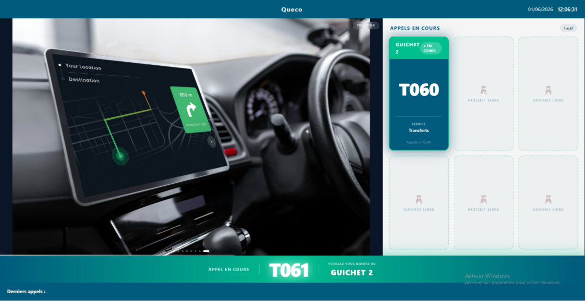*Figure 7.1 — Écran d'affichage orienté client dans une salle d'attente (exemple de mise en page)*  |

|         |                                                                                                                                                                                                                                                                                                                     |
|---------|---------------------------------------------------------------------------------------------------------------------------------------------------------------------------------------------------------------------------------------------------------------------------------------------------------------------|
| **TIP** | Considérez la Zone 1 comme une chaîne TV que votre agence contrôle, diffusant le contenu que vous programmez. La Zone 2 est le tableau de file d'attente en direct elle fonctionne automatiquement au fur et à mesure que les agents traitent les tickets. La Zone 3 est la bannière contextuelle en direct en bas. |

## 7.2 Concepts fondamentaux : Écrans, Playlists et Médias

Avant de configurer quoi que ce soit, il est important de comprendre la
hiérarchie à trois niveaux qui alimente le système d'affichage de Queco.
Chaque contenu visible sur un écran de diffusion passe par cette
structure.

### 7.2.1 La hiérarchie à trois niveaux

| **Level**   | **Entité**    | **Role**                                                                                                                                                                                      |
|-------------|---------------|-----------------------------------------------------------------------------------------------------------------------------------------------------------------------------------------------|
| **Level 1** | Écran         | Un appareil d'affichage physique enregistré dans l'agence. Chaque écran possède un code unique utilisé pour récupérer son contenu. Les écrans sont assignés à des zones au sein d'une agence. |
| **Level 2** | Playlist      | Une collection ordonnée d'éléments médias. Une playlist définit ce qui est diffusé sur un écran et dans quel ordre. Un écran peut avoir plusieurs playlists ; une seule est active à la fois. |
| **Level 3** | Élément média | Un contenu individuel une image ou une vidéo avec une durée d'affichage définie. Les éléments médias peuvent avoir des planifications qui contrôlent quand ils apparaissent.                  |

### 7.2.2 Analogie

Pensez-y comme un système de diffusion télévisée :

- L'**Écran** est le téléviseur fixé au mur l'appareil physique que les
  clients regardent.

- La **Playlist** est la chaîne TV un programme de contenu planifié qui
  se diffuse dans l'ordre.

- **Élément média** est une émission ou publicité individuelle une image
  ou clip vidéo dans le programme.

Un écran peut avoir plusieurs playlists (comme un téléviseur avec
plusieurs chaînes), mais une seule playlist est active à tout moment la
playlist courante. Les administrateurs peuvent changer la playlist
active à tout moment.

### 7.2.3 Planification

Les éléments médias supportent une planification basée sur le temps. Une
planification définit une fenêtre pendant laquelle un élément média
spécifique est éligible à la diffusion. En dehors de cette fenêtre,
l'élément est automatiquement ignoré. Cela vous permet d'afficher des
annonces matinales le matin, des offres promotionnelles aux heures de
pointe, et des avis de fermeture en fin de journée sans aucune
intervention manuelle.

## 7.3 Gestion des écrans

Les écrans représentent les appareils d'affichage physiques dans votre
agence. Chaque écran doit être enregistré dans Queco avant de pouvoir
recevoir et afficher du contenu. Seuls les Super Administrateurs et les
Responsables peuvent créer et gérer les écrans.

**7.3.1 Étape par étape : Créer un nouvel écran**

Avant de créer un écran dans une agence, il doit exister un utilisateur
déjà assigné à cette agence sur lequel on active l'option écran, avant
de créer des écrans pour l'agence.

**Étape 1 :** Allez dans « Utilisateurs » et recherchez l'utilisateur
dans l'agence concernée.

**Étape 2 :** Cliquez sur l'icône stylo sur l'utilisateur.

**Étape 3 :** Cochez la case « Utilisateur Écran d'appel » et
enregistrez.

|                                                                                                        |
|--------------------------------------------------------------------------------------------------------|
| *Figure 7.3 — Activating the screen on a user in an Agency*  |

**Étape 4 :** Allez dans « Gestion des diffusions » dans la barre
latérale.

**Étape 5 :** Filtrez l'agence dans laquelle vous souhaitez créer
l'écran.

**Étape 6 :** Cliquez sur le bouton « + Nouvel écran » et remplissez les
champs.

|                                                                    |
|--------------------------------------------------------------------|
| *Figure 7.3 New Screen*  |

|         |                                                                                                                                                |
|---------|------------------------------------------------------------------------------------------------------------------------------------------------|
| **TIP** | Pour qu'une agence dispose de plusieurs écrans, elle doit avoir plusieurs utilisateurs, c'est-à-dire qu'un écran est attaché à un utilisateur. |

### 7.4.2 Référence des champs du formulaire d'écran

| **Field**              | **Description**                                                                                        | **Status**      |
|------------------------|--------------------------------------------------------------------------------------------------------|-----------------|
| **Nom de l'écran**     | Nom descriptif de cet écran (ex. : « Écran Hall », « Étage 2 – Zone B »).                              | **Obligatoire** |
| **Code de l'écran**    | Identifiant unique généré automatiquement utilisé par l'URL du lecteur. Non modifiable après création. | **Automatique** |
| **Agence**             | L'agence à laquelle appartient cet écran.                                                              | **Obligatoire** |
| **Zone / Emplacement** | L'emplacement physique de l'écran dans l'agence (ex. : « Hall principal », « Couloir B »).             | **Optionnel**   |
| **Résolution**         | L'utilisateur (Responsable ou Admin) chargé de gérer le contenu de cet écran.                          | **Optionnel**   |
| **Description**        | Notes internes sur cet écran (ex. : « Près de l'entrée, haute visibilité »).                           | **Optionnel**   |
| **Statut**             | Actif ou Inactif. Les écrans inactifs ne reçoivent pas de mises à jour de contenu.                     | **Automatique** |

### 7.3.3 Actions de gestion des écrans

| **Action**           | **Comment l'effectuer**                                                                                  |
|----------------------|----------------------------------------------------------------------------------------------------------|
| Modifier un écran    | Cliquer sur le nom de l'écran → Modifier → modifier les champs → Enregistrer.                            |
| Désactiver           | Basculer le statut de l'écran sur Inactif. L'URL du lecteur cesse de recevoir des mises à jour.          |
| Supprimer            | Cliquer sur (⋮) → Supprimer → confirmer. L'écran et toutes ses associations de playlists sont supprimés. |
| Surveiller le signal | Voir Section 7.4.4 le signal indique si l'écran est actuellement en ligne.                               |

### 7.3.4 Signal de l'écran Surveillance de l'état en ligne

Chaque écran physique envoie périodiquement un signal à Queco pour
confirmer qu'il est en ligne et fonctionnel. Cela permet aux
administrateurs de surveiller l'état de tous les écrans en temps réel
depuis le tableau de bord de gestion des affichages.

| **État du signal**    | **Signification**                                                                |
|-----------------------|----------------------------------------------------------------------------------|
| **En ligne (Vert)**   | L'écran est actif, connecté et reçoit normalement les mises à jour.              |
| **Hors ligne (Gris)** | L'écran n'a pas répondu depuis plus de 5 minutes.                                |
| **Jamais connecté**   | L'écran a été créé mais l'URL du lecteur n'a jamais été ouverte sur un appareil. |

|                                                                                                                                          |
|------------------------------------------------------------------------------------------------------------------------------------------|
| 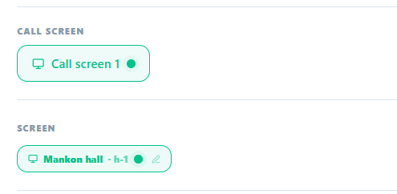*Figure 7.5 — Liste des écrans avec indicateurs d'état du signal* |

|          |                                                                                                                                                                                                                                                                        |
|----------|------------------------------------------------------------------------------------------------------------------------------------------------------------------------------------------------------------------------------------------------------------------------|
| **NOTE** | Le signal n'affecte pas l'appel des tickets si un écran se déconnecte, les agents peuvent toujours appeler les tickets normalement. Seul l'affichage est affecté. Les clients peuvent ne pas voir les numéros de tickets mis à jour jusqu'à la reconnexion de l'écran. |

## 7.5 Gestion des playlists

Les playlists sont le lien entre votre contenu média et vos écrans
physiques. Une playlist organise les éléments médias en une séquence
ordonnée et détermine ce qui est diffusé sur un écran. Vous pouvez créer
plusieurs playlists pour différentes campagnes, périodes ou zones
d'écran, et basculer entre elles instantanément.

### 7.5.1 Étape par étape : Créer une playlist

**Étape 1 :** Depuis la barre latérale, allez dans Gestion des
diffusions → Playlists.

**Étape 2 :** Cliquez sur « Créer une playlist ».

**Étape 3 :** Saisissez un Nom de playlist et une Description
optionnelle. Exemple : « Campagne Matinale – T1 2025 », « Boucle par
défaut Hall ».

**Étape 4 :** Cliquez sur Enregistrer. La playlist est créée vide.
Ajoutez-y des éléments médias à la Section 7.6

|                                                                                                                           |
|---------------------------------------------------------------------------------------------------------------------------|
| 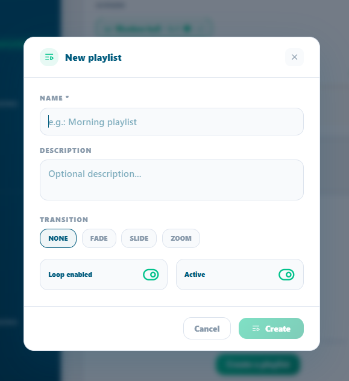*Figure 7.6 — Page de liste des playlists avec le bouton Ajouter une playlist*  |

### 7.5.2 Définir la playlist active d'un écran

Un écran peut avoir plusieurs playlists attachées, mais une seule est
active (en cours de diffusion) à tout moment.

**Étape 1 :** Ouvrez le profil de l'écran et allez dans l'onglet
Playlists.

**Étape 2 :** Trouvez la playlist que vous souhaitez activer et cliquez
simplement dessus ; elle deviendra automatiquement la liste en cours de
diffusion avec un bouton « en direct » dessus.

L'écran bascule vers la nouvelle playlist lors de son prochain cycle de
rafraîchissement de contenu (dans les 8 secondes).

|          |                                                                                                                                                                  |
|----------|------------------------------------------------------------------------------------------------------------------------------------------------------------------|
| **NOTE** | Changer la playlist active ne supprime ni ne détache la playlist précédente elle cesse simplement d'être diffusée. Vous pouvez revenir en arrière à tout moment. |

### 7.5.3 Réorganiser les playlists sur un écran

Lorsque plusieurs playlists sont attachées à un écran, vous pouvez
définir leur ordre de priorité. Cela détermine quelle playlist est
diffusée lorsque la playlist courante se termine ou est désactivée.

**Étape 1 :** Ouvrez le profil de l’ecran → onglet Playlists.

**Étape 2 :** Un bouton fléché est présent sur chaque onglet. Cliquez
sur la flèche vers le haut pour remonter et inversement.

**Étape 3 :** L'ordre est sauvegardé automatiquement.

### 7.5.4 Détacher ou supprimer une playlist d'un écran

**Étape 1 :** Ouvrez le profil de l'écran → onglet Playlists, OU ouvrez
la playlist → onglet Écrans.

**Étape 2 :** Trouvez l'icône de corbeille rouge et cliquez dessus pour
la supprimer.

**Étape 3 :** La suppression s'effectue automatiquement. Si la playlist
détachée était la playlist active, l'écran bascule vers la playlist
suivante dans l'ordre. Si aucune playlist ne reste, l'écran affiche une
zone de contenu vide.

## 7.6 Gestion des éléments médias

Les éléments médias sont les contenus individuels images ou vidéos qui
composent une playlist. Chaque élément possède une durée d'affichage,
une planification optionnelle et un statut qui contrôle s'il est
actuellement actif ou en pause.

### 7.6.1 Étape par étape : Ajouter un élément média à une playlist

**Étape 1 :** Ouvrez la playlist à laquelle vous souhaitez ajouter du
contenu.

**Étape 2 :** Faites défiler jusqu'à la section Éléments médias et
cliquez sur « Ajouter un média ».

**Étape 3 :** Remplissez les champs requis — vous pouvez également
ajouter des photos et des vidéos.

**Étape 4 :** Cliquez sur « Créer l'élément média ». L'élément est
ajouté à la playlist et commence à être diffusé immédiatement si la
playlist est actuellement active sur un écran.

**Étape 5 :** Répétez pour tous les éléments médias nécessaires.
Réorganisez-les si besoin.

<table>
<colgroup>
<col style="width: 100%" />
</colgroup>
<tbody>
<tr class="odd">
<td>

<em>Figure 7.7 — Formulaire d'importation d'élément média dans une
playlist</em>
</td>
</tr>
</tbody>
</table>

|         |                                                                                                                                                                                                                   |
|---------|-------------------------------------------------------------------------------------------------------------------------------------------------------------------------------------------------------------------|
| **TIP** | Gardez les fichiers images sous 2 Mo et les fichiers vidéo sous 50 Mo pour des performances optimales sur les écrans. Les fichiers volumineux causent des ralentissements et des temps de rafraîchissement lents. |

### 7.6.2 Référence des champs médias

| **Champs**        | **Description**                                                                                                                     | **Statut**       |
|-------------------|-------------------------------------------------------------------------------------------------------------------------------------|------------------|
| **Titre**         | Nom interne de cet élément média (ex. : « Bannière Ramadan 2025 »).                                                                 | **Obligatoire**  |
| **Type**          | Choisir entre texte, image ou vidéo.                                                                                                |                  |
| **Fichier média** | Le fichier image (JPG, PNG, GIF) ou vidéo (MP4) à afficher.                                                                         | **Obligatoire**  |
| **Durée**         | Durée d'affichage de cet élément avant de passer au suivant. En secondes (images uniquement les vidéos jouent leur durée complète). | **Obligatoire**  |
| **Contenu**       | Il s'agit du message publicitaire lorsque vous utilisez le type texte.                                                              | **Automatique**  |
| **Statut**        | Choisir entre Brouillon, Actif, En pause, Planifié, Archivé.                                                                        | **Choix manuel** |
| **Planification** | Fenêtre de temps optionnelle pendant laquelle cet élément est éligible à la diffusion. Voir Section 7.6.3.                          | **Optionnel**    |

### 7.6.3 Planifier un élément média

Les planifications permettent à un élément média d'être diffusé
uniquement pendant des fenêtres horaires spécifiques. En dehors de la
fenêtre planifiée, l'élément est automatiquement ignoré aucune
intervention manuelle n'est nécessaire.

**Étape 1 :** Ouvrez l'élément média que vous souhaitez planifier.

**Étape 2 :** Faites défiler jusqu'à la section Planifications et
cliquez sur « Ajouter une planification ».

**Étape 3 :** Définissez-la Date/Heure de début et là Date/Heure de fin
de la fenêtre de planification.

*Exemple : Début - Lundi 09h00, Fin - Lundi 17h00. L'élément ne sera
diffusé qu'entre 9h et 17h le lundi*.

**Étape 4 :** Cliquez sur Enregistrer la planification. Plusieurs
planifications peuvent être ajoutées à un même élément média pour des
fenêtres horaires récurrentes.

|                                                                                                                                                  |
|--------------------------------------------------------------------------------------------------------------------------------------------------|
| 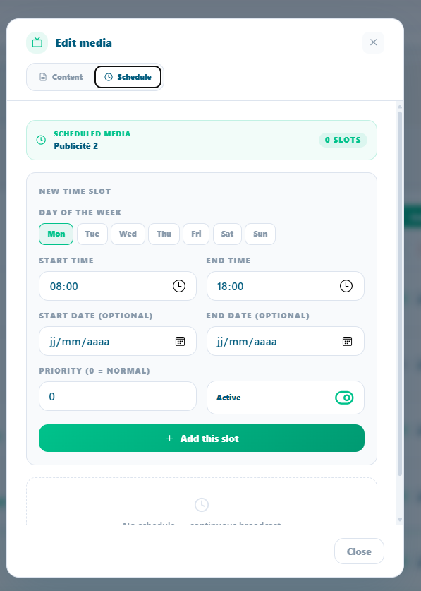*Figure 7.8 — Configuration de la planification d'un élément média avec les sélecteurs de date/heure*  |

|          |                                                                                                                                                                                                                                                                         |
|----------|-------------------------------------------------------------------------------------------------------------------------------------------------------------------------------------------------------------------------------------------------------------------------|
| **NOTE** | Si un élément média n'a pas de planification, il est diffusé à tout moment lorsque la playlist est active. Les planifications ne font que restreindre la diffusion elles ne forcent pas un élément média à être diffusé en dehors de son ordre normal dans la playlist. |

### 7.6.4 Gestion du statut des éléments médias

Vous pouvez activer ou désactiver des éléments médias individuels sans
les retirer de la playlist. Cela est utile pour mettre temporairement en
pause du contenu saisonnier sans le supprimer.

**Étape 1 :** Ouvrez la playlist et faites défiler jusqu'à la section
Éléments médias.

**Étape 2 :** Sur chaque onglet d'un élément média, vous trouverez une
flèche vers le haut ou vers le bas.

**Étape 3 :** Les modifications prennent effet au prochain cycle de
contenu de l'écran.

## 7.7 Résumé du chapitre

Ce chapitre a couvert l'ensemble du système de Diffusion d'écran dans
Queco de la compréhension de la mise en page des affichages à la
création des écrans, la construction des playlists, l'importation des
médias et la surveillance du lecteur. À présent, vous devriez être en
mesure de :

1.  Expliquer le rôle des deux zones d'affichage le Panneau publicitaire
    et le Panneau des tickets.

2.  Comprendre la hiérarchie Écran → Playlist → Élément média et leurs
    relations.

3.  Créer et configurer des écrans physiques avec les assignations de
    zones correctes.

4.  Créer des playlists, les attacher aux écrans et définir la playlist
    active.

5.  Importer des éléments médias, définir les durées d'affichage et
    configurer des planifications basées sur le temps.

6.  Utiliser la propagation pour diffuser une playlist sur tous les
    écrans de l'agence.

7.  Surveiller l'état des écrans via le signal de connexion.

*Chapter 8*

# Analytique & Reports

Comment lire et interpréter les tableaux de bord analytiques de Queco
comprendre les cartes KPI, les indicateurs de performance, les
classements d'agences, les graphiques de flux clients et les
répartitions par service, pour les Super Administrateurs et les
Responsables.

<table>
<colgroup>
<col style="width: 50%" />
<col style="width: 50%" />
</colgroup>
<thead>
<tr class="header">
<th>
<strong>In this chapter</strong>

8.1 Aperçu général 
8.2 Sélecteur de période 
8.3 Analytique Super Admin 
8.4 Analyse approfondie du classement des agences 
8.5 Analytique Responsable 
8.6 Graphiques Flux clients &amp; Répartition par service 
8.7 Référence des KPI 
8.8 Résumé du chapitre
</th>
<th>
<strong>After this chapter you will be able to</strong>

<ul>
<li>
Comprendre la différence entre les vues analytique du super Admin
et les Responsables
</li>
<li>
Utiliser le Sélecteur de période pour filtrer tous les widgets du
tableau de bord par plage de dates
</li>
<li>
Lire et interpréter toutes les cartes récapitulatives des KPI et
les cartes de performance réseau
</li>
<li>
Comprendre le tableau de classement des agences et le système de
médailles
</li>
<li>
Naviguer dans le tableau de bord du Responsable, y compris les
jauges et le widget Compteur Top/Flop
</li>
<li>
Lire le graphique en barres du flux clients et le graphique de
répartition par service
</li>
<li>
Rechercher la définition de n'importe quel indicateur dans le
tableau de référence des KPI
</li>
</ul></th>
</tr>
</thead>
<tbody>
</tbody>
</table>

## 8.1 Aperçu général

Le module Analytique offre aux parties prenantes de la plateforme une
visibilité en temps réel et historique sur les performances du réseau
d'agences. Il répond à trois questions essentielles : Combien de clients
avons-nous servis ? À quelle vitesse les avons-nous servis ? Quelles
agences et quels guichets sont les plus performants ?

L'Analytique est accessible depuis la barre latérale gauche. Le tableau
de bord affiché dépend entièrement de votre rôle le Super Administrateur
et le Responsable voient des vues complètement différentes, adaptées à
leur niveau d'autorité.

### 8.1.1 Accès a l’Analytics selon le role

| **Rôle**        | **Périmètre**                          | **Ce qu'ils voient**                                                                                                                                                             |
|-----------------|----------------------------------------|----------------------------------------------------------------------------------------------------------------------------------------------------------------------------------|
| **Super Admin** | Toute la plateforme toutes les agences | KPI à l'échelle du réseau, classement des agences avec médailles, volumes de tickets inter-agences, graphique de flux clients, répartition des services pour toutes les agences. |
| **Responsable** | Leur agence assignée uniquement        | Jauges de temps d'attente et de traitement, Top/Flop guichets, 5 cartes de performance propres à l'agence.                                                                       |
| **Agent**       | Aucun accès                            | Le module Analytique n'est pas disponible pour les agents. Les agents ne voient que le résumé de leur propre session à la fermeture d'un guichet.                                |

|          |                                                                                                                                                                 |
|----------|-----------------------------------------------------------------------------------------------------------------------------------------------------------------|
| **NOTE** | Le tableau de bord du Responsable est automatiquement limité à l'agence liée à son compte. Un Responsable ne peut pas consulter les données d'une autre agence. |

| *Figure 8.1 — Point d'entrée de l'Analytique dans la barre latérale et titre du tableau de bord selon le rôle*  |
|-----------------------------------------------------------------------------------------------------------------------------------------------------------|

## 8.2 Sélecteur de Période

En haut de chaque tableau de bord analytique pour les Super Admins comme
pour les Responsables se trouve le Sélecteur de Période. Ce filtre
temporel contrôle la plage de dates utilisée pour calculer tous les
widgets, cartes, graphiques et tableaux de la page simultanément.
Modifier la période met à jour toutes les données en une seule fois ; il
n'est pas nécessaire d'actualiser les widgets individuellement.

| *Figure 8.2 — Sélecteur de Période avec toutes les options visibles*  |
|-----------------------------------------------------------------------------------------------------------------|

| **Option de période**   | **Ce qu'elle couvre**                                           | **Utilisation typique**                                                                                          |
|-------------------------|-----------------------------------------------------------------|------------------------------------------------------------------------------------------------------------------|
| **Aujourd’hui**         | De minuit du jour en cours jusqu'au moment présent              | Suivi opérationnel en temps réel comment se passe la journée ?                                                   |
| **Cette semaine**       | Du lundi 00 :00 au moment présent (semaine calendaire en cours) | Bilan de performance hebdomadaire sommes-nous dans les objectifs ?                                               |
| **Ce mois**             | Du premier jour du mois en cours au moment présent              | Révision mensuelle des KPI comment évolue le mois ?                                                              |
| **Cette année**         | Du 1er janvier de l'année en cours au moment présent            | Vue d'ensemble annuelle et totaux depuis le début de l'année                                                     |
| **Plage personnalisée** | Toute date de début et de fin choisie par l'utilisateur         | Investigation ciblée — comparer une période de campagne, une saison festive ou une fenêtre d'incident spécifique |

| **TIP** | Utilisez *Aujourd'hui* pour les décisions opérationnelles en direct. Utilisez *Ce mois* pour les bilans de performance d'équipe. Utilisez *Plage personnalisée* pour les rapports de direction couvrant une période précise. |
|---------|------------------------------------------------------------------------------------------------------------------------------------------------------------------------------------------------------------------------------|

**TIP**

**TI**

**TIP**

| **NOTE** | Le filtre de période s'applique aux horodatages de création des tickets. Un ticket créé le lundi est comptabilisé dans « Cette semaine », même s'il a été clôturé le mardi. |
|----------|-----------------------------------------------------------------------------------------------------------------------------------------------------------------------------|

## 8.3 Tableau de bord Analytique Super Admin

Le tableau de bord Super Admin offre une vue d'ensemble de toute la
plateforme. Il agrège les données de toutes les agences, donnant une
image complète de la santé du réseau, des volumes et des performances à
tout moment.

<table>
<colgroup>
<col style="width: 100%" />
</colgroup>
<thead>
<tr class="header">
<th>

<em>Figure 8.3 — Tableau de bord Analytique Super Admin (vue
complète)</em>
</th>
</tr>
</thead>
<tbody>
</tbody>
</table>

### 8.3.1 Cartes KPI récapitulatives

Quatre cartes récapitulatives apparaissent tout en haut, chacune
affichant un indicateur à l'échelle du réseau pour la période
sélectionnée.

| **Carte**     | **Ce qu'elle affiche**                                                      | **Sous-texte affiché**                                     |
|---------------|-----------------------------------------------------------------------------|------------------------------------------------------------|
| Total Tickets | Tous les tickets créés dans toutes les agences sur la période sélectionnée. | Libellé de la période sélectionnée (ex. : « Aujourd'hui ») |
| Servis        | Tickets au statut TERMINÉ dans toutes les agences.                          | Taux de service % = Servis ÷ Total × 100                   |
| En attente    | Tickets au statut EN_ATTENTE ou EN_COURS dans toutes les agences.           | Nombre En cours affiché séparément                         |
| Annulés       | Tickets au statut ANNULÉ dans toutes les agences.                           | Nombre d'agences actives · agences inactives               |

### 8.3.2 Network Performance Panel 

Sous les cartes récapitulatives se trouve le panneau de performance
réseau 6 cartes de performance détaillées offrant une analyse plus
approfondie de l'ensemble du réseau.

| **Performance Card**   | **What It Measures**                                                            |
|------------------------|---------------------------------------------------------------------------------|
| **Total Tickets**      | Nombre cumulé de tickets sur la période indicateur principal de volume.         |
| **Tickets Servis**     | Tickets ayant atteint le statut TERMINÉ. Mesure principale du débit.            |
| **Tickets En Attente** | Tickets au statut EN_ATTENTE en file, pas encore appelés.                       |
| **Tickets En Cours**   | Tickets en cours de traitement par un agent (EN_COURS).                         |
| **Tickets Annules**    | Tickets annulés avant ou pendant le traitement.                                 |
| **Agences actives**    | Nombre d'agences avec is_active = true. Met en contexte les chiffres de volume. |

| *Figure 8.4 — Panneau de performance réseau avec 6 cartes de performance* |
|-------------------------------------------------------------------------------------------------------------------------------------------------|

| **TIP** | Surveillez *En attente* et *En cours* ensemble. Beaucoup En attente + Peu En cours = les guichets sont peut-être fermés ou en sous-effectif. Les deux élevés = agence à capacité maximale — envisagez d'ouvrir des guichets supplémentaires. |
|---------|----------------------------------------------------------------------------------------------------------------------------------------------------------------------------------------------------------------------------------------------|

## 8.4 Analyse approfondie du classement des agences

Le Classement des agences est la section la plus puissante du tableau de
bord Super Admin. Il présente chaque agence classée par performance,
offrant une vue immédiate des agences qui excellent et de celles qui
nécessitent une attention particulière.

| *Figure 8.5 — Classement des agences avec indicateurs de médailles, barres de progression et détails par agence* |
|----------------------------------------------------------------------------------------------------------------------------------------------------------------------------------------|

### 8.4.1 logique de tri du classement 

Les agences sont triées selon les règles de priorité suivantes :

1.  Les agences **actives** apparaissent toujours avant les agences
    **inactives**, quel que soit le volume de tickets.

2.  Parmi les agences actives : triées par **Tickets Servis**
    (décroissant) le plus grand volume en premier.

3.  Même nombre de Tickets Servis : triées **alphabétiquement** par nom
    d'agence (A→Z).

4.  Les agences inactives suivent les mêmes sous-règles entre elles, en
    bas du classement.

### 8.4.2 Systèmes des médailles 

Les 3 premières agences reçoivent une médaille une distinction visuelle
immédiatement reconnaissable pour les meilleures performances.

| **Position** | **Médaille** | **Style visuel**                                                                                       |
|--------------|--------------|--------------------------------------------------------------------------------------------------------|
| **1st**      | Or (🥇)      | Fond jaune (#FFF3CD), point doré (#F9A825). Surbrillance de ligne or chaud.                            |
| **2nd**      | Argent (🥈)  | Fond gris clair (#F4F4F4), point argenté (#AAB4C0). Surbrillance de ligne argent.                      |
| **3rd**      | Bronze (🥉)  | Fond orange chaud (#FDF0E8), point bronze (#CD7F32). Surbrillance de ligne bronze.                     |
| **4th+**     | Numéroté     | Lignes alternées blanc/bleu clair standard. Numéro de position affiché à la place de l'icône médaille. |

### 8.4.3 Lecture d’une ligne d’agence

| **Élément**            | **Signification**                                                                                                                                   |
|------------------------|-----------------------------------------------------------------------------------------------------------------------------------------------------|
| Icône Wifi / WifiOff   | Wifi vert = agence is_active : true (opérationnelle). WifiOff gris = is_active : false (suspendue).                                                 |
| Nom & Code de l'agence | Nom d'affichage en haut ; code unique de l'agence (ex. : AGC-001) en police monospace en dessous.                                                   |
| Barre de progression   | Remplissage proportionnel : Servis de cette agence ÷ Servis de l'agence en tête × 100. Barre à 100% = agence avec le plus grand volume.             |
| Servis                 | Tickets with FINISHED status for this agency in the selected period.                                                                                |
| En cours               | Tickets en cours de traitement (EN_COURS). Indique l'activité en direct.                                                                            |
| En attente             | Tickets en file non encore appelés (EN_ATTENTE). Des valeurs élevées peuvent signaler des problèmes de capacité.                                    |
| Annulés                | Tickets annulés. Des valeurs persistamment élevées peuvent indiquer des problèmes de processus ou d'effectif.                                       |
| Taux de service %      | Formule : Servis ÷ (Servis + En attente + En cours + Annulés) × 100. Arrondi à l'entier le plus proche. Principal indicateur de qualité par agence. |

| **NOTE** | Le Taux de service % utilise le total de tickets (tous statuts confondus) comme dénominateur. Une agence avec 80 servis et 20 en attente obtient un taux de 80% les 20 tickets en attente pèsent sur le taux même s'ils peuvent encore être traités. |
|----------|------------------------------------------------------------------------------------------------------------------------------------------------------------------------------------------------------------------------------------------------------|

| **TIP** | Un Taux de service élevé combiné à un nombre élevé d'Annulés est un signal d'alerte. Cela peut signifier que des agents annulent des tickets difficiles pour gonfler artificiellement le taux. Examinez toujours les Annulés et les Servis ensemble. |
|---------|------------------------------------------------------------------------------------------------------------------------------------------------------------------------------------------------------------------------------------------------------|

## 8.5 Tableau de bord Analytique Responsable

Le tableau de bord Responsable se concentre sur la qualité
opérationnelle des KPI temporels qui mesurent l'expérience client et
l'efficacité des guichets au sein de l'agence assignée au Responsable.
Contrairement à la vue Super Admin, il privilégie la profondeur à la
largeur.

|                                                                                                                                            |
|--------------------------------------------------------------------------------------------------------------------------------------------|
| *Figure 8.6 — Tableau de bord Analytique Responsable (vue complète)* |

### 8.5.1 Carte 1 : Temps d'attente médian (jauge circulaire)

Une jauge circulaire affichant le temps médian (en minutes) pendant
lequel les clients ont attendu avant que leur ticket soit appelé.

| **Élément**                  | **Explication**                                                                                                                                                                      |
|------------------------------|--------------------------------------------------------------------------------------------------------------------------------------------------------------------------------------|
| Valeur au centre de la jauge | Temps d'attente médian en minutes la valeur centrale lorsque tous les temps d'attente sont triés. La moitié des clients a attendu moins longtemps ; l'autre moitié, plus longtemps.  |
| Couleur de l'arc de la jauge | Ambre (#F59E0B). L'arc se remplit proportionnellement par rapport au maximum parmi : médiane, moyenne ou 60 minutes selon la valeur la plus élevée.                                  |
| Sous-texte sous la jauge     | Affiche le Temps d'attente moyen : « Moyenne : X min ». La moyenne peut être gonflée par des valeurs aberrantes ; la médiane est plus représentative de l'expérience client typique. |

### 8.5.2 Carte 2 : Temps de traitement médian (jauge circulaire)

Une jauge circulaire affichant le temps médian (en minutes) passé par
les agents à traiter un seul ticket, d’En cours à Clôturé.

| **Element**                  | **Explanation**                                                                                                                                                  |
|------------------------------|------------------------------------------------------------------------------------------------------------------------------------------------------------------|
| Valeur au centre de la jauge | Temps de traitement médian en minutes — durée de traitement du ticket central.                                                                                   |
| Couleur de l'arc de la jauge | Violet (#8B5CF6). L'arc se remplit par rapport au maximum parmi : médiane, moyenne ou 30 minutes.                                                                |
| Sous-texte sous la jauge     | Affiche le Temps de traitement moyen pour comparaison. Comparer moyenne et médiane permet de détecter les valeurs aberrantes qui tirent la moyenne vers le haut. |

|          |                                                                                                                                                                                                                                                                                                                        |
|----------|------------------------------------------------------------------------------------------------------------------------------------------------------------------------------------------------------------------------------------------------------------------------------------------------------------------------|
| **NOTE** | Médiane vs Moyenne : Si 9 clients attendent 5 minutes et 1 client attend 60 minutes, la moyenne est de 10,5 min mais la médiane est de 5 min. La médiane reflète la véritable expérience du client typique. Les deux sont affichées afin que les responsables puissent détecter et analyser les situations aberrantes. |

### 8.5.3 Carte 3 : Top / Flop Guichet

Compare le guichet le plus performant et le moins performant selon le
nombre de tickets servis sur la période sélectionnée principal
indicateur de performance des agents pour les responsables.

| **Element**               | **Explanation**                                                                                                                                         |
|---------------------------|---------------------------------------------------------------------------------------------------------------------------------------------------------|
| Guichet Top (gauche)      | Guichet avec le plus grand nombre de tickets au statut TERMINÉ. Nom de l'agent affiché avec une flèche verte vers le haut (↑) et son nombre de tickets. |
| Guichet Flop (droite)     | Guichet avec le plus petit nombre de tickets au statut TERMINÉ. Nom de l'agent affiché avec une flèche rouge vers le bas (↓) et son nombre.             |
| Barre de progression      | Barre de ratio: Tickets Top ÷ (Tickets Top + Tickets Flop). Entièrement verte à gauche = déséquilibre extrême. Centrée = performances similaires.       |
| Identification de l'agent | Nom résolu dans cet ordre : Prénom de l'agent (profil) → Nom du guichet → Préfixe e-mail → ID du guichet (6 premiers caractères).                       |

|         |                                                                                                                                                                                                                                                       |
|---------|-------------------------------------------------------------------------------------------------------------------------------------------------------------------------------------------------------------------------------------------------------|
| **TIP** | Le Guichet Flop n'est pas automatiquement un problème. Il peut gérer des opérations VIP complexes, avoir ouvert tardivement, ou traiter moins de tickets mais plus longs. Analysez toujours le contexte avant d'agir sur les seules données Top/Flop. |

### 8.5.4 Panneau de performance de l'agence

Sous les 3 cartes récapitulatives, le Responsable voit 5 Cartes de
performance identiques en structure au panneau réseau du Super Admin,
mais limitées exclusivement à son agence.

| **Carte de performance** | **Ce qu'elle mesure (périmètre de l'agence)**                         |
|--------------------------|-----------------------------------------------------------------------|
| **Total Tickets**        | Tous les tickets créés pour cette agence sur la période sélectionnée. |
| **Tickets Servis**       | Tickets au statut TERMINÉ pour cette agence.                          |
| **Tickets En attente**   | Tickets au statut EN_ATTENTE pour cette agence.                       |
| **Tickets En Cours**     | Tickets actuellement EN_COURS pour cette agence.                      |
| **Tickets Annules**      | Tickets au statut ANNULÉ pour cette agence.                           |

## 8.6 Graphiques : Flux Clients & Répartition par Service

Les deux tableaux de bord incluent deux graphiques en bas de page le
graphique en barres du Flux clients et la Répartition par service. Ils
apportent le contexte visuel derrière les chiffres KPI.

### 8.6.1 Graphique en barres du Flux Clients

Affiche le volume de tickets dans le temps combien de tickets ont été
créés à chaque intervalle de temps au sein de la période sélectionnée.
C'est l'outil principal pour identifier les heures de pointe, les
périodes creuses et les tendances journalières.

| **Role**        | **Chart Scope**                         | **Time Granularity**                                                |
|-----------------|-----------------------------------------|---------------------------------------------------------------------|
| **Super Admin** | Toutes agences combinées — total réseau | Par heure pour Aujourd'hui/Semaine, par jour pour Mois/Année        |
| **Manager**     | Leur agence uniquement                  | Par heure pour Aujourd'hui, par jour pour les périodes plus longues |

Comment lire le graphique en barres :

- Chaque barre = un intervalle de temps (heure ou jour selon la période
  sélectionnée).

- Hauteur de la barre = nombre de tickets créés sur cet intervalle.

- Barres plus hautes = pic de demande utile pour les décisions de
  planification du personnel.

- Périodes plates ou vides = faible demande bonnes fenêtres pour les
  pauses ou la fermeture de guichets.

|                                                                                                                                                   |
|---------------------------------------------------------------------------------------------------------------------------------------------------|
| *Figure 8.8 — Graphique en barres du Flux Clients (vue Responsable — détail horaire pour Aujourd'hui)*  |

|         |                                                                                                                                                                                               |
|---------|-----------------------------------------------------------------------------------------------------------------------------------------------------------------------------------------------|
| **TIP** | Consultez le graphique de flux le lundi matin pour identifier vos heures les plus chargées. Planifiez les guichets en amont avant le pic pas après que la file d'attente se soit déjà formée. |

### 8.6.2 Répartition par Service

Affiche la distribution du volume de tickets par type de service sur la
période sélectionnée. Répond à la question : lequel de nos services
génère le plus de demande ?

Comment lire la répartition par service :

- Chaque segment représente un service (ex. : Gestion de compte,
  Services de prêt).

- La taille du segment est proportionnelle à la part de ce service dans
  le total des tickets, exprimée en pourcentage.

- Les services dominants indiquent où concentrer les effectifs et les
  ressources de guichet.

- Les services à très faible volume peuvent faire l'objet d'une révision
  sont-ils encore nécessaires ? Les agents savent-ils qu'ils existent ?

|                                                                                                                                                         |
|---------------------------------------------------------------------------------------------------------------------------------------------------------|
| *Figure 8.9 — Répartition par service affichant la distribution proportionnelle entre les types de services*  |

|          |                                                                                                                                                                                                       |
|----------|-------------------------------------------------------------------------------------------------------------------------------------------------------------------------------------------------------|
| **NOTE** | La répartition par service comptabilise tous les statuts de tickets pas seulement les Servis. Cela donne une image fidèle de la demande réelle, y compris les tickets annulés ou toujours en attente. |

## 8.7 Référence des KPI

Ce tableau de référence définit chaque indicateur du module Analytique
Queco sa signification, son mode de calcul et le rôle qui peut le
consulter.

| **KPI Name**                    | **Unit**    | **Definition & Formula**                                                                                                                              | **Who Sees It** |
|---------------------------------|-------------|-------------------------------------------------------------------------------------------------------------------------------------------------------|-----------------|
| **Total Tickets**               | Nombre      | Tous les tickets créés sur la période — tous statuts inclus.                                                                                          | Les deux        |
| **Tickets Servis**              | nombre      | statut = TERMINÉ.                                                                                                                                     | Les deux        |
| **Tickets En attente**          | Nombre      | statut = EN_ATTENTE (en file, pas encore appelé).                                                                                                     | Les deux        |
| **Tickets En cours**            | **Count**   | statut = EN_COURS (agent en cours de traitement).                                                                                                     | Les deux        |
| **Tickets Annulés**             | **Count**   | statut = ANNULÉ.                                                                                                                                      | Les deux        |
| **Taux de service %**           | **%**       | Servis ÷ (Servis + En attente + En cours + Annulés) × 100. Arrondi à l'entier le plus proche.                                                         | Les deux        |
| **Agences Actives**             | **Nombre**  | Agences où is_active = true.                                                                                                                          | **Super Admin** |
| **Agences Inactives**           | **Count**   | Total agencies − Active agencies.                                                                                                                     | **Super Admin** |
| **Barre de progression agence** | **%**       | Servis de l'agence ÷ Servis max (agence en tête du classement) × 100. Comparaison relative pas un indicateur absolu.                                  | **Super Admin** |
| **Temps d'attente médian**      | **Minutes** | 50e percentile de wait_minutes sur tous les tickets de la période. Plus représentatif que la moyenne pour les distributions asymétriques.             | **Responsable** |
| **Temps d'attente moyen**       | **Minutes** | Somme de wait_minutes ÷ nombre de tickets. Peut être gonflé par des temps d'attente aberrants.                                                        | **Responsable** |
| **Temps de traitement médian**  | **Minutes** | 50e percentile de processing_minutes. Durée de traitement du ticket central, de En cours à Clôturé.                                                   | **Responsable** |
| **Temps de traitement moyen**   | **Minutes** | Somme de processing_minutes ÷ nombre de tickets.                                                                                                      | **Responsable** |
| **Guichet Top**                 | **Nombre**  | Guichet avec le plus grand nombre de tickets TERMINÉS sur la période. Identifié par prénom de l'agent → nom du guichet → préfixe e-mail → préfixe ID. | **Responsable** |
| **Flop Counter**                | **Nombre**  | Guichet avec le plus petit nombre de tickets TERMINÉS sur la période.                                                                                 | **Responsable** |

### 8.7.1 Format d'affichage des durées

Les temps d'attente et de traitement sont affichés comme suit sur toute
la plateforme :

| **Valeur brute**       | **Affichage**                       |
|------------------------|-------------------------------------|
| Moins d'1 minute       | « X sec » — ex. : « 45 sec »        |
| **1 to 59 minutes**    | 'X min’ — ex., '12 min'             |
| **60 minutes ou plus** | 'Xh Ymin’ — ex., '1h 30min' or '2h' |
| **Zero or null**       | '0 min'                             |

## 8.8 Résumé du Chapitre

Ce chapitre a couvert l'ensemble du module Analytique & Rapports de
l'accès selon les rôles jusqu'à chaque définition de KPI. Vous devriez
maintenant être en mesure de :

1.  Expliquer la différence entre les tableaux de bord analytiques du
    Super Admin et du Responsable, ainsi que leurs périmètres
    respectifs.

2.  Utiliser le Sélecteur de Période pour filtrer toutes les données du
    tableau de bord par Aujourd'hui, Semaine, Mois, Année ou une plage
    de dates personnalisée.

3.  Lire et interpréter les 4 cartes KPI récapitulatives du Super Admin
    et les 6 cartes de performance réseau.

4.  Comprendre la logique de tri du Classement des agences, le système
    de médailles et comment lire chaque élément d'une ligne d'agence.

5.  Interpréter les jauges circulaires de Temps d'attente médian et de
    Temps de traitement médian du Responsable, y compris la distinction
    médiane/moyenne.

6.  Utiliser le widget Top/Flop Guichet de manière appropriée, en
    comprenant son contexte et ses limites.

7.  Lire le graphique en barres du Flux clients et la Répartition par
    service pour les deux rôles.

8.  Rechercher la définition, la formule et le niveau d'accès de
    n'importe quel KPI dans le tableau de référence de la Section 8.7.
