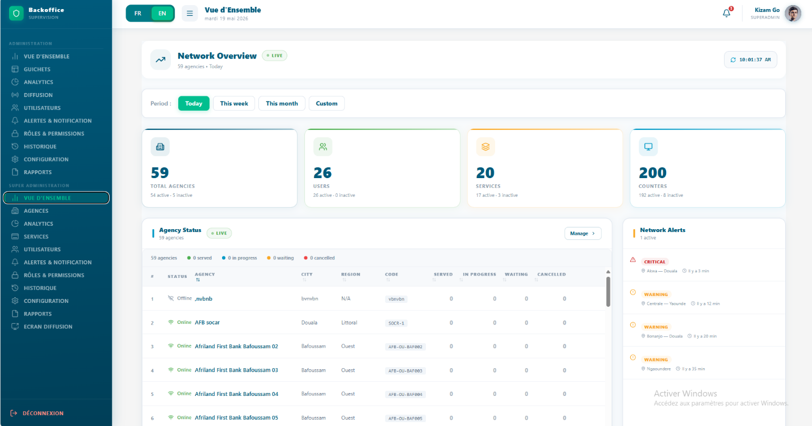
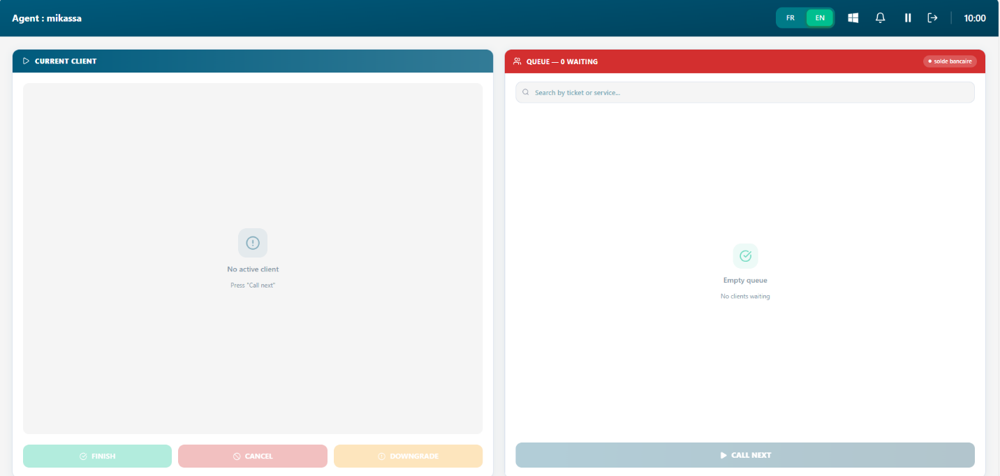

# Getting Started

*How to access Queco, log in securely, navigate the interface, and
understand your personalized dashboard.*

<table>
<colgroup>
<col style="width: 50%" />
<col style="width: 50%" />
</colgroup>
<thead>
<tr class="header">
<th>
<strong>In This Chapter</strong>

<ul>
<li>
2.1 Accessing the Platform
</li>
<li>
2.2 Logging In Step by Step
</li>
<li>
2.3 Login Errors &amp; Troubleshooting
</li>
<li>
2.4 Navigating the Interface
</li>
<li>
2.5 Your Dashboard Overview
</li>
</ul></th>
<th>
<strong>After this chapter you will be able to</strong>

<ul>
<li>
Open Queco in Your browser
</li>
<li>
Log in with your credentials
</li>
<li>
Recover from a failed login
</li>
<li>
Identify key UI elements
</li>
<li>
Read your role-specific dashboard
</li>
</ul></th>
</tr>
</thead>
<tbody>
</tbody>
</table>

## 2.1 Accessing the Platform

Queco is a web-based application with no installation is required. You
access it directly from your web browser using the URL provided by your
organization's administrator.

### 2.1.1 what you need before you start

Before logging in, make sure you have the following:

| **\#** | **Prerequisite**                  | **Where to Get It**                                    |
|--------|-----------------------------------|--------------------------------------------------------|
| **1**  | **Queco platform URL**            | Provided by your Super Admin                           |
| **2**  | **Your username (email address)** | Sent to you by the Super Admin during account creation |
| **3**  | **Your temporary password**       | Included in your account setup email                   |
| **4**  | **A supported web browser**       | Chrome 110+, Firefox 110+, Edge 110+, or Safari 16+    |
| **5**  | **Stable internet connection**    | Minimum 2 Mbps broadband recommended                   |

| **NOTE** | If you have not received your login credentials, contact your Super Admin or system administrator before proceeding. |
|----------|----------------------------------------------------------------------------------------------------------------------|

### 2.1.2 Opening the platform 

**Step1:** Open your web browser

> *Use a supported browser (Chrome, Firefox, Edge, or Safari).*

**Step 2:** Type the Queco URL in the address bar and press Enter

> *Example: https://app.queco.io your organization may use a custom
> subdomain.*

**Step 3** Wait for login page to load.

> *You should see the Queco login screen with fields for username and
> password.*

## 2.2 Logging In step by step

The login process is straightforward and takes less than 30 seconds.
Follow these steps every time you need to access Queco.

**Step 1** On the login page, locate the Username field.

> Enter your registered email address exactly as provided by the Super
> Admin. Usernames are **not case-sensitive**.

**Step 2** Click on the Password field and enter your password.

> Passwords are Not case-sensitive. It must start with a capital Letter

| *Figure 2.2: Login form with username and password fields highlighted*  |
|-------------------------------------------------------------------------------------------------------------------|

**Step 3** Click the Login button (or press Enter on your keyboard).

> The system will validate your credentials. This typically takes 1-3
> seconds.

**Step 4** Upon successful authentication, you will be redirected to
your Dashboard.

> The dashboard displayed is specific to your role **Super Admin,
> Manager, or Agent.** See Section 2.5 for a breakdown of each
> dashboard.

| *Figure 2.3 — Successful login redirect to Dashboard*  |
|--------------------------------------------------------------------------------------------------|

### 2.2.1 Login Form Field Reference:

A summary of all fields on the login form:

| **Field**    | **Description**                                                         | **Status**   |
|--------------|-------------------------------------------------------------------------|--------------|
| **Username** | Your registered email address (e.g., agent@myagency.com)                | **Required** |
| **Password** | Your account password. Hidden by default; click the eye icon to reveal. | **Required** |

| **WARNING** | Never share your Queco password with colleagues. Each user must have their own account. Shared credentials compromise audit logs and accountability. |
|-------------|------------------------------------------------------------------------------------------------------------------------------------------------------|

## 2.3 Login Errors & Troubleshooting

If your login attempt is unsuccessful, Queco will display an error
message on the login page. The table below lists all possible error
scenarios, their causes, and recommended actions.

| **Error Message**                                    | **Likely Cause**                                                    | **What To Do**                                                                                                 |
|------------------------------------------------------|---------------------------------------------------------------------|----------------------------------------------------------------------------------------------------------------|
| *Invalid username or password.*                      | Incorrect credentials entered.                                      | Re-enter your email and password carefully. Check Caps Lock. Try copy-pasting your password to rule out typos. |
| *Account locked. Please contact your administrator.* | 3 consecutive failed login attempts triggered an automatic lockout. | Contact your Super Admin or Manager to unlock your account. Lockouts reset after 30 minutes.                   |
| *Account is inactive.*                               | Your account was deactivated by an admin.                           | Contact your Super Admin to reactivate your account.                                                           |
| *Session expired. Please log in again.*              | Your previous session timed out after inactivity (default: 30 min). | Return to the login page and log in again. This is normal behavior.                                            |
| *Unable to connect to server.*                       | Network issue or server maintenance.                                | Check your internet connection. If the issue persists, contact your IT support team.                           |

### 2.3.1 Account Lockout Procedure

After 5 consecutive failed OTP, the OTP will be expired and you have to
login again. After a failed OTP and going back to login it won’t be
possible it will display OTP resend cooldown active

**Step 1**: Wait for 30 seconds

> *The lockout resets automatically after 30 seconds to 1 minutes of
> inactivity.*

**Step 2:** Alternatively, contact your Super Admin or Manager
immediately.

> *They can unlock your account from the User Management panel without
> waiting for the timer.*

**Step 3:** Once unlocked, return to the login page and try again with
the correct credentials.

| **NOTE** | All lockout events are logged in the platform audit trail and are visible to Super Admins. |
|----------|--------------------------------------------------------------------------------------------|

### 2.3.2 Resetting Your Password

All password forgotten are resetted by the Super Admin. So, contact the
super admin to reset your password

## 2.4 Navigating the interface

After logging in, you will see the Queco interface. The layout is
consistent across all user roles, though the available menu items and
content will vary depending on your permission. This is section describe
the core UI component present on every page.

###  2.4.1 Interface layout Overview

| **UI Element**         | **Description**                                                                                                                     |
|------------------------|-------------------------------------------------------------------------------------------------------------------------------------|
| **Top Navigation Bar** | Persistent bar at the top of every page. Contains the Queco logo, the current page title, notification bell, and user profile menu. |
| **Left Sidebar Menu**  | Main navigation panel listing all sections accessible to your role. Collapse on smaller screens.                                    |
| **Main Content Area**  | The central workspace where data, forms, and tables are displayed. This area changes based on the selected menu item.               |
| **Action Buttons**     | Context-sensitive buttons (Add, Edit, Delete, Save, Cancel) appear in the top-right of the content area.                            |
| **Notification Bell**  | Displays real-time alerts such as ticket assignments, system messages, and admin notifications.                                     |
| **User Profile Menu**  | Top-right corner. Access your profile settings,                                                                                     |

### 2.4.2 Left sidebar Navigation menu

The left sidebar is your primary navigation tool. The menu items visible
to you depend on your role. The table below shows which menu sections
are available per role.

| **Menu Section**          | **Super Admin** | **Manager** | **Agent** |
|---------------------------|-----------------|-------------|-----------|
| **Dashboard**             | ✔               | ✔           | ✔         |
| **Agencies**              | ✔               | ✘           | ✘         |
| **Users & Roles**         | ✔               | Limited     | ✘         |
| **Counters (Guichets)**   | ✔               | ✔           | ✘         |
| **Services & Operations** | ✔               | ✔           | ✘         |
| **History Tickets**       | ✔               | ✔           | ✔         |
| **Analytics**             | ✔               | ✔           | ✘         |
| **Settings**              | ✔               | Limited     | ✘         |

| **NOTE** | Menu items shown as 'Limited' indicate read-only or scoped access. For example, a manager can view users in their agency but cannot create users across all agencies. |
|----------|-----------------------------------------------------------------------------------------------------------------------------------------------------------------------|

### 2.4.3 Logging Out

Always log out of Queco when you are done working, especially on shared
or public computers.

**Step 1:** As agent in the agent’s dashboard, the logout is situated on
the top right-hand corner. Just click it and you will be logout and
directed back to the login page.

As super admin or chef d’agence, the logout button is at the bottom left
of the side bar. Just click it and you will be redirected to login page

| **WARNING** | Sessions automatically expire after 30 minutes of inactivity. |
|-------------|---------------------------------------------------------------|

## 2.5 Your Dashboard Overview

The Dashboard is the first page you see after logging in. It is
personalized to your role and provides a real-time snapshot of platform
activity. The content displayed varies significantly between roles what
a Super Admin sees differs from what an Agent sees.

### 2.5.1 Super Admin Dashboard

The Super Admin dashboard provides a global view of the entire platform.

<table>
<colgroup>
<col style="width: 100%" />
</colgroup>
<thead>
<tr class="header">
<th>

<em>Figure 2.6 Super Admin Dashboard</em>
</th>
</tr>
</thead>
<tbody>
</tbody>
</table>

<table>
<colgroup>
<col style="width: 25%" />
<col style="width: 74%" />
</colgroup>
<thead>
<tr class="header">
<th><strong>UI Element</strong></th>
<th><strong>Description</strong></th>
</tr>
</thead>
<tbody>
<tr class="odd">
<td><strong>Top Navigation Bar</strong></td>
<td>Persistent header displayed at the top of the platform. Contains the
language switcher (FR/EN), menu toggle button, current page title (“Vue
d’Ensemble”), date display, notification bell, and logged-in user
profile information.</td>
</tr>
<tr class="even">
<td><strong>Left Sidebar Menu</strong></td>
<td><table>
<colgroup>
<col style="width: 100%" />
</colgroup>
<tbody>
</tbody>
</table>
<table>
<colgroup>
<col style="width: 100%" />
</colgroup>
<thead>
<tr class="header">
<th>Vertical navigation panel located on the left side of the screen.
Provides access to all major modules such as Vue d’Ensemble, Guichets,
Analytics, Diffusion, Utilisateurs, Alertes &amp; Notifications, Roles
&amp; Permissions, Historique, Configuration, and Rapports</th>
</tr>
</thead>
<tbody>
</tbody>
</table>

Collapse on smaller screens.
</td>
</tr>
<tr class="odd">
<td><strong>Main Content Area</strong></td>
<td>Central workspace where all dashboard information is displayed,
including overview cards, statistics, agency status tables, alerts, and
management tools. The content updates depending on the selected
module.</td>
</tr>
<tr class="even">
<td><strong>Overview Cards</strong></td>
<td>Summary statistic cards displayed below the header section. Show key
platform metrics such as total agencies, users, services, and counters,
including active and inactive counts.</td>
</tr>
<tr class="odd">
<td><strong>Period filter Buttons</strong></td>
<td>Context filter buttons (“Today”, “This week”, “This month”,
“Custom”) allowing users to change the reporting period for displayed
statistics and data.</td>
</tr>
<tr class="even">
<td><strong>Notification Bell</strong></td>
<td>Located at the top-right corner. Displays unread notifications and
system alerts in real time.</td>
</tr>
<tr class="odd">
<td><strong>User Profile Menu</strong></td>
<td><table>
<colgroup>
<col style="width: 100%" />
</colgroup>
<thead>
<tr class="header">
<th>Located at the top-right corner beside the notification bell.
Displays the logged-in user’s name, role, and profile avatar, with
access to account-related actions.</th>
</tr>
</thead>
<tbody>
</tbody>
</table>
<table>
<colgroup>
<col style="width: 100%" />
</colgroup>
<tbody>
</tbody>
</table></td>
</tr>
<tr class="even">
<td><strong>Agency Status Table</strong></td>
<td><table>
<colgroup>
<col style="width: 100%" />
</colgroup>
<tbody>
</tbody>
</table>
<table>
<colgroup>
<col style="width: 100%" />
</colgroup>
<thead>
<tr class="header">
<th>Real-time monitoring table displaying agencies, their operational
status, city, region, code, and ticket processing statistics such as
served, waiting, in progress, and cancelled tickets.</th>
</tr>
</thead>
<tbody>
</tbody>
</table></td>
</tr>
<tr class="odd">
<td><strong>Action Buttons</strong></td>
<td>Contextual buttons such as “Manage” displayed within dashboard
sections, allowing quick access to configuration and management
actions.</td>
</tr>
</tbody>
</table>

### 2.5.2 Manager Dashboard

The Manager dashboard is scoped to the agency or agencies the manager
oversees.

| *Figure 2.7 — Manager Dashboard* |
|-------------------------------------------------------------------------------------------------------|

<table>
<colgroup>
<col style="width: 29%" />
<col style="width: 70%" />
</colgroup>
<thead>
<tr class="header">
<th><strong>Widget / Section</strong></th>
<th><strong>What It Shows</strong></th>
</tr>
</thead>
<tbody>
<tr class="odd">
<td><strong>Statistics Overview Cards</strong></td>
<td><table>
<colgroup>
<col style="width: 100%" />
</colgroup>
<thead>
<tr class="header">
<th>Summary cards displayed at the top of the dashboard showing key
queue metrics including tickets waiting, tickets in progress, customers
served today, cancelled tickets, and service rate percentage.</th>
</tr>
</thead>
<tbody>
</tbody>
</table>
<table>
<colgroup>
<col style="width: 100%" />
</colgroup>
<tbody>
</tbody>
</table></td>
</tr>
<tr class="even">
<td><strong>Guichet Status Panel</strong></td>
<td><table>
<colgroup>
<col style="width: 100%" />
</colgroup>
<thead>
<tr class="header">
<th>Operational monitoring section displaying the real-time status of
each guichet/counter, assigned agent, and availability state. Each card
indicates whether the guichet is currently available or occupied.</th>
</tr>
</thead>
<tbody>
</tbody>
</table>
<table>
<colgroup>
<col style="width: 100%" />
</colgroup>
<tbody>
</tbody>
</table></td>
</tr>
<tr class="odd">
<td><strong>Queue by Service section</strong></td>
<td><table>
<colgroup>
<col style="width: 100%" />
</colgroup>
<thead>
<tr class="header">
<th>Displays queue statistics grouped by service category such as
savings accounts, credit, online deposit, and account balance inquiries,
including the number of clients currently waiting.</th>
</tr>
</thead>
<tbody>
</tbody>
</table>
<table>
<colgroup>
<col style="width: 100%" />
</colgroup>
<tbody>
</tbody>
</table></td>
</tr>
<tr class="even">
<td><strong>Logout Button</strong></td>
<td><table>
<colgroup>
<col style="width: 100%" />
</colgroup>
<thead>
<tr class="header">
<th>Located at the bottom-left of the sidebar. Allows the current user
to securely disconnect from the platform.</th>
</tr>
</thead>
<tbody>
</tbody>
</table>
<table>
<colgroup>
<col style="width: 100%" />
</colgroup>
<tbody>
</tbody>
</table></td>
</tr>
</tbody>
</table>

### 2.5.3 Agent (Guichetier) Dashboard

The Agent dashboard is focused and minimal it shows exactly what an
agent needs to start working.

| *Figure 2.8: Agent Dashboard* |
|----------------------------------------------------------------------------------------------------|

| **Widget / Section**     | **What It Shows**                                                                                                                                                             |
|--------------------------|-------------------------------------------------------------------------------------------------------------------------------------------------------------------------------|
| **Agent Header**         | Displays the logged-in agent's name (e.g., "Agent: mikassa"), language switcher (FR/EN), notification bell, pause, and logout icons along with the current time               |
| **Current client panel** | The left panel showing the client currently being served. When idle, displays "No active client / Press Call next" as a placeholder.                                          |
| **Queue Panel**          | The right panel showing all waiting tickets for this agent's counter. Displays the queue count (e.g., "Queue 0 Waiting") and the active service tag (e.g., "solde bancaire"). |
| **Search bar**           | Located inside the Queue panel — allows the agent to search waiting tickets by ticket number or service name.                                                                 |
| **Action Button**        | Three buttons at the bottom of the Current Client panel: **Finish** (green), **Cancel** (red/pink), and **Downgrade** (yellow) for resolving the current ticket.              |
| **Call Next button**     | A prominent button at the bottom of the Queue panel triggers calling the next waiting ticket to this counter. Greyed out when the queue is empty.                             |
| **Empty queue state**    | Shown when no clients are waiting displays a checkmark icon with "Empty queue / No clients waiting".                                                                          |

**  
**

*Chapter 3*

