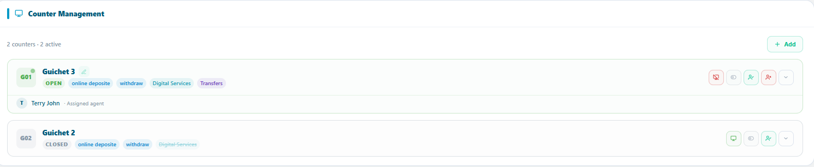
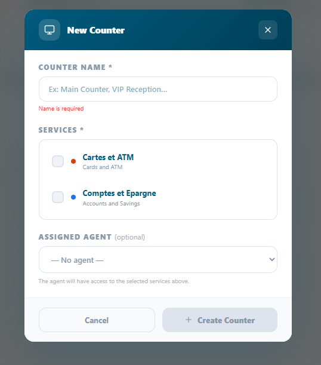

# Counter (Guichet) Management

*How to create, configure, assign, and operate service counters the
front-line service points where agents process customer tickets.*

<table>
<colgroup>
<col style="width: 50%" />
<col style="width: 50%" />
</colgroup>
<tbody>
<tr class="odd">
<td>
<strong>In this chapter</strong>

<ul>
<li>
4.1 What is a Counter ?
</li>
<li>
4.2 Creating a Counter
</li>
<li>
4.3 Assigning Counters to Agents
</li>
<li>
4.4 Opening &amp; Closing a Counter
</li>
<li>
4.5 Managing Counters
</li>
<li>
4.6 Counter Best Practices
</li>
</ul></td>
<td>
<strong>After this chapter you will be able to</strong>

<ul>
<li>
Understand the counter's role in Queco
</li>
<li>
Create a new counter in an agency
</li>
<li>
Assign an agent to a counter
</li>
<li>
Open and close a counter for daily operations
</li>
<li>
Edit, deactivate, and delete counters
</li>
<li>
Apply best practices for optimal queue flow
</li>
</ul></td>
</tr>
</tbody>
</table>

## 4.1 What is a counter?

A counter also referred to as a guichet is a designated service point
within an agency where customer tickets are received and processed. In a
physical office, a counter corresponds to a desk or service window. In a
virtual or hybrid environment, it represents a digital service channel
assigned to a specific agent.

Counters are the operational core of Queco. Every ticket that enters the
system is eventually routed to a counter, where it is called, processed,
and closed by an assigned agent. Without at least one open counter, no
tickets can be served.

### 4.1.1 Counter Status Model

Every counter in Queco has one of four statuses at any given time.
Understanding these statuses is essential for both agents managing their
workstation and managers monitoring queue flow.

| **Status** | **Color Indicator** | **What It Means**                                                                                                    |
|------------|---------------------|----------------------------------------------------------------------------------------------------------------------|
| **Open**   | Green               | The counter is active and available. Tickets are being routed to it. The agent is logged in and ready.               |
| **Pause**  | Amber               | The counter is temporarily on break (e.g., lunch). No new tickets are routed to it. It can be reopened by the agent. |
| **Close**  | Gray                | The counter is offline. No tickets can be routed to it. Typical at end of shift or when a counter is decommissioned. |

***NB: All counters are open or closed of a particular agency is done by
the super admin or anyone that has the role of managing a counter***

|                                                                                                                                |
|--------------------------------------------------------------------------------------------------------------------------------|
| *Figure 4.1 — Counter status grid on Manager Dashboard (color-coded Open / Closed)*  |

## 4.2 Creating a Counter

Counters must be created before agents can begin processing tickets.
Only Super Admins and Manager can create and assign counters to a
particular user in an agency. Each counter belongs to exactly one agency
and one user and can handle one or more services.

### 4.2.1 Step by Step: Create a New Counter 

**Step 1:** From the left side bar click agency

> *The list off list agency active will appear*

**Step 2:** Choose the specific agency u want to create a counter in and
click on in

**Step 3:** Go to counter management and click the “+Add” green button
at the top corner in the card

**Step 4:** a pop-up form will appear, fill all the requirement

**Step 5:** In the Services section, select all services this counter is
authorized to handle.

> *A counter must be linked to at least one service to receive ticket
> routing.*

**Step 6:** Optionally assign an agent in the Assigned User field.

*You can also assign the agent later*

**Step 7:** Click Save.

> *The counter is created in Closed status. It will not receive tickets
> until an admin opens it.*

<table>
<colgroup>
<col style="width: 100%" />
</colgroup>
<tbody>
<tr class="odd">
<td>

<em>Figure 4.2 — New Counter creation form with all
fields</em>
</td>
</tr>
</tbody>
</table>

|         |                                                                                                                                                                                                                 |
|---------|-----------------------------------------------------------------------------------------------------------------------------------------------------------------------------------------------------------------|
| **TIP** | Name your counters clearly and consistently (e.g., 'Counter A', 'Window 3', 'Desk – Payments'). Agents see their counter name on their dashboard every day — good naming reduces confusion during busy periods. |

### 4.2.2 Counter Form Field Reference

| **Field**         | **Description**                                                                        | **Status**   |
|-------------------|----------------------------------------------------------------------------------------|--------------|
| **Counter Name**  | Display name shown to agents on their dashboard and on customer display screens.       | **Required** |
| **Assigned User** | The agent responsible for this counter. Can be left blank and assigned later.          | **Optional** |
| **Services**      | One or more services this counter can handle. Only linked services route tickets here. | **Required** |

|             |                                                                                                                |
|-------------|----------------------------------------------------------------------------------------------------------------|
| **WARNING** | If you create and assign a counter to the wrong agency, you must delete and recreate it in the correct agency. |

## 4.3 Assign Counters to Agents

Each counter should be assigned to one agent. The assigned agent sees
the counter on their dashboard and is responsible for opening it at the
start of their shift. An agent can only be assigned to one counter at a
time.

### 4.3.1 Assigning an Agent at counter Creation

During the counter creation flow (Section 4.2.1, Step 6), you can select
an agent from the Assigned User dropdown. Only users with the Agent role
in the same agency appear in this list

### 4.3.2 Assigning or Reassigning an Agent After Creation 

**Step 1:** From the sidebar, click agencies and choose the agency you
created the counter

**Step 2:** Go to counter management and locate the counter created

**Step 3:** On the counter created, click the “green people” button and
the form will pop up containing a dropdown of user assign to that same
agency in which the counter was created

> *Only agents in the same agency are shown. If no agents appear, verify
> that agent accounts have been created for this agency (Chapter 3 —
> Section 3.4).*

**Step 4:** Click save

> *The changes take effect on the agent's next login or dashboard
> refresh.*

|          |                                                                                                                                                                                    |
|----------|------------------------------------------------------------------------------------------------------------------------------------------------------------------------------------|
| **NOTE** | If a counter has no assigned agent, it remains in Closed status and will not accept tickets. Always ensure every active counter has an assigned agent before the start of a shift. |

<table>
<colgroup>
<col style="width: 100%" />
</colgroup>
<tbody>
<tr class="odd">
<td>

<em>Figure 4.3 — Counter profile edit view showing the Assigned User
dropdown</em>
</td>
</tr>
</tbody>
</table>

### 4.3.3 Unassigning an Agent

To temporary remove an agent from a counter without deleting a counter

**Step 1:** Go to counter management and locate the counter created and
click the “red people icon” button

**Step 2:** Click remove. Changes take effect immediately

|         |                                                                                                                                                                                          |
|---------|------------------------------------------------------------------------------------------------------------------------------------------------------------------------------------------|
| **TIP** | Use unassigning rather than deactivation when an agent is temporarily absent (sick leave, vacation). This keeps the counter intact and ready to reassign quickly when the agent returns. |

## 4.4 Opening & Closing a Counter

Opening a counter marks the start of a service session. Tickets begin
routing to the counter only after it is opened. Closing a counter ends
the session and stops all new ticket routing. This is a daily workflow
performed by the assigned agent, though Managers can also perform this
action remotely. Only the admin that has the role to close or open a
counter

### 4.4.1 Opening a Closed Counter (Agent)

**Step 1** Log in to Queco with as super admin.

**Step 2** On your Admin Dashboard, locate the Agency widget and locate
the counter in the particular agency that is closed

> *It displays the counter number and a CLOSED highlight with gray
> color*

**Step 3** Click the green icon appearing like a screen icon to Open
Counter

**Step 4** A confirmation dialog appears click Open to proceed.

> *The counter status changes to Open (green). Tickets from the queue
> are now routed to your counter.*

### 4.4.2 Pausing a Counter

Use the pause function for short breaks (e.g., lunch etc.)

**Step 1:** login as an agent

**step 2:** At top bar of the counter locate the pause/play button and
click it. The counter will be pause and the pause timer will
automatically activate

And this is good for breaks

|          |                                                                                                                                                                           |
|----------|---------------------------------------------------------------------------------------------------------------------------------------------------------------------------|
| **NOTE** | Paused counters are excluded from the average wait time calculation during the pause period. This prevents artificially inflating wait times while no agent is available. |

### 4.4.3 Closing a counter 

Managers can open or close any counter in their agency remotely, useful
when an agent is unexpectedly absent or unresponsive.

For the following step please see 4.4.1

Follow the same step and identify the opened account you will love to
close and click the red screen icon on the counter bar and confirm the
dialog box

|          |                                                                                                                                                                             |
|----------|-----------------------------------------------------------------------------------------------------------------------------------------------------------------------------|
| **NOTE** | Closed account, th agent will log in but won’t see their counters and there will be a message addressing them to visit the admin or a message that requires an admin action |

## 4.5 Managing Counter

All counter management are done by the super admin and admin or whosever
has the role & permission to. All counters are management in
correspondence to their specific agency i.e., all counters have a
particular agency it belongs to. So, managing a counter or taking any
specific action on a counter, you must locate it agency first before the
counter agency

### 4.5.1 Counter Management Actions

| **Action**                | **How To Perform It**                                                                                                                                                |
|---------------------------|----------------------------------------------------------------------------------------------------------------------------------------------------------------------|
| **Edit Counter name**     | Click the counter name → click Edit → modify fields → click Save.                                                                                                    |
| **Reassign Agent**        | Open the counter → Edit → change the Assigned User → Save. See Section 4.3.2.                                                                                        |
| **Add / Remove Services** | Locate the counter→ click the dropdown on the counter→ click add to add a service allocated to that counter                                                          |
| **Deactivate**            | On the counter → click the red screen icon button and confirm the diaglog box. The counter goes Closed and is hidden from agent dashboards. Reactivate the same way. |

### 4.5.2 Updating Counter services

If your agency expands its service offering, you may need to add new
services to existing counters. Removing a service from a counter stops
new tickets of that type from routing to it but does not affect tickets
already in the queue.

**Step 1:** Locate the counter and click the dropdown on the counter

> *The admin will have to assign or allocate a particular service to a
> counter before he/she add it and activate it*

**Step 2:** In the service section activate or deactivate a service
using the checkbox

|         |                                                                                      |
|---------|--------------------------------------------------------------------------------------|
| **TIP** | One counter can handle multiple services which can be assign only by the super admin |

## 4.6 Counter best Practices

Following these practices will help ensure smooth daily operation and
consistent service qualify across your agencies.

**For Managers**

- Create at least two counters per active service so that if one agent
  is absent service can continue without interruption

- Review the Counter Status Grid on the Manager Dashboard at the start
  of each day to verify all counters are correctly opened.

- Monitor counters with high Busy rates this may indicate the need for
  an additional counter for that service.

- Set a Max Queue Size on counters to prevent runaway queues during peak
  hours. When the cap is reached, new tickets are held in a general pool
  until capacity opens.

**For Agents**

- Always complete the current client In Progress ticket before pausing
  or logging out your counter.

- If you notice your queue is growing faster than you can process it,
  alert your manager through the platform notification or direct message
  do not simply ignore the queue.

- Logout first never just close the browser tab. The auto-close delay
  can cause ticket routing gaps.

## 4.7 Chapter Summary

This chapter covered the full lifecycle of a counter in Queco, from
creation to daily operation to long term management. By now you should
be able to:

1.  Create counters with correct fields values and service assignments.

2.  Assign agents to counters and reassign them as staffing changes.

3.  Open, pause and close counter following the correct procedure

4.  Apply best practice to keep counter running efficiently

*Chapter 5*

