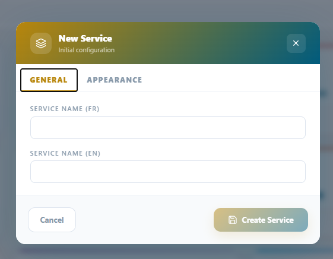
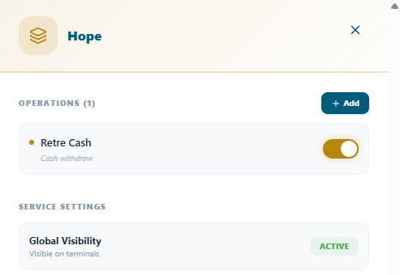
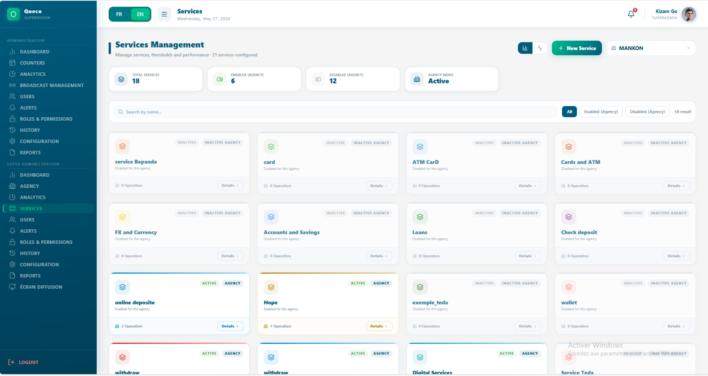

# Services & Operations

*How to build and manage the service catalogue defining what your agency
offers, structuring operations within each service, and activating them
per agency.*

<table>
<colgroup>
<col style="width: 50%" />
<col style="width: 50%" />
</colgroup>
<thead>
<tr class="header">
<th>
<strong>In this chapter</strong>

<ul>
<li>
5.1 Services vs. Operations
</li>
<li>
5.2 Planning Your Service Catalogue
</li>
<li>
5.3 Creating a Service
</li>
<li>
5.4 Creating Operations
</li>
<li>
5.5 Activating Services per Agency
</li>
<li>
5.6 Managing the Service Catalogue
</li>
<li>
5.7 Service Catalogue Best Practices
</li>
</ul></th>
<th>
<strong>After this chapter you will be able to</strong>

<ul>
<li>
Distinguish services from operations
</li>
<li>
Plan a logical service catalogue
</li>
<li>
Create services with all required fields
</li>
<li>
Add operations to a service
</li>
<li>
Activate services for specific agencies
</li>
<li>
Edit, deactivate, and reorganize services
</li>
<li>
Apply best practices for clean catalogue management
</li>
</ul></th>
</tr>
</thead>
<tbody>
</tbody>
</table>

## 5.1 Service vs Operations

Before building your service catalogue, it is essential to understand
the distinction between a Service and an operation. These two works
together to describe what your agency offers and how each customer
request is categorized when a ticket is created.

| **Concept**   | **Definition**                                                      | **Example**                                       |
|---------------|---------------------------------------------------------------------|---------------------------------------------------|
| **Service**   | A broad category of work offered to customers by an agency.         | Account Management                                |
| **Operation** | A specific, discrete task performed within a service.               | Open Account, Close Account, Update Personal Info |
| **Ticket**    | A customer request linked to exactly one Service and one Operation. | Ticket for 'Account Management → Open Account'    |

Think of a service as a folder and operation as a file inside it. When
an agent creates a ticket, they select the service first then choose the
specific operation being performed. These two-level structures allow
Queco’s analytic to report not only on which services are most demanded,
but specific task consume the most time.

| **NOTE** | A Service can contain as many Operations as needed. However, every Service must have at least one Operation before it can be activated for an agency. |
|----------|-------------------------------------------------------------------------------------------------------------------------------------------------------|

### 5.1.1 Real-World Examples

| **Industry**      | **Service Example**   | **Operations Inside It**                                                            |
|-------------------|-----------------------|-------------------------------------------------------------------------------------|
| **Banking**       | Loan Services         | New Loan Application, Loan Repayment, Loan Balance Inquiry, Loan Pre-closure        |
| **Government**    | Civil Registration    | Birth Certificate, Death Certificate, Marriage Certificate, Name Change             |
| **Telecom**       | SIM Card Services     | New SIM Activation, SIM Replacement, SIM Blocking, Plan Upgrade                     |
| **Health Clinic** | Consultation Services | General Consultation, Follow-up Visit, Lab Results Collection, Prescription Renewal |
| **Post Office**   | Parcel Services       | Send Parcel, Track Parcel, Collect Parcel, Return Parcel                            |

## 5.2 Planning Your Service Catalogue

Taking time to plan your service catalogue before configuring it in
Queco will save significant rework later. A well-structured catalogue
improves ticket routing accuracy, makes analytics more meaningful, and
reduces confusion for agents when creating tickets.

### 5.2.1 Catalogue Planning Checklist

1.  List all customer-facing services your organization provides.

2.  For each service, list every distinct task an agent might perform
    for a customer.

3.  Group overlapping tasks if two tasks are essentially the same, merge
    them into one operation.

4.  Estimate the average time needed to complete each operation. This
    value feeds the wait time estimator.

5.  Identify which agencies offer which services not all agencies need
    the full catalogue.

6.  Agree on consistent naming conventions before entering anything in
    Queco (e.g., use verbs: 'Open Account', not 'Account Opening').

| **TIP** | Prepare your service catalogue in a spreadsheet first (Service Name, Service Code, Operations, Estimated Duration, Agencies). Review it with your team before creating anything in Queco. Renaming services after tickets have been processed against them can affect historical reporting. |
|---------|---------------------------------------------------------------------------------------------------------------------------------------------------------------------------------------------------------------------------------------------------------------------------------------------|

### 5.2.2 Naming Conventions

Consistent naming across your service catalogue makes the platform
easier to use for every role. Follow these guidelines :

| **Element**        | **Recommended Style**                  | **Example**                       |
|--------------------|----------------------------------------|-----------------------------------|
| **Service Name**   | Title Case, noun-based                 | Account Management, Loan Services |
| **Service Code**   | Uppercase, hyphen-separated, 3–6 chars | ACC-MGT, LOAN-SVC, REG-DOC        |
| **Operation Name** | Title Case, action verb + object       | Open Account, Submit Application  |
| **Operation Code** | Uppercase, short, no spaces            | OPEN-ACC, SUBMT-APP               |

## 5.3 Creating a Service

Services are created at the platform level by the Super Admin or a
Manger. Once created, they exist in the master catalogue can then be
selectively activated for individual agencies. A service no operation
cannot be activated.

### 5.3.1 Step-by-step: Create a new service

**Step 1** From the left sidebar, click service,

**Step 2** Click Add service in the top-right corner of the service
page.

**Step 3** Fill all require fields in the new service form

*And you can also set the appearance color of your choice*

| *Figure 5.1 — New Service creation form*  |
|-------------------------------------------------------------------------------------|

| *Figure 5.1 — New Service appearance color*  |
|----------------------------------------------------------------------------------------|

| **NOTE** | A newly created service is invisible to all agents and counters until it is (1) given at least one operation, and (2) explicitly activated for an agency. See Sections 5.4 and 5.5. |
|----------|-------------------------------------------------------------------------------------------------------------------------------------------------------------------------------------|

### 5.3.2 Service Form Field Reference

| **Field**             | **Description**                                                   | **Status**   |
|-----------------------|-------------------------------------------------------------------|--------------|
| **Service Name (FR)** | Human-readable name displayed to agents and in reports in French  | **Required** |
| **Service Name (EN)** | Human-readable name displayed to agents and in reports in English | **Required** |

## 5.4 Creating Operation

Operations are the individual tasks within a service. They must be
created after the parent service exists. You can add multiple operations
to one service at any time even after the service is already active and
being used.

### 5.4.1 Step by step: Add an operation to a service 

**Step 1** Click Services, click the name of the service you want to add
operations to or identify the service u want to add operation to and
click details button on the service card

**Step 2:** Create a new service by clicking the “+Add” button at the
top right-hand corner and fill the required field.

| *Figure 5.2 Service Detail page showing the Operations section and 'Add Operation' button*  |
|---------------------------------------------------------------------------------------------------------------------------------------|

| **TIP** | Add all operations for a service before activating it for agencies. Adding operations to an already-active service works fine, but agents using the service at that moment won't see the new operation until their next page refresh. Moreover, You can activate and deactivate and operation in a particular service |
|---------|-----------------------------------------------------------------------------------------------------------------------------------------------------------------------------------------------------------------------------------------------------------------------------------------------------------------------|

### 5.4.2 Operation form Field Reference

| **Field**          | **Description**                                                                                        | **Status**   |
|--------------------|--------------------------------------------------------------------------------------------------------|--------------|
| **Operation Name** | Action-verb name agents see when creating a ticket (e.g., 'Open Account'). For both English and French | **Required** |

<table>
<colgroup>
<col style="width: 100%" />
</colgroup>
<thead>
<tr class="header">
<th>

<em>Figure 5.2 Operation form field</em>
</th>
</tr>
</thead>
<tbody>
</tbody>
</table>

## 5.5 Activating Services per Agency

Creating a service in the master catalogue does not make it available to
any agency automatically. Each service must be explicitly activated for
each agency that needs it. This design allows different agencies to
offer different service catalogues from the same master list for
example, a main branch may offer all 12 services while a satellite
office offers only 4.

### 5.5.1 Step-by-Step: Activate a Service for an Agency

**Step 1:** From side bar click Services

**Step 2:** On the top right-hand corner beside the button New Service,
there is a search bar with a dropdown of all the agencies created, just
select the agency you want to activate the service in

**Step 3:** After selecting it, the catalogue of all the Services will
appear deactivated

**Step 4:** Click on the service in question and side bar from the right
will appear

**Step 5:** In the side bar bellow click the green button **“Enable for
this agency”** and after it will turn red

**Step 6:** Above you can also active the operation in that service for
that agency is you wish

| *Figure 5.4 Agency Services tab showing master catalogue with activated and deactivated service for an agency (ex. Mankon)*  |
|------------------------------------------------------------------------------------------------------------------------------------------------------------------------|

| *Figure 5.4 — Detail page showing how to activate a service with its operation*  |
|---------------------------------------------------------------------------------------------------------------------------|

| **NOTE** | If a service has no operations, or its operation is deactivated, simply activate the service first then activate the operation later respective. And if a service has no operation, you could create one later. |
|----------|-----------------------------------------------------------------------------------------------------------------------------------------------------------------------------------------------------------------|

| **TIP** | After activating services for an agency, verify that at least one counter in that agency has been linked to each activated service. If no counter handles a service, tickets for that service will enter the queue but never be routed to an agent. |
|---------|-----------------------------------------------------------------------------------------------------------------------------------------------------------------------------------------------------------------------------------------------------|

## 5.6 Managing the Service Catalogue

Services and operations can be edited, deactivated, or achieved at any
time. Understanding the impact of each action on live data is important
before making changes to an active service catalogue.

### 5.6.1 Service Management Actions

| **Action**               | **How To Perform It**                                                                                                |
|--------------------------|----------------------------------------------------------------------------------------------------------------------|
| **Edit a Service**       | Go to Services → click the service name → click Edit → modify fields → Save.                                         |
| **Deactivate a Service** | Go to Services → click the service name → click deactivated → click confirm                                          |
| **Reactivate a Service** | Go to Services → click the service name → click activated → click confirm                                            |
| **Delete a Service**     | Go to Services → click the service name → click Archive service → type the name of the service, click Confirm delete |

### 5.6.2 Operation Management Actions

| **Action**                  | **How To Perform It**                                                                                                                       |
|-----------------------------|---------------------------------------------------------------------------------------------------------------------------------------------|
| **Edit an Operation**       | Open the service → click the operation → click Edit → modify → Save.                                                                        |
| **Deactivate an Operation** | Open the service → toggle the operation's status Off. Agents no longer see it in the ticket creation form. Existing tickets are unaffected. |
| **Reactivate an Operation** | Toggle the operation's status back On. It reappears for agents immediately.                                                                 |
| **Delete an Operation**     | Open the service → click (⋮) on the operation → Delete → confirm. Permanent. Historical tickets retain a 'Deleted Operation' label.         |
| **Reorder Operations**      | Drag operation rows by the handle icon (☰) within a service. Controls the display order in the ticket form.                                 |

| **WARNING** | Deleting a service or operation that has associated open (unresolved) tickets will cause those tickets to display incomplete information. Always check for open tickets before deleting. Deactivate instead of deleting when in doubt. |
|-------------|----------------------------------------------------------------------------------------------------------------------------------------------------------------------------------------------------------------------------------------|

### 5.6.3 Impact Matrix: Action vs Data

Use this table to understand the effect of each management action on
live data before proceeding.

| **Action**               | **Open Tickets**           | **Historical Tickets**          | **Agency Availability**                    |
|--------------------------|----------------------------|---------------------------------|--------------------------------------------|
| **Deactivate Service**   | No new tickets created     | Fully intact                    | Removed from all agencies                  |
| **Reactivate Service**   | Resumes normally           | Fully intact                    | Restored to all previously active agencies |
| **Delete Service**       | Marked as incomplete       | Labels show 'Deleted Service'   | Permanently removed                        |
| **Deactivate Operation** | No new tickets for this op | Fully intact                    | Operation hidden in ticket form            |
| **Delete Operation**     | Marked as incomplete       | Labels show 'Deleted Operation' | Permanently removed                        |

## 5.7 Service Catalogue Best Practices

A well-maintained service catalogue is the foundation of accurate
analytics and efficient queue management. Follow these practices to keep
the catalogue clean and effective.

**Catalogue Design**

- Keep service broad and operation specific. Aim for 3 – 8 operation per
  service. If a service has more than 10 operations, consider splitting
  it into 2 services.

- Avoid creating duplicate operation across service category.

**Ongoing Maintenance**

- Review the service catalogue once per quarter. Remove or deactivate
  operation that are no longer operational.

- When a service changes significantly (e.g a new process introduced)
  update the instruction field so that agent always have current
  guidance at hand.

- Monitor the service usage report in analytics to identify operation
  with very low volumes

- Never delete a service or an operation while an active initiative is
  running. Schedule deletions during off-peak hours and announce them to
  agent in advance

## 5.8 Chapter summary

This chapter covers the complete service catalogue workflow in Queco,
from planning and naming convections through creation, activation and
ongoing management. By now you should be able to;

- Distinguish service from operations and explain how they relate to
  tickets.

- Plan and document a service catalogue before configuring it in Queco

- Create service with all required fields and consistent naming
  conventions

- Add and manage operations within each service

- Activate service for individual agencies and specific operations
  within them

*Chapter 6*

