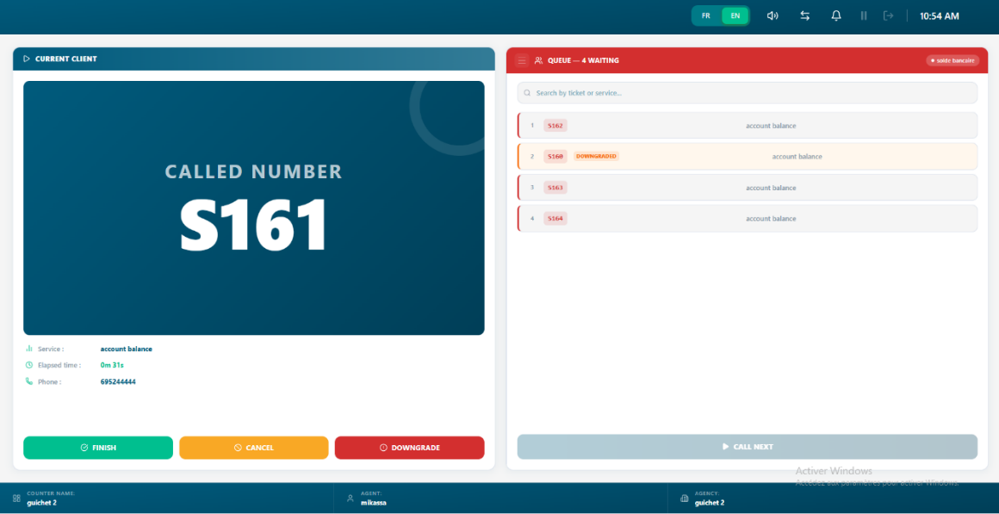
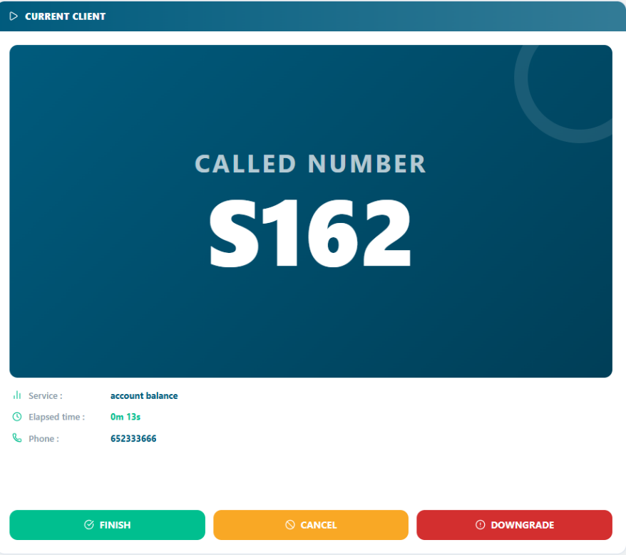

# Ticket Management

*The core daily workflow how to create, call, process, hold, transfer,
and close service tickets from start to finish.*

<table>
<colgroup>
<col style="width: 50%" />
<col style="width: 50%" />
</colgroup>
<thead>
<tr class="header">
<th>
<strong>In this chapter</strong>

<ul>
<li>
6.1 The Ticket Lifecycle
</li>
<li>
6.2 Creating a Ticket
</li>
<li>
6.3 Calling the Next Ticket
</li>
<li>
6.4 Processing a Ticket
</li>
<li>
6.5 Putting a Ticket On Hold
</li>
<li>
6.6 Transferring a Ticket
</li>
<li>
6.7 Closing a Ticket
</li>
<li>
6.8 Ticket History &amp; Search
</li>
</ul></th>
<th>
<strong>After this chapter you will be able to</strong>

<ul>
<li>
Understand every stage of a ticket
</li>
<li>
Create a new service ticket correctly
</li>
<li>
Call the next customer from the queue
</li>
<li>
Process and update a ticket in real time
</li>
<li>
Place a ticket on hold and resume it
</li>
<li>
Transfer a ticket to another counter or agent
</li>
<li>
Close a ticket with proper resolution notes
</li>
<li>
Search and review historical tickets
</li>
</ul></th>
</tr>
</thead>
<tbody>
</tbody>
</table>

## 6.1 The Ticket Lifecycle

Every customer service request in Queco follows a defined lifecycle.
Understanding each stage helps handle tickets correctly and helps
managers identify where delays or issue occur in the queue.

| **\#** | **Status**      | **Description**                                                                               |
|--------|-----------------|-----------------------------------------------------------------------------------------------|
| **1**  | **Create**      | A new ticket has been issued. It has a unique number and is waiting in the agency queue.      |
| **2**  | **Queued**      | The ticket is in line and waiting to be called by an available agent at the relevant counter. |
| **3**  | **Called**      | An agent has called the ticket number. The customer is being summoned to the counter.         |
| **4**  | **In Progress** | The agent is actively processing the customer's request at the counter.                       |
| **5**  | **Cancelled**   | The ticket was voided before processing (e.g., customer left, duplicate entry).               |
| **6**  | **declassed**   | The ticket is added back at the end of the queue list                                         |

| **NOTE** | A ticket can move between, Waiting, Called, in progress and Terminate or Cancelled. Every status change is logged in the ticket's activity history for full auditability. |
|----------|---------------------------------------------------------------------------------------------------------------------------------------------------------------------------|

## 6.2 Creating a Ticket (Ticket Kiosk)

Tickets represent individual customer service request. They can be
created by Super Admin, Managers and agents. In most deployment, agent
at the reception desk create tickets on behalf of the customer as they
arrive.

### 6.2.1 Step- Step: Creating a New Ticket on kiosk

**Step 1:** When the client comes to a particular agency, they will meet
the agent at desk

that will help the create the ticket on the kiosk

> *Super Admins see all agencies. Managers and Agents see only their
> assigned agency.*

**Step 2:** Select the service the customer needs.

> *Only services activated for this agency are shown. See Chapter 5 -
> Section 5.5 if a service is missing.*

**Step 3:** Select the operation, the specific task within the service

> *Example: Under 'Account Management', select 'Open Account'.*

**Step 4:** Enter the customer mobile number

> *The customer phone number is obligated*

**Step 5:** After the customer has entered their number, click Passer

> *A unique ticket number is generated (e.g., ACC-0042) and the ticket
> joins the queue immediately.*

| *Figure 6.2 — New Ticket creation form with all fields*  |
|----------------------------------------------------------------------------------------------------|

| **NOTE** | If no services appear in the Service dropdown, the agency has no activated services. A Manager or Super Admin must activate services for this agency first (Chapter 5 — Section 5.5). |
|----------|---------------------------------------------------------------------------------------------------------------------------------------------------------------------------------------|

## 6.3 Calling the Next Ticket

Once your counter is open you can begin calling ticket from the Queue.
The system automatically serves tickets. The oldest ticket is served
first (FIFO).

### 6.3.1 step by step: Call Next Ticket

**Step 1:** Ensure your counter is Open

> *If your counter shows Closed or display a non-assigned message signal
> the admin or super admin.*

**Step 2:** When a customer creates a new ticket on the kiosk, the tick
is automatically assigning to the queue list of that service in that
agency.

> *The ticket number is automatically displayed in the waiting list of a
> counter how perform that service*

**Step 3**: While in the queue list the ticket status is IN_WAITING and
when called to active session it changes to CALLED then after
IN_PROGRESS and counter time start immediately

> *The customer is expected to approach your counter when called*

<table>
<colgroup>
<col style="width: 100%" />
</colgroup>
<thead>
<tr class="header">
<th>

<em>Figure 6.3 Agent Dashboard showing active ticket actions button
and queue list with waiting ticket and Call Next button</em>
</th>
</tr>
</thead>
<tbody>
</tbody>
</table>

| **TIP** | If a customer does not arrive after being called, you can downgrade and the ticket number is displayed back into the queue list with an orange color highlighted on it. |
|---------|-------------------------------------------------------------------------------------------------------------------------------------------------------------------------|

### 6.3.2 Downgrade a Ticket

If a ticket is being called and the agent has waited for at list one
minute and the customer hasn’t approached the agent concern, the ticket
is downgraded back into the end of the waiting list to be called again
the second time.

**Step 1:** On the active ticket view, click the “Downgrade” button

> *The ticket is moved back into the queue list. The system is to
> re-queue the ticket (giving the customer one more chance) or cancel it
> automatically. A ticket is only Downgrade once after when called back,
> the downgraded button becomes inactive leaving “terminate” or
> “cancelled”*

## 6.4 Processing a Ticket

Once the ticket is in progress, the agent handles the customer request.
This may involve using other internal systems or preforming different
operations within Queco. The ticket remain in progress until is
Terminated, Cancelled or Downgrade.

### 6.4.1 The Active Ticket View

When a ticket is in progress, the agent sees the active ticket panel on
their dashboard. This panel contains all the information needed to
process the request.

| **Panel Element**       | **What It Shows**                                                             |
|-------------------------|-------------------------------------------------------------------------------|
| **Ticket Number**       | The called number displayed prominently (e.g., S162)                          |
| **Service & Operation** | The type of service requested by the customer (e.g., account balance)         |
| **Elapsed Time**        | Live timer showing how long the ticket has been in progress (e.g., 0m 13s)    |
| **Action Buttons**      | Finish, Cancel, Downgrade — the three key actions available during processing |
| **Phone**               | The customer's phone number (e.g., 652333666)                                 |

| *Figure 6.4 — Active Ticket panel with all elements labelled*  |
|---------------------------------------------------------------------------------------------------------|

## 6.5 Closing a Ticket

Close a ticket once the customer's request has been fully addressed.
Closing is the final step in the ticket lifecycle. It records the
resolution, stops the processing timer, and makes the ticket available
in the historical archive for reporting and audit purposes.

### 6.5.1 Step-by-Step: Close a ticket

We can close a ticket by performing from the active view by performing 3
actions

1.  **Terminate a ticket**

Step 1: On the active Ticket Panel, Click Finish Button

Step The terminate instantly and with the timer and recorded in the
history section

2.  **Downgrade a Ticket**

Step 1: Click the downgrade button and the ticket will go at back at the
end of the waiting list with an orange color to differentiate

3.  **Cancel a Ticket**

**Step 1:** On the yellow button click cancel

**Step 2:** The cancel dialog appears on the screen

**Step 3:** Click Confirm to actually cancel the ticket and it will also
record in the history section

A cancelled ticket was never fully processed. It is voided before or
during the process.

| **Scenario**                                | **Correct Action**                                               |
|---------------------------------------------|------------------------------------------------------------------|
| **Customer left before being called**       | Use the cancel button in the counter                             |
| **Customer changed their mind mid-process** | Cancel the In Progress ticket                                    |
| **Wrong service selected at creation**      | Cancel the ticket and create a new one with the correct service. |

| **WARNING** | Cancellation is permanent and cannot be undone. Cancelled tickets are included from most analytics reports. Use Cancel only when appropriate do not use it to avoid recording an Unresolved outcome. |
|-------------|------------------------------------------------------------------------------------------------------------------------------------------------------------------------------------------------------|

## 6.6 Ticket History

All Finished and cancelled tickets are archived in the Ticket History.
Managers and Super Admins have full access. Agents can search tickets
from their own counter's history for the day. After a day and after, the
ticket history is cleared off for a new day.

### 6.6.1 Accessing Ticket History

**Step 1:** In the counter on the top bar click the arrow and it will
flip to the next interface where the history is located

<table>
<colgroup>
<col style="width: 100%" />
</colgroup>
<thead>
<tr class="header">
<th>

<em>Figure 6.8 — Ticket History page with search bar and filter
panel</em>
</th>
</tr>
</thead>
<tbody>
</tbody>
</table>

## 6.7 Chapter Summary

This chapter covered the complete ticket management workflow from
creation through every processing stage to final closure and historical
review. By now you should be able to:

1.  Describe every stage of the ticket lifecycle and what each status
    means.

2.  Create a ticket with correct service, operation, and priority
    settings.

3.  Call the next ticket from the queue and begin processing it.

4.  Close a ticket with the correct resolution status.

5.  Search and filter ticket history.

*Chapter 7*

