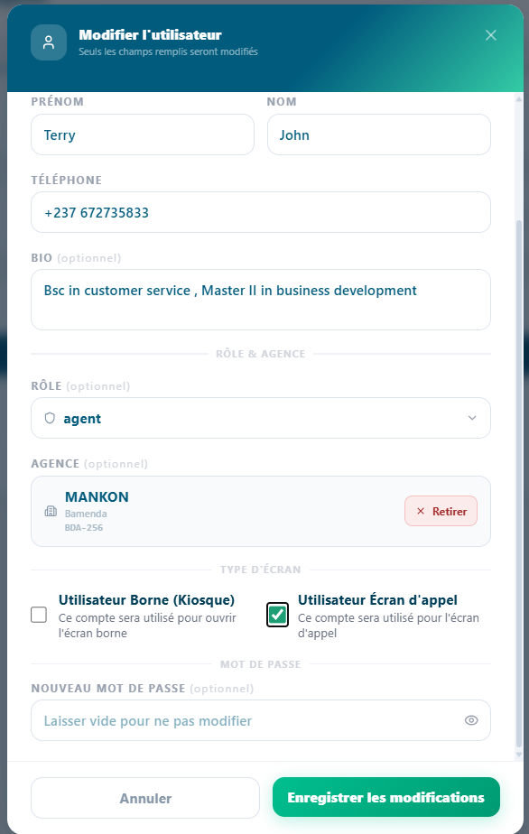
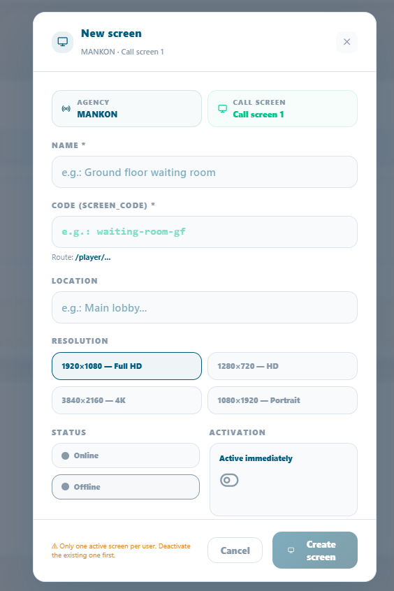
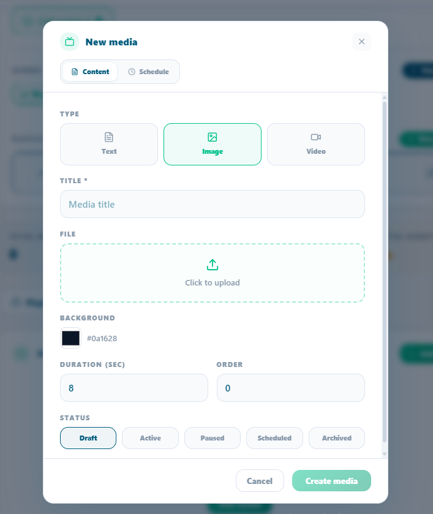

# Screen Diffusion & Display Management

*How to configure, manage, and operate the customer-facing display
screens from creating screens and playlists to scheduling media content
and monitoring screen health.*

<table>
<colgroup>
<col style="width: 50%" />
<col style="width: 50%" />
</colgroup>
<thead>
<tr class="header">
<th>
<strong>In this chapter</strong>

<ul>
<li>
7.1 What is Screen Diffusion ?
</li>
<li>
7.2 Anatomy of the Diffusion Screen
</li>
<li>
7.3 Core Concepts : Screens, Playlists &amp; Media
</li>
<li>
7.4 Managing Screens
</li>
<li>
7.5 Managing Playlists
</li>
<li>
7.6 Managing Media Items
</li>
<li>
7.7 The Player How It All Comes Together
</li>
<li>
7.8 Chapter Summary
</li>
</ul></th>
<th>
<strong>After this chapter you will be able to</strong>

<ul>
<li>
Explain what screen diffusion does
</li>
<li>
Identify the two zones of the display screen
</li>
<li>
Understand the Screen → Playlist → Media hierarchy
</li>
<li>
Create and configure display screens
</li>
<li>
Build playlists and attach them to screens
</li>
<li>
Upload media items and set schedules
</li>
<li>
Understand how the player fetches and displays content
</li>
</ul></th>
</tr>
</thead>
<tbody>
</tbody>
</table>

## 7.1 What is Screen Diffusion?

Screen Diffusion is Queco's integrated display management system. It
controls the customer-facing screens installed in your agency's waiting
areas the screens that customers look at while waiting for their ticket
number to be called.

These screens serve two purposes simultaneously: they inform customers
of queue progress in real time, and they broadcast promotional or
informational content managed by the agency. The result is a
professional, branded waiting experience that keeps customers engaged
and informed.

| **Purpose**           | **Description**                                                                                                                       |
|-----------------------|---------------------------------------------------------------------------------------------------------------------------------------|
| **Queue Visibility**  | Customers can see which ticket numbers are currently being called and at which counter, reducing anxiety and preventing missed calls. |
| **Content Broadcast** | The agency can display images, videos, promotional banners, and announcements on the same screen without any manual intervention.     |
| **Zonal Control**     | Multiple screens can be deployed across different zones or floors of the agency, each showing content relevant to its location.       |
| **Automated Updates** | Screens update automatically when an agent calls a new ticket — no manual refresh needed.                                             |

|          |                                                                                                                                                                                                                                  |
|----------|----------------------------------------------------------------------------------------------------------------------------------------------------------------------------------------------------------------------------------|
| **NOTE** | Screen Diffusion is managed entirely from the Queco platform. Physical screens only need a browser and internet connection to receive and display content — no dedicated software installation is required on the screen device. |

|                                                                                                                             |
|-----------------------------------------------------------------------------------------------------------------------------|
| *Figure 7.1 — Customer-facing display screen in a waiting area (example layout)*  |

|         |                                                                                                                                                                                                                                 |
|---------|---------------------------------------------------------------------------------------------------------------------------------------------------------------------------------------------------------------------------------|
| **TIP** | Think of Zone 1 as a TV channel your agency controls playing whatever content you schedule. Zone 2 is the live queue board it runs automatically as agents process tickets. You manage Zone 3 is the live pop live Banner below |

## 7.2 Core Concept: Screen, Playlists & Media

Before configuring anything, it is important to understand the
three-level hierarchy that powers the Queco display system. Every piece
of content you see on a diffusion screen flows through this structure.

### 7.2.1 The Three-Level Hierarchy

| **Level**   | **Entity**     | **Role**                                                                                                                                                                 |
|-------------|----------------|--------------------------------------------------------------------------------------------------------------------------------------------------------------------------|
| **Level 1** | **Screen**     | A registered physical display device in the agency. Each screen has a unique code used to fetch its content. Screens are assigned to zones within an agency.             |
| **Level 2** | **Playlist**   | An ordered collection of media items. A playlist defines what plays on a screen and in what order. One screen can have multiple playlists; only one is active at a time. |
| **Level 3** | **Media Item** | An individual piece of content an image or video with a defined display duration. Media items can have schedules that control when they appear.                          |

### 7.2.2 Analogy

Think of it like a television broadcast system:

- The Screen is the TV set on the wall the physical device customers
  look at.

- The Playlist is the TV channel a scheduled program of content that
  plays in order.

- The Media Item is a single show or commercial one image or video clip
  in the program.

A screen can have multiple playlists (like a TV with multiple channels),
but only one playlist is active at any given time the current playlist.
Admins can switch the active playlist at any moment.

|          |                                                                                                                                                                                                                                                                                             |
|----------|---------------------------------------------------------------------------------------------------------------------------------------------------------------------------------------------------------------------------------------------------------------------------------------------|
| **NOTE** | The relationship between screens and playlists is many-to-many: one playlist can be attached to multiple screens (useful for broadcasting the same content across all waiting areas), and one screen can have multiple playlists (useful for switching content by time of day or campaign). |

### 7.2.3 Scheduling

Media items support time-based scheduling. A schedule defines a window
during which a specific media item is eligible to play. Outside that
window, the item is skipped automatically. This allows you to show
morning announcements in the morning, promotional offers during peak
hours, and closing notices at end of day all without manual
intervention.

<table>
<colgroup>
<col style="width: 100%" />
</colgroup>
<tbody>
<tr class="odd">
<td>
<strong>[ SCREENSHOT PLACEHOLDER ]</strong>

<em>Figure 7.3 — Screen → Playlist → Media Items hierarchy
diagram</em>
</td>
</tr>
</tbody>
</table>

## 7.3 Managing Screens 

Screens represent the physical display devices in your agency. Each
screen must be registered in Queco before it can receive and display
content. Only Super Admins and Managers can create and manage screens.

### 7.3.1 Step-Step: Create a New Screen

Before creating a screen in an agency there must exist a user who is
already assign in that agency so we activate the screen option on him,
then before creating screens for the agency.

**Step 1:** Got to user, and search for the user in the agency precisely

**Step 2:** Click the pen icon on the user

**Step 3:** check the box “**Utilisateur Écran d'appel** “and save

|                                                                                                        |
|--------------------------------------------------------------------------------------------------------|
| *Figure 7.3 — Activating the screen on a user in an Agency*  |

**Step 4:** Go to Broadcast management on the side bar

**Step 5:** filter the Agency you want to create the screen in

**Step 6:** click the button **“+ New screen”** and fill in the fields

|                                                                    |
|--------------------------------------------------------------------|
| *Figure 7.3 New Screen*  |

|         |                                                                                                              |
|---------|--------------------------------------------------------------------------------------------------------------|
| **TIP** | For an agency to have multiple screens, it must have multiple users i.e., one screen is attached to one user |

### 7.4.2 Screen Form Field Reference

| **Field**           | **Description**                                                                           | **Status**   |
|---------------------|-------------------------------------------------------------------------------------------|--------------|
| **Screen Name**     | Descriptive name for this screen (e.g., 'Lobby Screen', 'Floor 2 – Zone B').              | **Required** |
| **Screen Code**     | Unique auto-generated identifier used by the player URL. Read-only after creation.        | **Auto-set** |
| **Agency**          | The agency this screen belongs to.                                                        | **Required** |
| **Zone / Location** | The physical location of the screen within the agency (e.g., 'Main Lobby', 'Corridor B'). | **Optional** |
| **Resolution**      | The user (Manager or Admin) responsible for managing this screen's content.               | **Optional** |
| **Description**     | Internal notes about this screen (e.g., 'Near entrance, high visibility').                | **Optional** |
| **Status**          | Active or Inactive. Inactive screens do not receive content updates.                      | **Auto-set** |

### 7.3.3 Screen Management actions

| **Action**            | **How To Perform It**                                                                   |
|-----------------------|-----------------------------------------------------------------------------------------|
| **Edit Screen**       | Click the screen name → Edit → modify fields → Save.                                    |
| **Deactivate**        | Toggle the screen status to Inactive. The player URL stops receiving updates.           |
| **Delete**            | Click (⋮) → Delete → confirm. The screen and all its playlist associations are removed. |
| **Monitor Heartbeat** | See Section 7.4.4 — the heartbeat shows whether the screen is currently online.         |

### 7.3.4 Screen Heartbeat – Monitoring Online Status

Each physical screen periodically sends a heartbeat signal to Queco to
confirm it is online and functioning. This allows administrators to
monitor the health of all screens in real time from the Display
Management dashboard

| **Heartbeat Status** | **Meaning**                                                              | **Action Required** |
|----------------------|--------------------------------------------------------------------------|---------------------|
| **Online (Green)**   | Screen is active, connected, and receiving updates normally.             |                     |
| **Offline (gray)**   | Screen has not responded for more than 5 minutes.                        |                     |
| **Never Connected**  | Screen was created but the player URL has never been opened on a device. |                     |

|                                                                                                                                    |
|------------------------------------------------------------------------------------------------------------------------------------|
| *Figure 7.5 — Screen list with heartbeat status indicators* |

|          |                                                                                                                                                                                                                            |
|----------|----------------------------------------------------------------------------------------------------------------------------------------------------------------------------------------------------------------------------|
| **NOTE** | The heartbeat does not affect ticket calling if a screen goes offline, agents can still call tickets normally. Only the display is affected. Customers may not see the updated ticket numbers until the screen reconnects. |

## 7.5 Managing Playlists

Playlists are the bridge between your media content and your physical
screens. A playlist organizes media items into an ordered sequence and
determines what plays on a screen. You can create multiple playlists for
different campaigns, time periods, or screen zones, and switch between
them instantly.

### 7.5.1 Step-By-Step: Create a Playlist

**Step 1** From the sidebar, go to Display Management → Playlists.

**Step 2** Click Create Playlist.

**Step 3** Enter a Playlist Name and optional Description.

> *Example: 'Morning Campaign – Q1 2025', 'Lobby Default Loop'.*

**Step 4** Click Save.

> *The playlist is created empty. Add media items to it in Section 7.6.*

|                                                                                                       |
|-------------------------------------------------------------------------------------------------------|
| *Figure 7.6 — Playlist list page with Add Playlist button*  |

### 7.5.2 Setting the active Playlist screen

A screen can have multiple playlists attached, but only one is active
(playing) at any time.

**Step 1** Open the screen profile and go to the Playlists tab.

**Step 2** Find the playlist you want to activate and just click it; it
will automatically be the current list playing with a live button on it

> *The screen switches to the new playlist on its next content refresh
> cycle (within 8 seconds).*

|          |                                                                                                                                        |
|----------|----------------------------------------------------------------------------------------------------------------------------------------|
| **NOTE** | Switching the active playlist does not delete or detach the previous playlist it simply stops playing. You can switch back at anytime. |

### 7.5.3 Reordering Playlists on a screen

When multiple playlists are attached to a screen, you can define their
priority order. This affects which playlist plays when the current
playlist ends or is deactivated.

**Step 1** Open the screen profile → Playlists tab.

**Step 2** there is an arrow button on each of the Tab, just click the
arrow up to go up and vice versa

**Step 3** The order saves automatically

### 7.5.4 Detaching or deleting a Playlist from a screen

**Step 1** Open the screen profile → Playlist’s tab, OR open the
playlist → Screens tab.

**Step 2** Find the dust bin red icon and click it to delete it

**Step 3** delete automatically

> *If the detached playlist was the active playlist, the screen falls
> back to the next playlist in the order. If no playlists remain, the
> screen displays a blank content area.*

## 7.6 Managing Media Items

Media items are the individual content pieces images or videos that make
up a playlist. Each item has a display duration, an optional schedule,
and a status that controls whether it is currently active or paused.

### 7.6.1 Step-by-Step: Add a Media Item to a Playlist

**Step 1** Open the playlist you want to add content to.

**Step 2** Scroll to the Media Items section and click Add Media.

**Step 3** fill in the required fields and u can add photos and videos
too

<table>
<colgroup>
<col style="width: 100%" />
</colgroup>
<tbody>
<tr class="odd">
<td>

<em>Figure 7.7 Media Item upload form within a playlist</em>
</td>
</tr>
</tbody>
</table>

**Step 4** Click Create Media Item.

> *The item is added to the playlist and begins playing immediately if
> the playlist is currently active on a screen.*

**Step 5** Repeat for all media items needed. Reorder them if needed.

|         |                                                                                                                                                      |
|---------|------------------------------------------------------------------------------------------------------------------------------------------------------|
| **TIP** | Keep image files under 2MB and video files under 50MB for optimal performance on screen devices. Large files cause buffering and slow refresh times. |

### 7.6.2 Media Field Reference

| **Field**      | **Description**                                                                                                      | **Status**          |
|----------------|----------------------------------------------------------------------------------------------------------------------|---------------------|
| **Title**      | Internal name for this media item (e.g., 'Ramadan Banner 2025').                                                     | **Required**        |
| **Type**       | Chosing either text, image or video                                                                                  |                     |
| **Media File** | The image (JPG, PNG, GIF) or video (MP4) file to display.                                                            | **Required**        |
| **Duration**   | How long this item displays before moving to the next one. In seconds (images only — videos play their full length). | **Required**        |
| **Content**    | This is the advertising message when you texted                                                                      | **Auto-set**        |
| **Status**     | You either choose draft, active, Paused, schedule, Archive                                                           | **Manually chosen** |
| **Schedule**   | Optional time window during which this item is eligible to play. See Section 7.6.3.                                  | **Optional**        |

### 7.6.3 Scheduling a Media Item 

Schedules allow a media item to play only during specific time windows.
Outside the scheduled window, the item is automatically skipped no
manual intervention needed.

**Step 1** Open the media item you want to schedule.

**Step 2** Scroll to the Schedules section and click Add Schedule.

**Step 3** Set the Start Date/Time and End Date/Time for the schedule
window.

> *Example: Start — Monday 09:00, End — Monday 17:00. The item only
> plays between 9am and 5pm on Mondays.*

**Step 4** Click Save Schedule.

> *Multiple schedules can be added to one media item for recurring time
> windows.*

|                                                                                                                  |
|------------------------------------------------------------------------------------------------------------------|
| *Figure 7.8 Media item schedule configuration with date/time pickers*  |

|          |                                                                                                                                                                                                    |
|----------|----------------------------------------------------------------------------------------------------------------------------------------------------------------------------------------------------|
| **NOTE** | If a media item has no schedule, it plays at all times whenever the playlist is active. Schedules only restrict playback they do not force a media item to play outside its normal playlist order. |

### 7.6.4 Media Item Status Management 

You can activate or deactivate individual media items without removing
them from the playlist. This is useful for temporarily pausing seasonal
content without deleting it.

**Step 1** Open the playlist and scroll down to the media items.

**Step 2** Toggle between Active and Inactive using the eye icon.

**Step 3** The change takes effect on the screen's instantly

|         |                                                                                                                                                                                                                   |
|---------|-------------------------------------------------------------------------------------------------------------------------------------------------------------------------------------------------------------------|
| **TIP** | Use Inactive status to 'park' content you will reuse later (e.g., holiday promotions, seasonal campaigns). Keeping the item in the playlist but inactive is faster than deleting and re-uploading it next season. |

### 7.6.5 Reordering Media Items in a Playlist

The order of media items determines the playback sequence. The playlist
loops continuously in the defined order.

**Step 1** Open the playlist and scroll to the Media Items section.

**Step 2** On each tab of a Media Item you find an arrow either up or
down

**Step 3** Changes take effect on the screen's next content cycle.

## 7.7 Chapter Summary

This chapter covered the complete Screen Diffusion system in Queco from
understanding the display layout through creating screens, building
playlists, uploading media, and monitoring the player. By now you should
be able to:

1.  Explain the purpose of both display zones the Publicity Panel and
    the Ticket Card Panel.

2.  Understand the Screen → Playlist → Media Item hierarchy and how they
    relate.

3.  Create and configure physical screens with correct zone assignments.

4.  Build playlists, attach them to screens, and set the active
    playlist.

5.  Upload media items, set display durations, and configure time-based
    schedules.

6.  Use Propagate to push a playlist to all screens agency-wide.

7.  Monitor screen health via the heartbeat status

*Chapter 8*

