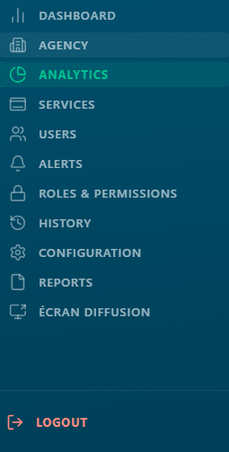
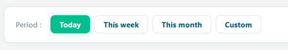
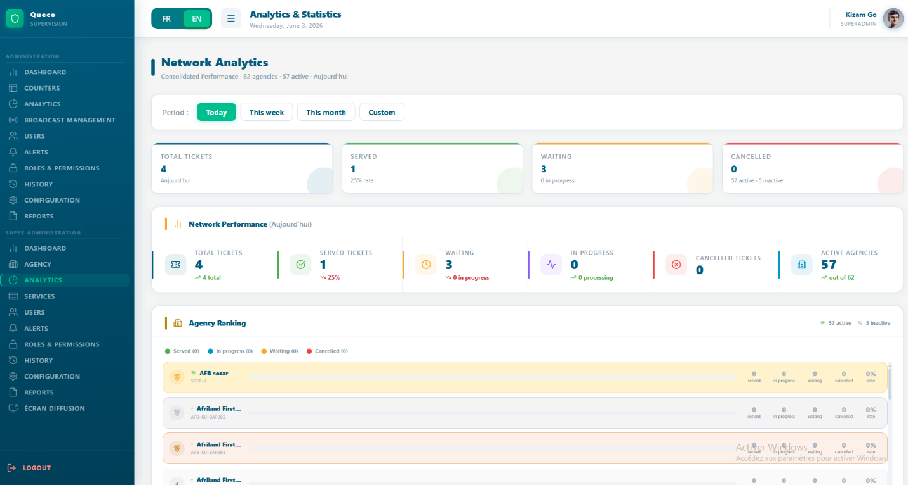
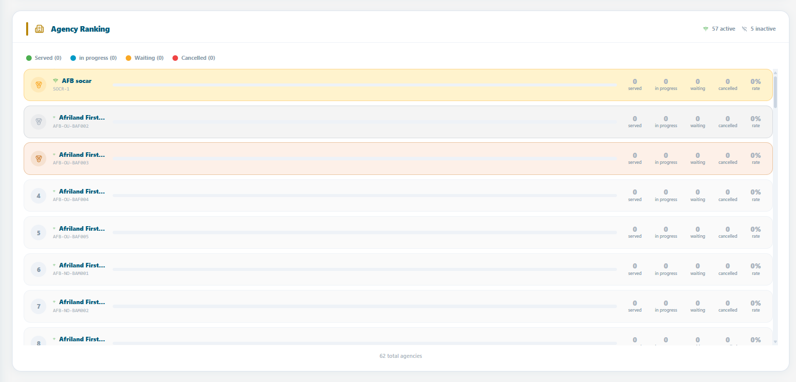

# Analytics & Reporting

*How to read and interpret the Queco analytics dashboards understanding
KPI cards, performance metrics, agency rankings, client flow charts, and
service breakdowns for both Super Admins and Managers.*

<table>
<colgroup>
<col style="width: 50%" />
<col style="width: 50%" />
</colgroup>
<thead>
<tr class="header">
<th>
<strong>In this chapter</strong>

8.1 Overview

8.2 Period Selector

8.3 Super Admin Analytics

8.4 Agency Ranking Deep Dive

8.5 Manager Analytics

8.6 Charts Client Flow &amp; Service Breakdown

8.7 KPI Reference

8.8 Chapter Summary
</th>
<th>
<strong>After this chapter you will be able to</strong>

<ul>
<li>
Understand the difference between Super Admin and Manager
analytics views
</li>
<li>
Use the Period Selector to filter all dashboard widgets by time
range
</li>
<li>
Read and interpret all KPI summary cards and network performance
cards
</li>
<li>
Understand the Agency Ranking table and medal system
</li>
<li>
Navigate the Manager dashboard including gauges and Counter
Top/Flop widget
</li>
<li>
Read the Client Flow bar chart and Service Breakdown
chart
</li>
<li>
Look up the definition of any metric in the KPI Reference
table
</li>
</ul></th>
</tr>
</thead>
<tbody>
</tbody>
</table>

## 8.1 Overview

The Analytics module gives platform stakeholders real-time and
historical visibility into how the agency network is performing. It
answers three core questions: How many customers did we serve? How fast
did we serve them? Which agencies and counters are performing best?

Analytics is accessible from the left sidebar. The dashboard displayed
depends entirely on your role the Super Admin and the Manager see
completely different views, scoped to their level of authority.

### 8.1.1 Role-Based Analytics Access

| **Role**        | **Scope**                    | **What They See**                                                                                                                           |
|-----------------|------------------------------|---------------------------------------------------------------------------------------------------------------------------------------------|
| **Super Admin** | Entire platform all agencies | Network-wide KPIs, agency ranking with medals, cross-agency ticket volumes, client flow chart, service breakdown across all agencies.       |
| **Manager**     | Their assigned agency only   | Wait & processing time gauges, counter Top/Flop, 5 agency-scoped performance cards, hourly client flow, service breakdown for their agency. |
| **Agent**       | No access                    | The Analytics module is not available to agents. Agents see only their own session summary when closing a counter.                          |

|          |                                                                                                                                       |
|----------|---------------------------------------------------------------------------------------------------------------------------------------|
| **NOTE** | The Manager dashboard is automatically scoped to the agency linked to their account. A Manager cannot view data from any other agency |

| *Figure 8.1 Analytics sidebar entry point and role-based dashboard title*  |
|----------------------------------------------------------------------------------------------------------------------|

## 8.2 Period Sector

At the top of every analytics dashboard for both Super Admins and
Managers is the Period Selector. This time filter controls the date
range used to calculate every widget, card, chart, and table on the page
simultaneously. Changing the period updates all data at once; there is
no need to refresh individual widgets.

| *Figure 8.2 Period Selector with all options visible*  |
|--------------------------------------------------------------------------------------------------|

| **Period Option** | **What it Covers**                                         | **Typical Use**                                                                               |
|-------------------|------------------------------------------------------------|-----------------------------------------------------------------------------------------------|
| **Today**         | From midnight of the current day to the current moment     | Real-time operational monitoring how is today going?                                          |
| **This Week**     | Monday 00:00 to the current moment (current calendar week) | Weekly performance check are we on track this week?                                           |
| **This Month**    | First day of the current month to the current moment       | Monthly KPI review how is the month shaping up?                                               |
| **This Year**     | January 1st of the current year to the current moment      | Annual performance overview and year-to-date totals                                           |
| **Custom range**  | Any start date and end date selected by the user           | Targeted investigation compare a specific campaign period, holiday season, or incident window |

| **TIP** | Use Today for live operational decisions. Use This Month for team performance reviews. Use Custom Range for management reports covering a specific period. |
|---------|------------------------------------------------------------------------------------------------------------------------------------------------------------|

| **NOTE** | The period filter applies to ticket creation timestamps. A ticket created on Monday is counted in 'This Week' even if it was closed on Tuesday. |
|----------|-------------------------------------------------------------------------------------------------------------------------------------------------|

## 8.3 Super Admin Analytics Dashboard

The super admin dashboard provides a bird’s-eye view of the entire
platform. It aggregates data across all the agencies, giving a complete
picture of network health, volumes and performance at any moment.

<table>
<colgroup>
<col style="width: 100%" />
</colgroup>
<thead>
<tr class="header">
<th>

<em>Figure 8.3 Super Admin Analytics Dashboard (full
view)</em>
</th>
</tr>
</thead>
<tbody>
</tbody>
</table>

### 8.3.1 Summary KPI Cards

For summary cards appear at the very top each showing a network-wide
metric for the selected period

| **Card**          | **What It Shows**                                               | **Sub-text Displayed**                    |
|-------------------|-----------------------------------------------------------------|-------------------------------------------|
| **Total Tickets** | All tickets created across all agencies in the selected period. | Selected period label (e.g., 'Today')     |
| **Served**        | Tickets with status FINISHED across all agencies.               | Service Rate % = Served ÷ Total × 100     |
| **Waiting**       | Tickets in WAITING or IN_PROGRESS status across all agencies.   | In Progress count shown separately        |
| **Cancelled**     | Tickets with status CANCELLED across all agencies.              | Active agencies · Inactive agencies count |

### 8.3.2 Network Performance Panel

Below the summary cards sits the network performance panel 6 detailed
performance cards showing deeper breakdown across the entire network

| **Performance Card**    | **What It Measures**                                                    |
|-------------------------|-------------------------------------------------------------------------|
| **Total Tickets**       | Cumulative ticket count for the period — the top-line volume metric.    |
| **Tickets Served**      | Tickets that reached FINISHED status. Primary measure of throughput.    |
| **Tickets Waiting**     | Tickets in WAITING status queued but not yet called.                    |
| **Tickets In Progress** | Tickets currently being processed by an agent (IN_PROGRESS).            |
| **Tickets Cancelled**   | Tickets voided before or during processing.                             |
| **Active Agencies**     | Number of agencies with is_active = true. Gives volume figures context. |

| *Figure 8.4 — Network Performance panel with 6 PerfCards* |
|---------------------------------------------------------------------------------------------------------------------------------|

| **TIP** | Monitor Waiting and In Progress together. High Waiting + Low In Progress = counters may be closed or understaffed. Both high = agency at peak capacity — consider opening additional counters. |
|---------|------------------------------------------------------------------------------------------------------------------------------------------------------------------------------------------------|

## 8.4 Agency Ranking Deep Dive

The Agency Ranking is the most powerful section of the super Admin
dashboard. It shows every agency ranked by performance, giving an
immediate view of which agencies are thriving and which need attention

| *Figure 8.5 Agency Ranking with medal indicators, progress bars, and per-agency breakdowns* |
|-------------------------------------------------------------------------------------------------------------------------------------------------------------------|

### 8.4.1 Ranking Sort Logic

Agencies are sorted using the following priority rules:

1.  Active agencies always appear before Inactive agencies regardless of
    ticket volume.

2.  Within Active agencies: sorted by Tickets Served (descending)
    highest volume first.

3.  Same Tickets Served count: sorted alphabetically by agency name
    (A→Z).

4.  Inactive agencies follow the same sub-rules among themselves at the
    bottom.

### 8.4.2 Medal System

The top 3 agencies receive a medal an immediately recognizable visual
distinction for the top performers.

| **Position** | **Medal**   | **Visual Style**                                                                         |
|--------------|-------------|------------------------------------------------------------------------------------------|
| **1st**      | Gold (🥇)   | Yellow background (#FFF3CD), gold dot (#F9A825). Warm gold row highlight.                |
| **2nd**      | Silver (🥈) | Light grey background (#F4F4F4), silver dot (#AAB4C0). Silver row highlight.             |
| **3rd**      | Bronze (🥉) | Warm orange background (#FDF0E8), bronze dot (#CD7F32). Bronze row highlight.            |
| **4th+**     | Numbered    | Standard alternating white/light blue rows. Position number shown instead of medal icon. |

### 8.4.3 Reading an Agency Row 

| **Element**             | **What It Means**                                                                                                                        |
|-------------------------|------------------------------------------------------------------------------------------------------------------------------------------|
| **Wifi / WifiOff icon** | Green Wifi = agency is_active: true (operational). Grey WifiOff = is_active: false (suspended).                                          |
| **Agency Name & Code**  | Display name above; unique agency code (e.g., AGC-001) in monospace font below.                                                          |
| **Progress Bar**        | Proportional fill: this agency's Served count ÷ the top-ranked agency's Served count × 100. Bar at 100% = the highest-volume agency.     |
| **Served**              | Tickets with FINISHED status for this agency in the selected period.                                                                     |
| **In Progress**         | Tickets currently being processed (IN_PROGRESS). Indicates live activity.                                                                |
| **Waiting**             | Tickets in queue not yet called (WAITING). High values may signal capacity issues.                                                       |
| **Cancelled**           | Tickets voided. Persistently high values may indicate process or staffing problems.                                                      |
| **Service Rate %**      | Formula: Served ÷ (Served + Waiting + In Progress + Cancelled) × 100. Rounded to nearest integer. The primary quality metric per agency. |

| **NOTE** | Service Rate % uses total tickets (all statuses) as the denominator. An agency with 80 served and 20 waiting has a rate of 80% the 20 waiting tickets count against the rate even though they may still be resolved. |
|----------|----------------------------------------------------------------------------------------------------------------------------------------------------------------------------------------------------------------------|

| **TIP** | A high Service Rate with a high Cancelled count is a red flag. It may mean agents are cancelling difficult tickets to inflate the rate. Always review Cancelled and Served together. |
|---------|--------------------------------------------------------------------------------------------------------------------------------------------------------------------------------------|

## 8.5 Manager Analytics Dashboard 

The Manager dashboard focuses on operational quality time-based KPIs
that measure customer experience and counter efficiency within the
Manager's assigned agency. Unlike the Super Admin view, it prioritises
depth over breadth.

|                                                                                                                              |
|------------------------------------------------------------------------------------------------------------------------------|
| *Figure 8.6 — Manager Analytics Dashboard (full view)* |

### 8.5.1 Card 1: Median Wait Time (Circular Gauge)

A circular gauge showing the median time (in minutes) customers waited
before their ticket was called.

| **Element**              | **Explanation**                                                                                                                                           |
|--------------------------|-----------------------------------------------------------------------------------------------------------------------------------------------------------|
| **Gauge centre value**   | Median wait time in minutes — the middle value when all wait times are sorted. Half of customers waited less; half waited more.                           |
| **Gauge arc colour**     | Amber (#F59E0B). Arc fills proportionally relative to the maximum of: median, average, or 60 minutes — whichever is highest.                              |
| **Sub-text below gauge** | Shows Average Wait Time: 'Average: X min'. The average can be inflated by outliers; the median is more representative of the typical customer experience. |

### 8.5.2 Card 2: Median Processing Time (Circular Gauge)

A circular gauge showing the median time (in minutes) agents spent
processing a single ticket from In Progress to Closed.

| **Element**              | **Explanation**                                                                                                    |
|--------------------------|--------------------------------------------------------------------------------------------------------------------|
| **Gauge centre value**   | Median processing time in minutes — how long the middle ticket took to resolve.                                    |
| **Gauge arc colour**     | Purple (#8B5CF6). Arc fills relative to max of: median, average, or 30 minutes.                                    |
| **Sub-text below gauge** | Shows Average Processing Time for comparison. Compare average vs median to detect outliers pulling the average up. |

|          |                                                                                                                                                                                                                                                                         |
|----------|-------------------------------------------------------------------------------------------------------------------------------------------------------------------------------------------------------------------------------------------------------------------------|
| **NOTE** | Median vs Average: If 9 customers wait 5 minutes and 1 waits 60 minutes, the average is 10.5 min but the median is 5 min. The median tells the true story of the typical customer experience. Both are shown so managers can detect and investigate outlier situations. |

### 8.5.3 Card 3: Counter Top / Flop

Compares the best and the worst performing counters by tickets served in
the selected period the key agent performance indication for managers.

| **Element**              | **Explanation**                                                                                                             |
|--------------------------|-----------------------------------------------------------------------------------------------------------------------------|
| **Top counter (left)**   | Counter with the highest FINISHED ticket count. Agent name shown with a green upward arrow (↑) and their ticket count.      |
| **Flop counter (right)** | Counter with the lowest FINISHED ticket count. Agent name shown with a red downward arrow (↓) and their count.              |
| **Progress bar**         | Ratio bar: Top tickets ÷ (Top + Flop tickets). Fully green left = extreme imbalance. Centred = similar performance.         |
| **Agent identification** | Name resolved in this order: Agent first name from profile → Counter name → Email prefix → Counter ID (first 6 characters). |

|         |                                                                                                                                                                                                          |
|---------|----------------------------------------------------------------------------------------------------------------------------------------------------------------------------------------------------------|
| **TIP** | The Flop counter is not automatically a problem. It may handle complex VIP operations, opened late, or serves fewer but longer tickets. Always investigate context before acting on Top/Flop data alone. |

### 8.5.4 Agency Performance Panel

Below the 3 summary cards, the Manager sees 5 Performance Cards
identical in structure to the Super Admin's Network panel, but scoped
exclusively to their agency.

| **Performance Card**    | **What It Measures (Agency Scope)**                         |
|-------------------------|-------------------------------------------------------------|
| **Total Tickets**       | All tickets created for this agency in the selected period. |
| **Tickets Served**      | Tickets with FINISHED status for this agency.               |
| **Tickets Waiting**     | Tickets in WAITING status for this agency.                  |
| **Tickets In Progress** | Tickets currently IN_PROGRESS for this agency.              |
| **Tickets Cancelled**   | Tickets with CANCELLED status for this agency.              |

## 8.6 Chart: Client Flow & Service Breakdown

Both dashboards include two charts at the bottom of the page the Client
Flow bar chart and the Service Breakdown. These provide the visual
context behind the KPI numbers.

### 8.6.1 Client Flow Bar Chart

Shows ticket volume over time how many tickets were created during each
time interval within the selected period. The primary tool for
identifying peak hours, slow periods, and daily patterns.

| **Role**        | **Chart Scope**                     | **Time Granularity**                        |
|-----------------|-------------------------------------|---------------------------------------------|
| **Super Admin** | All agencies combined network total | Hourly for Today/Week, daily for Month/Year |
| **Manager**     | Their agency only                   | Hourly for Today, daily for longer periods  |

How to read the bar chart:

- Each bar = one time interval (hour or day depending on period
  selected).

- Bar height = number of tickets created in that interval.

- Taller bars = peak demand useful for staffing decisions.

- Flat or empty periods = low demand good windows for breaks or counter
  closures.

<table>
<colgroup>
<col style="width: 100%" />
</colgroup>
<tbody>
<tr class="odd">
<td>
<strong>[ SCREENSHOT PLACEHOLDER ]</strong>

<em>Figure 8.8 — Client Flow Bar Chart (Manager view — hourly
breakdown for Today)</em>
</td>
</tr>
</tbody>
</table>

|         |                                                                                                                                                            |
|---------|------------------------------------------------------------------------------------------------------------------------------------------------------------|
| **TIP** | Check the flow chart on Monday morning to identify your busiest hours. Staff counters proactively before the peak — not after the queue has already built. |

### 8.6.2 Service Breakdown

Shows the distribution of ticket volume by service type for the selected
period. Answers the question: which of our services is generating the
most demand?

How to read the service breakdown:

- Each segment represents one service (e.g., Account Management, Loan
  Services).

- Segment size is proportional to that service's share of total tickets
  as a percentage.

- Dominant services indicate where to focus staffing and counter
  resources.

- Services with very low volume may be candidates for review are they
  still needed? Are agents aware they exist?

<table>
<colgroup>
<col style="width: 100%" />
</colgroup>
<tbody>
<tr class="odd">
<td>
<strong>[ SCREENSHOT PLACEHOLDER ]</strong>

<em>Figure 8.9 — Service Breakdown showing proportional distribution
across service types</em>
</td>
</tr>
</tbody>
</table>

|          |                                                                                                                                                                 |
|----------|-----------------------------------------------------------------------------------------------------------------------------------------------------------------|
| **NOTE** | The service breakdown counts all ticket statuses — not just Served. This gives a true picture of demand, including tickets that are cancelled or still waiting. |

## 8.7 KPI Reference

This master table defines every metric in the Queco Analytics module
what it means, how it is calculated, and which role can see it.

| **KPI Name**                | **Unit** | **Definition & Formula**                                                                                                                | **Who Sees It** |
|-----------------------------|----------|-----------------------------------------------------------------------------------------------------------------------------------------|-----------------|
| **Total Tickets**           | Count    | All tickets created in the period — all statuses included.                                                                              | **Both**        |
| **Tickets Served**          | Count    | status = FINISHED.                                                                                                                      | **Both**        |
| **Tickets Waiting**         | Count    | status = WAITING (queued, not yet called).                                                                                              | **Both**        |
| **Tickets In Progress**     | Count    | status = IN_PROGRESS (agent actively processing).                                                                                       | **Both**        |
| **Tickets Cancelled**       | Count    | status = CANCELLED.                                                                                                                     | **Both**        |
| **Service Rate %**          | %        | Served ÷ (Served + Waiting + In Progress + Cancelled) × 100. Rounded to nearest integer.                                                | **Both**        |
| **Active Agencies**         | Count    | Agencies where is_active = true.                                                                                                        | **Super Admin** |
| **Inactive Agencies**       | Count    | Total agencies − Active agencies.                                                                                                       | **Super Admin** |
| **Agency Progress Bar**     | %        | Agency Served ÷ Max Served (highest-ranked agency) × 100. Relative comparison — not an absolute metric.                                 | **Super Admin** |
| **Median Wait Time**        | Minutes  | 50th percentile of wait_minutes across all tickets in the period. More representative than average for skewed distributions.            | **Manager**     |
| **Average Wait Time**       | Minutes  | Sum of wait_minutes ÷ ticket count. Can be inflated by outlier long waits.                                                              | **Manager**     |
| **Median Processing Time**  | Minutes  | 50th percentile of processing_minutes. How long the middle ticket took from In Progress to Closed.                                      | **Manager**     |
| **Average Processing Time** | Minutes  | Sum of processing_minutes ÷ ticket count.                                                                                               | **Manager**     |
| **Top Counter**             | Count    | Counter with the highest FINISHED ticket count in the period. Identified by agent first name → counter name → email prefix → ID prefix. | **Manager**     |
| **Flop Counter**            | Count    | Counter with the lowest FINISHED ticket count in the period.                                                                            | **Manager**     |

### 8.7.1 Time Display Format

Wait and processing times are formatted as follows throughout the
platform:

| **Raw Value**          | **Displayed As**                     |
|------------------------|--------------------------------------|
| **Less than 1 minute** | 'X sec’ — e.g., '45 sec'             |
| **1 to 59 minutes**    | 'X min' — e.g., '12 min'             |
| **60 minutes or more** | 'Xh Ymin' — e.g., '1h 30min' or '2h' |
| **Zero or null**       | '0 min'                              |

## 8.8 Chapter Summary

This chapter covered the complete Analytics & Reporting module from
role-based access through every KPI definition. By now you should be
able to:

1.  Explain the difference between the Super Admin and Manager analytics
    dashboards and their respective scopes.

2.  Use the Period Selector to filter all dashboard data by Today, Week,
    Month, Year, or a custom date range.

3.  Read and interpret the 4 Super Admin summary KPI cards and 6 Network
    Performance cards.

4.  Understand the Agency Ranking sort logic, medal system, and how to
    read each agency row element.

5.  Interpret the Manager's Median Wait and Processing Time circular
    gauges, including the median vs average distinction.

6.  Use the Top/Flop Counter widget appropriately, understanding its
    context and limitations.

7.  Read the Client Flow bar chart and Service Breakdown for both roles.

8.  Look up any KPI definition, formula, and access level using the
    master reference table in Section 8.7.
