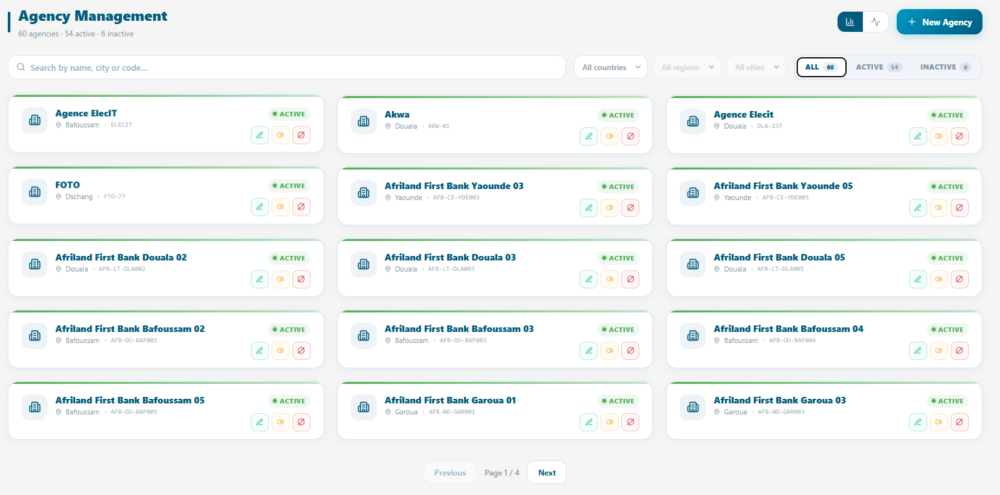
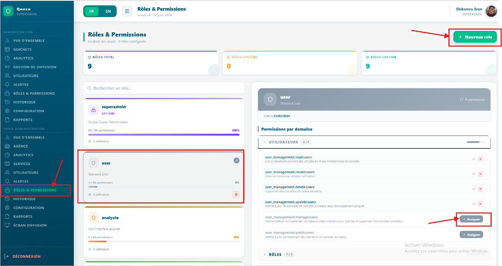

# Configuration du Super Admin

*Comment le Super Administrateur configure la plateforme : création des
agences, gestion des utilisateurs et définition des rôles et
permissions.*

<table>
<colgroup>
<col style="width: 50%" />
<col style="width: 50%" />
</colgroup>
<tbody>
<tr class="odd">
<td>
<strong>Dans ce chapitre</strong>

• 3.1 Présentation du Super Administrateur 
• 3.2 Création d’une agence 
• 3.3 Gestion des agences 
• 3.4 Création des utilisateurs 
• 3.5 Gestion des utilisateurs 
• 3.6 Rôles et permissions 
• 3.7 Analytique
</td>
<td>
<strong>Apres ce chapitre, vous serez en mesure de</strong>

• Configurer une nouvelle agence à partir de zéro 
• Configurer les paramètres d’une agence 
• Créer et gérer des comptes utilisateurs 
• Affecter des utilisateurs à des agences 
• Comprendre le contrôle d’accès basé sur les rôles 
• Personnaliser les permissions par rôle
</td>
</tr>
</tbody>
</table>

## 3.1 Présentation du Super Administrateur

Le Super Administrateur est le compte disposant du niveau de privilège
le plus élevé dans Queco. Généralement, le rôle de Super Administrateur
peut être attribué à toute personne ; celle-ci disposera alors d’un
accès complet à la plateforme et pourra effectuer toutes les actions
disponibles.

Toute la configuration globale de la plateforme création des agences,
provisionnement des utilisateurs et définition des règles d’accès est
réalisée à partir du compte Super Administrateur.

Lorsque le Super Administrateur se connecte, il accède à un tableau de
bord centralisé offrant une vue d’ensemble de toute la plateforme :
toutes les agences, le nombre d’utilisateurs, le nombre d’utilisateurs
actifs, les guichets actifs et les volumes de tickets en temps réel.

<table>
<colgroup>
<col style="width: 100%" />
</colgroup>
<tbody>
<tr class="odd">
<td>

<em>Figure 3.1 —</em> Tableau de bord Super Admin avec cartes
récapitulatives de la plateforme et boutons d'action rapide
</td>
</tr>
</tbody>
</table>

### 3.1.1 Responsabilités du Super Administrateur

| **Responsabilité**                   | **Description**                                                                                                |
|--------------------------------------|----------------------------------------------------------------------------------------------------------------|
| **Configuration des agences**        | Créer et configurer toutes les agences opérant sur la plateforme.                                              |
| **Provisionnement des utilisateurs** | Créer les comptes utilisateurs et les affecter à l’agence et au rôle appropriés.                               |
| **Gestion des rôles**                | Définir et personnaliser les rôles (Gestionnaire, Agent) avec des permissions granulaires.                     |
| **Catalogue des services**           | Créer et maintenir la liste principale des services et des opérations.                                         |
| **Supervision de la plateforme**     | Surveiller l’état général de la plateforme, les volumes de tickets et l’activité des agences.                  |
| **Contrôle d’accès**                 | Activer, désactiver ou supprimer des utilisateurs et des agences en fonction des changements organisationnels. |

|             |                                                                                                                                                                                                                                               |
|-------------|-----------------------------------------------------------------------------------------------------------------------------------------------------------------------------------------------------------------------------------------------|
| **WARNING** | Les identifiants du Super Administrateur doivent être conservés en toute sécurité. Activez l’authentification à deux facteurs si elle est disponible et ne partagez jamais le compte Super Administrateur avec d’autres membres du personnel. |

## 3.2 Création d’une Agence

Les agences sont les principales unités organisationnelles de Queco.
Chaque utilisateur, guichet et service appartient à une agence. Vous
devez créer au moins une agence avant de pouvoir ajouter des
utilisateurs, des guichets, des services et des opérations, ainsi
qu’affecter un utilisateur à une agence et à un guichet.

Considérez une agence comme une succursale, un département ou un bureau
de votre organisation.

### 3.2.1 Étape par étape : Créer une nouvelle agence

> **Étape 1 :** Dans la barre latérale, cliquez sur **Agences**.
>
> **Étape 2 :** Cliquez sur le bouton **Ajouter une agence** située dans
> le coin supérieur droit de la page des agences.
>
> **Étape 3 :** La fenêtre modale **Nouvelle agence** s’ouvre avec le
> formulaire. Remplissez tous les champs obligatoires.
>
> **Étape 4 :** Vérifiez attentivement toutes les informations saisies,
> puis cliquez sur **Enregistrer**.
>
> *L’agence est enregistrée avec le statut **Actif** par défaut.*
>
> **Étape 5 :** Pour activer ou désactiver l’agence créée, cliquez
> simplement sur l’icône de statut (icône jaune) sur la carte de
> l’agence.
>
> Seules les agences **actives** peuvent traiter des tickets et
> apparaître dans les tableaux de bord des utilisateurs.
>
> **Étape 6 :** Confirmez l’activation en vérifiant sa présence dans la
> liste des agences avec un bouton vert.

<table>
<colgroup>
<col style="width: 100%" />
</colgroup>
<tbody>
<tr class="odd">
<td>

<em>Figure 3.2 — Formulaire de création d’une nouvelle agence avec
tous les champs visibles</em>
</td>
</tr>
</tbody>
</table>

|         |                                                                                                                                                                                                               |
|---------|---------------------------------------------------------------------------------------------------------------------------------------------------------------------------------------------------------------|
| **TIP** | Créez toutes vos agences avant d’ajouter des utilisateurs. Ainsi, vous pourrez affecter chaque utilisateur à son agence correcte lors de la création de son compte, sans avoir à les modifier ultérieurement. |

### 3.2.2 Référence des champs du formulaire d’agence

| **Field**            | **Description**                                                                                                                 | **Statut**      |
|----------------------|---------------------------------------------------------------------------------------------------------------------------------|-----------------|
| **Nom de l’agence**  | Nom complet légal ou opérationnel de l’agence (par exemple : « Agence de Mfoundi »). Affiché sur toute la plateforme.           | **Obligatoire** |
| **Pays de l’agence** | Pays dans lequel l’agence est située (Cameroun).                                                                                | **Obligatoire** |
| **Région**           | Région administrative ou province dans laquelle l’agence opère. Doit être sélectionnée avant de pouvoir choisir une ville.      | **Obligatoire** |
| **City**             | Ville dans laquelle l’agence est située. Disponible uniquement après la sélection d’une région.                                 | **Obligatoire** |
| **Code de l’agence** | Identifiant court unique de l’agence (par exemple : « YDE-007 »). Utilisé pour les références internes et les intégrations API. | **Obligatoire** |
| **Altitude**         | Altitude géographique de la localisation de l’agence. Valeur par défaut : 0.                                                    | Optionnel       |
| **Longitudes**       | Coordonnée géographique de la longitude de la localisation de l’agence. Valeur par défaut : 0.                                  | **Optionnel**   |

|          |                                                                                                                                                                                                         |
|----------|---------------------------------------------------------------------------------------------------------------------------------------------------------------------------------------------------------|
| **NOTE** | Le code de l’agence ne peut pas être modifié après le traitement du premier ticket dans cette agence, car il est intégré dans les numéros de tickets. Choisissez-le avec soin lors de la configuration. |

## 3.3 Managing Agencies

Après la création des agences, vous pouvez modifier leurs informations,
changer leur statut ou les supprimer entièrement depuis la page
**Agences**. Utilisez la barre de recherche située en haut de la liste
pour trouver rapidement une agence par son nom ou son code.

### 3.1.1 Action disponible sur la page des agences 

| **Action**                             | **Comment l’effectuer**                                                                                                                                           |
|----------------------------------------|-------------------------------------------------------------------------------------------------------------------------------------------------------------------|
| **Voir les détails**                   | Cliquez sur la carte de l’agence pour ouvrir son profil complet, incluant les guichets, les utilisateurs et les statistiques des services.                        |
| **Modifier**                           | Cliquez sur l’icône verte en forme de stylo. Le formulaire modal apparaîtra pour permettre les modifications.                                                     |
| **Activer**                            | Toutes les agences désactivées se trouvent dans la liste des agences désactivées. Allez-y puis activez l’agence en changeant son statut.                          |
| **Désactiver**                         | Cliquez sur l’icône de statut → **Désactiver**. L’agence est suspendue ; aucun nouveau ticket ne peut être créé. Les tickets ouverts existants sont mis en pause. |
| **Supprimer**                          | Cliquez sur l’icône rouge. Une fenêtre modale apparaîtra pour confirmer le code de l’agence, puis le bouton de suppression sera activé.                           |
| **Voir les statistiques de l’agence**  | Cliquez sur l’onglet de l’agence et toutes les statistiques seront affichées.                                                                                     |
| **Gérer les utilisateurs de l’agence** | Dans une agence, l’utilisateur est affecté à un guichet de cette agence. Ainsi, dans chaque guichet, vous verrez l’agent qui lui est affecté.                     |

|             |                                                                                                                                                                                                                                                                                                  |
|-------------|--------------------------------------------------------------------------------------------------------------------------------------------------------------------------------------------------------------------------------------------------------------------------------------------------|
| **WARNING** | La suppression d’une agence entraîne la suppression définitive de tous ses utilisateurs, guichets, services et de l’historique de ses tickets. Cette action est irréversible. Désactivez une agence au lieu de la supprimer, sauf si vous êtes certain que ses données ne sont plus nécessaires. |

<table>
<colgroup>
<col style="width: 100%" />
</colgroup>
<tbody>
<tr class="odd">
<td>

<em>Figure 3.3 — Liste des agences avec les options du menu
d’actions</em>
</td>
</tr>
</tbody>
</table>

## 3.4 Création des utilisateurs

Chaque personne qui accède à Queco doit disposer d’un compte utilisateur
unique. Les comptes sont créés par le Super Administrateur puis affectés
à une agence et à un rôle. L’agent fournit l’adresse e-mail qui sera
utilisée pour la connexion, sur laquelle il/elle recevra un OTP lors de
la connexion. Tous les mots de passe sont créés et gérés par le Super
Administrateur**. L’agent ne peut pas réinitialiser son mot de passe
pour le moment.**

### 3.4.1 Étape par étape : Créer un nouvel utilisateur

**Étape 1 :** Dans la barre latérale gauche, cliquez sur
**Utilisateurs**.

**Étape 2 :** Cliquez sur le bouton **Nouvel utilisateur** situé dans le
coin supérieur droit.

**Étape 3 :** Le formulaire **Nouvel utilisateur** s’ouvre. Remplissez
tous les champs obligatoires puis cliquez sur **Créer et continuer**.

<table>
<colgroup>
<col style="width: 100%" />
</colgroup>
<tbody>
<tr class="odd">
<td>

<em>Figure 3.4 — Formulaire de création d’un nouvel
utilisateur</em>
</td>
</tr>
</tbody>
</table>

|          |                                                                                                                                                                                      |
|----------|--------------------------------------------------------------------------------------------------------------------------------------------------------------------------------------|
| **NOTE** | L’adresse e-mail du nouvel utilisateur devient son identifiant de connexion et ne peut pas être modifiée après la création du compte. Vérifiez-la attentivement avant d’enregistrer. |

### 3.4.2 Référence du formulaire utilisateur

| **Field**                     | **Description**                                                                                                             | **Status**   |
|-------------------------------|-----------------------------------------------------------------------------------------------------------------------------|--------------|
| **Adresse e-mail**            | Champ texte obligatoire pour l’adresse e-mail de l’utilisateur. Un exemple de format est affiché (par ex. : exemple@scb.com | **Required** |
| **Mot de passe**              | Champ mot de passe obligatoire avec une icône de visibilité (œil) permettant d’afficher ou de masquer la saisie.            | **Required** |
| **Bouton Annuler**            | Bouton contour permettant de fermer la fenêtre modale sans enregistrer les données.                                         |              |
| **Bouton Créer et continuer** | Bouton principal (vert) qui valide les identifiants et passe à l’étape 2 (Profil).                                          |              |

## 3.5 Gestion des utilisateurs

La gestion des utilisateurs couvre l’ensemble du cycle de vie d’un
compte utilisateur : de sa création à son administration quotidienne,
jusqu’à sa désactivation ou sa suppression. Toutes les actions de
gestion des utilisateurs sont effectuées depuis **Utilisateurs & Rôles →
Utilisateurs**.

### 3.5.1 Actions de gestion des utilisateurs

| **Action**                      | **Comment l’effectuer**                                                                                                                                            |
|---------------------------------|--------------------------------------------------------------------------------------------------------------------------------------------------------------------|
| Modifier le profil              | Cliquez sur le nom de l’utilisateur pour ouvrir son profil, cliquez sur **Modifier**, effectuez les changements puis cliquez sur **Enregistrer**.                  |
| Désactiver                      | Ouvrez le profil utilisateur → basculez le **Statut** sur **Inactif**. L’utilisateur est immédiatement déconnecté et ne peut plus se reconnecter.                  |
| Réactiver                       | Ouvrez le profil utilisateur → remettez le **Statut** sur **Actif**. L’utilisateur peut se reconnecter immédiatement.                                              |
| Changer le rôle                 | Ouvrez le profil utilisateur → modifiez le champ **Rôle** → enregistrez. Les nouvelles permissions s’appliqueront lors de la prochaine connexion de l’utilisateur. |
| Affecter à une autre agence     | Ouvrez le profil utilisateur → modifiez le champ **Agence** → enregistrez. L’utilisateur perd l’accès à l’agence précédente.                                       |
| Supprimer                       | Cliquez sur **Supprimer** dans la liste des utilisateurs. L’utilisateur et son journal d’activité sont supprimés définitivement.                                   |
| Consulter le journal d’activité | Ouvrez le profil utilisateur → cliquez sur l’onglet **Activité** pour voir la piste d’audit complète de toutes les actions effectuées par cet utilisateur.         |

|             |                                                                                                                                                                                                                                                    |
|-------------|----------------------------------------------------------------------------------------------------------------------------------------------------------------------------------------------------------------------------------------------------|
| **WARNING** | La suppression d’un utilisateur est définitive et le retire de tous les journaux d’audit. Désactivez les comptes au lieu de les supprimer, sauf si vous êtes certain que les données ne sont plus nécessaires à des fins de conformité ou d’audit. |

## 3.6 Rôles et permissions

Queco utilise le contrôle d’accès basé sur les rôles (RBAC). Chaque
utilisateur se voit attribuer exactement un rôle. Le rôle est un
ensemble nommé de permissions qui contrôle les pages, les actions et les
données auxquelles l’utilisateur peut accéder. Queco est fourni avec
trois rôles par défaut : Super Administrateur, Gestionnaire et Agent.

### 3.6.1 Comparaison des rôles par défaut

| **Fonctionnalité / Action**               | **Super Administrateur** | **Gestionnaire** | **Agent** |
|-------------------------------------------|--------------------------|------------------|-----------|
| **Créer / gérer les agences**             | **✔**                    | **✘**            | **✘**     |
| **Créer / gérer les utilisateurs**        | **✔**                    | Limited          | **✘**     |
| **Attribuer les rôles et permissions**    | **✔**                    | **✘**            | **✘**     |
| **Créer / gérer les guichets**            | **✔**                    | **✔**            | **✘**     |
| **Définir les services et opérations**    | **✔**                    | **✔**            | **✘**     |
| **Activer les services par agence**       | **✔**                    | **✔**            | **✘**     |
| **Créer des tickets**                     | **✔**                    | **✔**            | **✔**     |
| **Traiter les tickets au guichet**        | **✔**                    | **✔**            | **✔**     |
| **Transférer les tickets**                | **✔**                    | **✔**            | **✔**     |
| **Consulter les analyses**                | **✔**                    | **✔**            | **✘**     |
| **Exporter les rapports**                 | **✔**                    | **✔**            | **✘**     |
| **Voir toutes les agences (global)**      | **✔**                    | **✘**            | **✘**     |
| **Gérer les paramètres de la plateforme** | **✔**                    | **✘**            | **✘**     |

|          |                                                                                                                                                                                                                        |
|----------|------------------------------------------------------------------------------------------------------------------------------------------------------------------------------------------------------------------------|
| **NOTE** | Limité » signifie que le Gestionnaire peut effectuer cette action uniquement au sein de l’agence qui lui est attribuée (par exemple, voir les utilisateurs de sa propre agence, mais pas ceux de toute la plateforme). |

### 3.6.2 Personnalisation des permissions des rôles

Le Super Administrateur peut personnaliser les permissions par défaut
des rôles Gestionnaire et Agent. Ces personnalisations s’appliquent à
l’ensemble de la plateforme pour tous les utilisateurs possédant ce
rôle.

**Étape 1 :** Dans la barre latérale, allez dans **Rôles &
permissions**, puis **Rôles**.

**Étape 2 :** Cliquez sur le rôle souhaité ou créez un nouveau rôle en
cliquant sur le bouton **« Nouveau rôle »** situé dans le coin supérieur
droit, puis attribuez les permissions souhaitées.

**Étape 3 :** Le rôle sera mis en évidence avec sa couleur unique, tout
comme la section des permissions. Vous pourrez ensuite lui attribuer les
permissions souhaitées et une barre de pourcentage sera affichée.

**Étape 4 :** Cliquez sur **Attribuer** pour chaque permission que vous
souhaitez accorder au rôle concerné.

Les permissions attribuées sont affichées en vert ; celles non
attribuées en rouge.

**Etape 5** : les modifications sont enregistrées automatiquement

Le role personnalisé est désormais disponible dans le champ **Rôle**
lors de la création ou de la modification d’utilisateurs.

<table>
<colgroup>
<col style="width: 100%" />
</colgroup>
<tbody>
<tr class="odd">
<td>

<em>Figure 3.6 Panneau des permissions des rôles avec interrupteurs
de fonctionnalités</em>
</td>
</tr>
</tbody>
</table>

|         |                                                                                                                                                                                                                                                         |
|---------|---------------------------------------------------------------------------------------------------------------------------------------------------------------------------------------------------------------------------------------------------------|
| **TIP** | Commencez par le rôle Agent comme base et ajoutez uniquement les permissions supplémentaires nécessaires. Cela respecte le principe du moindre privilège : les utilisateurs ne reçoivent que les accès dont ils ont besoin pour accomplir leur travail. |

### 3.6.4 Attribution d’un rôle à un utilisateur

Les rôles sont attribués à chaque utilisateur lors de la création du
compte ou à tout moment via le profil de l’utilisateur. Il n’y a aucune
limite au nombre d’utilisateurs pouvant partager le même rôle.

|          |                                                                                                                                                                                                                                                                                            |
|----------|--------------------------------------------------------------------------------------------------------------------------------------------------------------------------------------------------------------------------------------------------------------------------------------------|
| **NOTE** | La modification du rôle d’un utilisateur prend effet lors de sa prochaine connexion ou après l’actualisation de la page. Si un utilisateur est connecté au moment où son rôle est modifié, il peut rencontrer un comportement inattendu jusqu’à ce qu’il se déconnecte puis se reconnecte. |

## 3.7 Résumé du chapitre

Ce chapitre a couvert l’ensemble du processus de configuration du Super
Administrateur. À présent, vous devriez avoir :

1.  Créé une ou plusieurs agences avec tous les champs de configuration
    requis.

2.  Activé les agences afin qu’elles puissent commencer à accepter des
    tickets.

3.  Créé des comptes utilisateurs pour tous les Gestionnaires et Agents
    de chaque agence.

4.  Affecte chaque utilisateur à l’agence et au rôle appropriés.

5.  Vérifié et, si nécessaire personnalisé les permissions des rôles
    pour votre organisation

*Chapitre 4*

