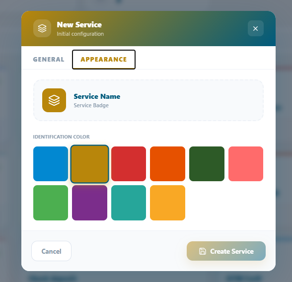
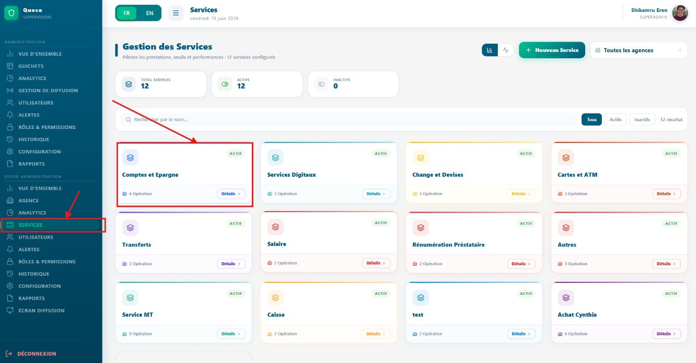
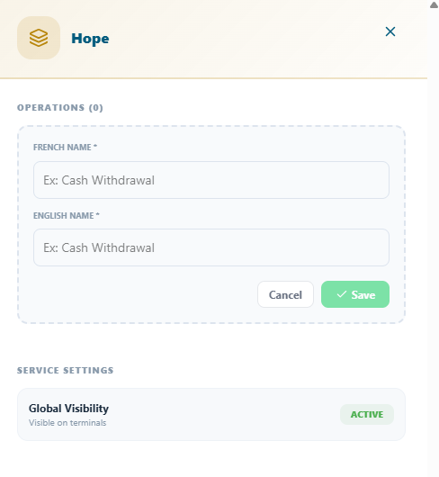
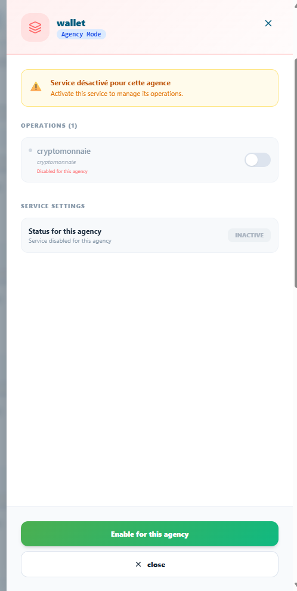
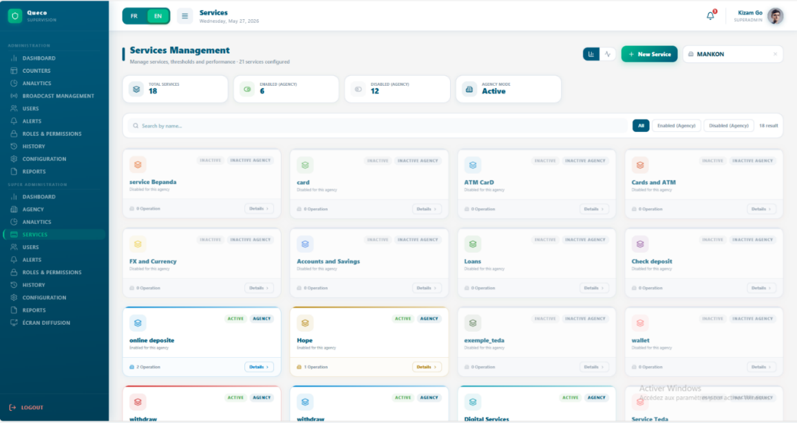

# Services & Operations

*Comment construire et gérer le catalogue de services définissant ce que
votre agence propose, structurer les opérations au sein de chaque
service et les activer pour chaque agence.*

<table>
<colgroup>
<col style="width: 50%" />
<col style="width: 50%" />
</colgroup>
<thead>
<tr class="header">
<th>
<strong>Dans ce Chapitre :</strong>

<ul>
<li>
5.1 Services vs. Opérations
</li>
<li>
5.2 Planification de votre catalogue de services
</li>
<li>
5.3 Création d’un service
</li>
<li>
5.4 Création des opérations
</li>
<li>
5.5 Activation des services par agence
</li>
<li>
5.6 Gestion du catalogue de services
</li>
<li>
5.7 Bonnes pratiques pour la gestion du catalogue de
services
</li>
</ul></th>
<th><blockquote>

<strong>A l’issue de ce chapitre, vous serez capable
de :</strong>

</blockquote>
<ul>
<li>
Distinguer les services des opérations
</li>
<li>
Planifier un catalogue de services logique et cohérent
</li>
<li>
Créer des services avec tous les champs requis
</li>
<li>
Ajouter des opérations à un service
</li>
<li>
Activer des services pour des agences spécifiques
</li>
<li>
Modifier, désactiver et réorganiser les services
</li>
<li>
Appliquer les bonnes pratiques pour maintenir un catalogue de
services clair et bien structuré.
</li>
</ul></th>
</tr>
</thead>
<tbody>
</tbody>
</table>

## 5.1 Service vs Opérations

Avant de construire votre catalogue de services, il est essentiel de
comprendre la distinction entre un Service et une Opération. Ces deux
éléments fonctionnent ensemble pour décrire ce que votre agence propose
et comment chaque demande client est catégorisée lors de la création
d'un ticket.

| **Concept**   | **Definition**                                                     | **Example**                                                                     |
|---------------|--------------------------------------------------------------------|---------------------------------------------------------------------------------|
| **Service**   | Une large catégorie de travail offerte aux clients par une agence. | Gestion de compte                                                               |
| **Operation** | Une tâche spécifique et précise effectuée au sein d'un service.    | Ouvrir un compte, Fermer un compte, Mettre à jour les informations personnelles |
| **Ticket**    | Une demande client liée exactement à un Service et une Opération.  | Ticket pour « Gestion de compte → Ouvrir un compte »                            |

Considérez un service comme un dossier et une opération comme un fichier
à l'intérieur. Lorsqu'un agent crée un ticket, il sélectionne d'abord le
service, puis choisit l'opération spécifique effectuée. Cette structure
à deux niveaux permet aux analyses de Queco de rendre compte non
seulement des services les plus demandés, mais aussi des tâches
spécifiques qui consomment le plus de temps.

| **NOTE** | Un service peut contenir autant d'opérations que nécessaire. Cependant, chaque service doit avoir au moins une opération avant de pouvoir être activé pour une agence. |
|----------|------------------------------------------------------------------------------------------------------------------------------------------------------------------------|

### 5.1.1 Exemples concerts 

| **Industry**        | **Exemple Service**      | **Opérations qu'il contient**                                                               |
|---------------------|--------------------------|---------------------------------------------------------------------------------------------|
| **Banque**          | Services de prêt         | Nouvelle demande de prêt, Remboursement de prêt, Consultation du solde, Clôture anticipée   |
| **Administration**  | État civil               | Acte de naissance, Acte de décès, Acte de mariage, Changement de nom                        |
| **Telecom**         | Services carte SIM       | Activation nouvelle SIM, Remplacement SIM, Blocage SIM, Mise à niveau du forfait            |
| **Clinique**        | Services de consultation | Consultation générale, Visite de suivi, Collecte des résultats, Renouvellement d'ordonnance |
| **Bureau de Poste** | Services colis           | Envoyer un colis, Suivre un colis, Collecter un colis, Retourner un colis                   |

## 5.2 Planification de votre catalogue de services

Prendre le temps de planifier votre catalogue de services avant de le
configurer dans Queco permettra d'éviter des retouches importantes
ultérieurement. Un catalogue bien structuré améliore la précision du
routage des tickets, rend les analyses plus pertinentes et réduit la
confusion pour les agents lors de la création des tickets.

### 5.2.1 Liste de contrôle pour la planification du catalogue

1.  Listez tous les services orientés clients que votre organisation
    fournit.

2.  Pour chaque service, listez chaque tâche distincte qu'un agent
    pourrait effectuer pour un client.

3.  Regroupez les tâches qui se recoupent si deux tâches sont
    essentiellement identiques, fusionnez-les en une seule opération.

4.  Estimez le temps moyen nécessaire pour accomplir chaque opération.
    Cette valeur alimente l'estimateur de temps d'attente.

5.  Identifiez quelles agences proposent quels services toutes les
    agences n'ont pas besoin du catalogue complet.

6.  Convenez de conventions de nommage cohérentes avant de saisir quoi
    que ce soit dans Queco (ex. : utilisez des verbes : « Ouvrir un
    compte », et non « Ouverture de compte »).

| **TIP** | Préparez d'abord votre catalogue de services dans un tableur (Nom du service, Code du service, Opérations, Durée estimée, Agences). Examinez-le avec votre équipe avant de créer quoi que ce soit dans Queco. Renommer des services après que des tickets ont été traités peut affecter les rapports historiques. |
|---------|-------------------------------------------------------------------------------------------------------------------------------------------------------------------------------------------------------------------------------------------------------------------------------------------------------------------|

### 5.2.2 Conventions de nommage

Un nommage cohérent dans votre catalogue de services facilite
l'utilisation de la plateforme pour tous les rôles. Suivez ces
recommandations :

| **Element**             | **Recommended Style**                                | **Example**                             |
|-------------------------|------------------------------------------------------|-----------------------------------------|
| **Nom du service**      | Première lettre en majuscule, basé sur un nom        | Gestion de compte, Services de prêt     |
| **Code du Service**     | Majuscules, séparé par des tirets, 3 à 6 caractères  | ACC-MGT, LOAN-SVC, REG-DOC              |
| **Nom de l’opération**  | Première lettre en majuscule, verbe d'action + objet | Ouvrir un compte, Soumettre une demande |
| **Code de l’opération** | Majuscules, court, sans espaces                      | OPEN-ACC, SUBMT-APP                     |

## 5.3 Création d'un service

Les services sont créés au niveau de la plateforme par le Super
Administrateur ou un Responsable. Une fois créés, ils existent dans le
catalogue principal et peuvent ensuite être activés de manière sélective
pour chaque agence. Un service sans opération ne peut pas être activé.

### 5.3.1 Étape par étape : Créer un nouveau service

**Étape 1 :** Depuis la barre latérale gauche, cliquez sur « Services ».

**Étape 2 :** Cliquez sur « Ajouter un service » dans le coin supérieur
droit de la page des services.

**Étape 3 :** Remplissez tous les champs obligatoires dans le formulaire
du nouveau service.

Vous pouvez également définir la couleur d'apparence de votre choix.

| *Figure 5.1 — Couleur d'apparence du service*  |
|-----------------------------------------------------------------------------------------|

| *Figure 5.1 — Formulaire de création d'un nouveau service*  |
|-------------------------------------------------------------------------------------------------------|

| **NOTE** | Un service nouvellement créé est invisible pour tous les agents et guichets jusqu'à ce qu'il soit (1) doté d'au moins une opération, et (2) explicitement activé pour une agence. Voir Sections 5.4 et 5.5. |
|----------|-------------------------------------------------------------------------------------------------------------------------------------------------------------------------------------------------------------|

### 5.3.2 Référence des champs du formulaire de service

| **Field**             | **Description**                                                 | **Statut**      |
|-----------------------|-----------------------------------------------------------------|-----------------|
| **Nom Services (FR)** | Nom lisible affiché aux agents et dans les rapports en français | **Obligatoire** |
| **Nom Services (EN)** | Nom lisible affiché aux agents et dans les rapports en anglais  | **Obligatoire** |

## 5.4 Création d’une Operation

Les opérations sont les tâches individuelles au sein d'un service. Elles
doivent être créées après l'existence du service parent. Vous pouvez
ajouter plusieurs opérations à un service à tout moment, même après que
le service est déjà actif et utilisé.

### 5.4.1 Étape par étape : Ajouter une opération à un service

**Étape 1 :** Cliquez sur « Services », cliquez sur le nom du service
auquel vous souhaitez ajouter des opérations, ou identifiez le service
et cliquez sur le bouton « Détails » de la carte du service.

**Étape 2 :** Créez une nouvelle opération en cliquant sur le bouton «
+Ajouter » dans le coin supérieur droit et remplissez les champs requis.

| *Figure 5.2 Service Detail page showing the Operations section and 'Add Operation' button*  |
|---------------------------------------------------------------------------------------------------------------------------------------|

| **TIP** | Ajoutez toutes les opérations d'un service avant de l'activer pour les agences. L'ajout d'opérations à un service déjà actif fonctionne bien, mais les agents utilisant le service à ce moment-là ne verront pas la nouvelle opération avant leur prochain rafraîchissement de page. De plus, vous pouvez activer et désactiver une opération dans un service particulier. |
|---------|----------------------------------------------------------------------------------------------------------------------------------------------------------------------------------------------------------------------------------------------------------------------------------------------------------------------------------------------------------------------------|

### 5.4.2 Référence des champs du formulaire d'opération

| **Field**              | **Description**                                                                                                                        | **Statut**      |
|------------------------|----------------------------------------------------------------------------------------------------------------------------------------|-----------------|
| **Nom de l’opération** | Nom avec verbe d'action que les agents voient lors de la création d'un ticket (ex. : « Ouvrir un compte »). En anglais et en français. | **Obligatoire** |

<table>
<colgroup>
<col style="width: 100%" />
</colgroup>
<thead>
<tr class="header">
<th>

<em>Figure 5.2 Operation form field</em>
</th>
</tr>
</thead>
<tbody>
</tbody>
</table>

## 5.5 Activation des services par agence

La création d'un service dans le catalogue principal ne le rend pas
automatiquement disponible pour une agence. Chaque service doit être
explicitement activé pour chaque agence qui en a besoin. Cette
conception permet à différentes agences de proposer différents
catalogues de services à partir de la même liste principale par exemple,
une agence principale peut proposer tous les 12 services tandis qu'un
bureau satellite n'en propose que 4.

###  5.5.1 Étape par étape : Activer un service pour une

**Étape 1 :** Depuis la barre latérale, cliquez sur « Services ».

**Étape 2 :** Dans le coin supérieur droit, à côté du bouton « Nouveau
service », se trouve une barre de recherche avec un menu déroulant de
toutes les agences créées. Sélectionnez simplement l'agence pour
laquelle vous souhaitez activer le service.

**Étape 3 :** Après la sélection, le catalogue de tous les services
apparaîtra en état désactivé.

**Étape 4 :** Cliquez sur le service concerné et une barre latérale
apparaîtra depuis la droite.

**Étape 5 :** Dans la barre latérale, cliquez sur le bouton vert «
Activer pour cette agence » qui deviendra ensuite rouge.

| *Figure 5.4 — Page de détail montrant comment activer un service avec son opération*  |
|---------------------------------------------------------------------------------------------------------------------------------|

**Étape 6 :** En haut, vous pouvez également activer l'opération dans ce
service pour cette agence si vous le souhaitez.

| *Figure 5.4 Agency Services tab showing master catalogue with activated and deactivated service for an agency (ex. Mankon)* |
|----------------------------------------------------------------------------------------------------------------------------------------------------------------------------------------------------|

| **NOTE** | Si un service n'a pas d'opérations, ou si son opération est désactivée, activez d'abord le service puis activez l'opération ultérieurement. Et si un service n'a pas d'opération, vous pourrez en créer une plus tard. |
|----------|------------------------------------------------------------------------------------------------------------------------------------------------------------------------------------------------------------------------|

| **TIP** | Après avoir activé les services pour une agence, vérifiez qu'au moins un guichet de cette agence a été lié à chaque service activé. Si aucun guichet ne gère un service, les tickets pour ce service entreront dans la file d'attente mais ne seront jamais acheminés vers un agent. |
|---------|--------------------------------------------------------------------------------------------------------------------------------------------------------------------------------------------------------------------------------------------------------------------------------------|

## 5.6 Gestion du catalogue de services

Les services et les opérations peuvent être modifiés, désactivés ou
archivés à tout moment. Il est important de comprendre l'impact de
chaque action sur les données en cours avant d'apporter des
modifications à un catalogue de services actif.

### 5.6.1 Actions de gestion des services

| **Action**              | **Comment L’effectuer**                                                                                                                                  |
|-------------------------|----------------------------------------------------------------------------------------------------------------------------------------------------------|
| **Modifier un Service** | Aller dans Services → cliquer sur le nom du service → cliquer sur Modifier → modifier les champs → Enregistrer.                                          |
| Désactiver un service   | Aller dans Services → cliquer sur le nom du service → cliquer sur Désactiver → cliquer sur Confirmer.                                                    |
| Réactiver un service    | Aller dans Services → cliquer sur le nom du service → cliquer sur Activer → cliquer sur Confirmer.                                                       |
| Supprimer un service    | Aller dans Services → cliquer sur le nom du service → cliquer sur Archiver le service → saisir le nom du service → cliquer sur Confirmer la suppression. |

### 5.6.2 Actions de gestion des opérations

| **Action**                 | **Comment L’effecteur**                                                                                                                                                                 |
|----------------------------|-----------------------------------------------------------------------------------------------------------------------------------------------------------------------------------------|
| Modifier une opération     | Ouvrir le service → cliquer sur l'opération → cliquer sur Modifier → modifier → Enregistrer.                                                                                            |
| Désactiver une opération   | Ouvrir le service → basculer le statut de l'opération sur Désactivé. Les agents ne la voient plus dans le formulaire de création de ticket. Les tickets existants ne sont pas affectés. |
| Réactiver une opération    | Basculer le statut de l'opération sur Activé. Elle réapparaît immédiatement pour les agents.                                                                                            |
| Supprimer une opération    | Ouvrir le service → cliquer sur (⋮) sur l'opération → Supprimer → confirmer. Action permanente. Les tickets historiques conservent le libellé « Opération supprimée ».                  |
| Réorganiser les opérations | Faire glisser les lignes d'opération par l'icône de poignée au sein d'un service. Contrôle l'ordre d'affichage dans le formulaire de ticket.                                            |

| **WARNING** | La suppression d'un service ou d’une opération associée à des tickets ouverts (non résolus) entraînera l'affichage d'informations incomplètes sur ces tickets. Vérifiez toujours l'existence de tickets ouverts avant de supprimer. En cas de doute, désactivez plutôt que de supprimer. |
|-------------|------------------------------------------------------------------------------------------------------------------------------------------------------------------------------------------------------------------------------------------------------------------------------------------|

### 5.6.3 Matrice d'impact : Action vs Données

Utilisez ce tableau pour comprendre l'effet de chaque action de gestion
sur les données en cours avant de procéder.

| **Action**                   | **Tickets ouverts**                       | **Tickets historiques**          | **Disponibilité agence**                              |
|------------------------------|-------------------------------------------|----------------------------------|-------------------------------------------------------|
| **Désactiver un service**    | Aucun nouveau ticket créé                 | Entièrement intacts              | Retiré de toutes les agences                          |
| **Réactiver un service**     | Reprend normalement                       | Entièrement intacts              | Restauré dans toutes les agences précédemment actives |
| **Supprimer un service**     | Marqués comme incomplets                  | Libellés « Service supprimé »    | Supprimé définitivement                               |
| **Désactiver une opération** | Aucun nouveau ticket pour cette opération | Entièrement intacts              | Opération masquée dans le formulaire de ticket        |
| **Supprimer une opération**  | Marqués comme incomplets                  | Libellés « Opération supprimée » | Supprimé définitivement                               |

## 5.7 Bonnes pratiques du catalogue de services

Un catalogue de services bien entretenu est le fondement d'analyses
précises et d'une gestion efficace des files d'attente. Suivez ces
pratiques pour maintenir le catalogue propre et efficace.

> **Conception du catalogue**

- Gardez les services larges et les opérations spécifiques. Visez 3 à 8
  opérations par service. Si un service compte plus de 10 opérations,
  envisagez de le diviser en 2 services.

- Évitez de créer des opérations en double entre les catégories de
  services.

> **Maintenance Continue**

- Examinez le catalogue de services une fois par trimestre. Supprimez ou
  désactivez les opérations qui ne sont plus en vigueur.

- Lorsqu'un service change significativement (ex. : introduction d'un
  nouveau processus), mettez à jour le champ instructions afin que les
  agents disposent toujours des directives actuelles.

- Surveillez le rapport d'utilisation des services dans les analyses
  pour identifier les opérations à très faibles volumes.

- Ne supprimez jamais un service ou une opération pendant qu'une
  initiative active est en cours. Planifiez les suppressions pendant les
  heures creuses et annoncez-les aux agents à l'avance.

## 5.8 Résumé du chapitre

Ce chapitre couvre l'ensemble du flux de travail du catalogue de
services dans Queco, de la planification et des conventions de nommage
jusqu'à la création, l'activation et la gestion continue. À présent,
vous devriez être en mesure de :

- Distinguer les services des opérations et expliquer leur relation avec
  les tickets.

- Planifier et documenter un catalogue de services avant de le
  configurer dans Queco.

- Créer des services avec tous les champs requis et des conventions de
  nommage cohérentes.

- Ajouter et gérer des opérations au sein de chaque service.

- Activer des services pour des agences individuelles et des opérations
  spécifiques au sein de celles-ci.

*Chapitre 6*

