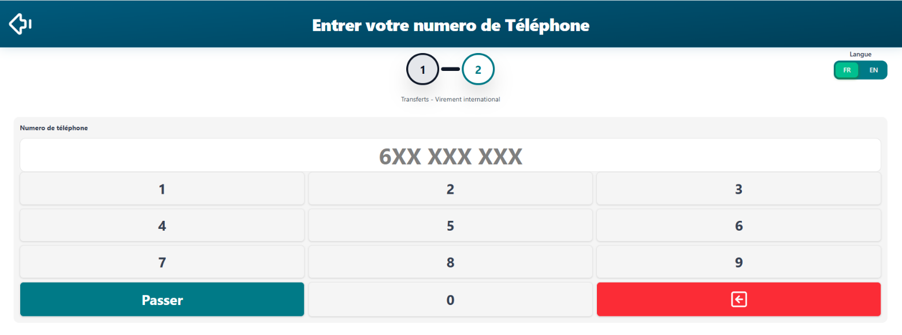
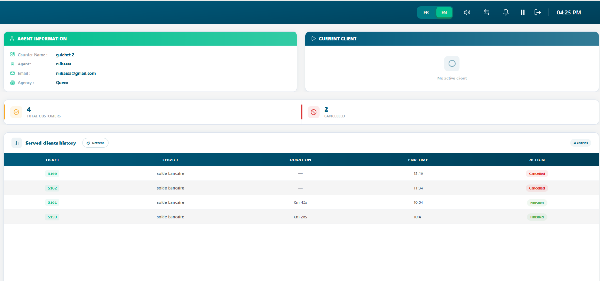

# Gestion Des Tickets

*Le flux de travail quotidien principal : comment créer, appeler,
traiter, mettre en attente, transférer et clôturer les tickets de
service du début à la fin.*

<table>
<colgroup>
<col style="width: 50%" />
<col style="width: 50%" />
</colgroup>
<thead>
<tr class="header">
<th>
<strong>Dans ce Chapitre</strong>

• 6.1 Le cycle de vie d’un ticket 
• 6.2 Création d’un ticket 
• 6.3 Appeler le ticket suivant 
• 6.4 Traitement d’un ticket 
• 6.5 Mettre un ticket en attente 
• 6.6 Transférer un ticket 
• 6.7 Clôturer un ticket 
• 6.8 Historique et recherche des tickets
</th>
<th>
<strong>Apres ce Chapitre, Vous serez en mesure de</strong>

<blockquote>

• Comprendre chaque étape du cycle de vie d’un ticket 
• Créer correctement un nouveau ticket de service 
• Appeler le prochain client dans la file d’attente 
• Traiter et mettre à jour un ticket en temps réel 
• Mettre un ticket en attente et le reprendre 
• Transférer un ticket vers un autre guichet ou un autre agent 
• Clôturer un ticket avec des notes de résolution appropriées 
• Rechercher et consulter les tickets historiques

</blockquote></th>
</tr>
</thead>
<tbody>
</tbody>
</table>

## 6.1 Le cycle de vie d'un ticket

Chaque demande de service client dans Queco suit un cycle de vie défini.
Comprendre chaque étape aide à traiter les tickets correctement et
permet aux responsables d'identifier les retards ou problèmes dans la
file d'attente.

| **\#** | **Status** | **Description**                                                                               |
|--------|------------|-----------------------------------------------------------------------------------------------|
| **1**  | Créé       | A new ticket has been issued. It has a unique number and is waiting in the agency queue.      |
| **2**  | En attente | The ticket is in line and waiting to be called by an available agent at the relevant counter. |
| **3**  | Appelé     | An agent has called the ticket number. The customer is being summoned to the counter.         |
| **4**  | En cours   | The agent is actively processing the customer's request at the counter.                       |
| **5**  | Annulé     | The ticket was voided before processing (e.g., customer left, duplicate entry).               |
| **6**  | Déclassé   | The ticket is added back at the end of the queue list                                         |

| **NOTE** | Un ticket peut passer entre les statuts En attente, Appelé, En cours, Terminé ou Annulé. Chaque changement de statut est enregistré dans l'historique d'activité du ticket pour une traçabilité complète. |
|----------|-----------------------------------------------------------------------------------------------------------------------------------------------------------------------------------------------------------|

## 6.2 Création d'un ticket (Kiosque)

Les tickets représentent des demandes de service client individuelles.
Ils peuvent être créés par les Super Administrateurs, les Responsables
et les Agents. Dans la plupart des déploiements, les agents au bureau
d'accueil créent les tickets au nom du client à son arrivée.

### 6.2.1 Étape par étape : Créer un nouveau ticket sur le kiosque

**Étape 1 :** Lorsque le client arrive dans une agence, il rencontrera
l'agent au bureau qui l'aidera à créer le ticket sur le kiosque.

*Les Super Administrateurs voient toutes les agences. Les Responsables
et Agents ne voient que leur agence assignée.*

**Étape 2 :** Sélectionnez le service dont le client a besoin.

*Seuls les services activés pour cette agence sont affichés. Voir
Chapitre 5 Section 5.5 si un service est manquant.*

**Étape 3 :** Sélectionnez l'opération, c'est-à-dire la tâche spécifique
au sein du service.

*Exemple : Sous « Gestion de compte », sélectionnez « Ouvrir un compte
».*

**Étape 4 :** Saisissez le numéro de téléphone mobile du client.

*Le numéro de téléphone du client est obligatoire.*

**Étape 5 :** Après que le client a saisi son numéro, cliquez sur «
Passer ».

*Un numéro de ticket unique est généré (ex. : ACC-0042) et le ticket
rejoint immédiatement la file d'attente.*

| *Figure 6.2 — New Ticket creation form with all fields*  |
|----------------------------------------------------------------------------------------------------|

| **NOTE** | Si aucun service n'apparaît dans le menu déroulant des services, l'agence n'a pas de services activés. Un Responsable ou Super Administrateur doit d'abord activer les services pour cette agence (Chapitre 5 Section 5.5). |
|----------|-----------------------------------------------------------------------------------------------------------------------------------------------------------------------------------------------------------------------------|

## 6.3 Appel du prochain ticket

Une fois votre guichet ouvert, vous pouvez commencer à appeler les
tickets de la file d'attente. Le système sert automatiquement les
tickets. Le ticket le plus ancien est servi en premier (FIFO).

### 6.3.1 Étape par étape : Appeler le prochain ticket

**Étape 1 :** Assurez-vous que votre guichet est Ouvert.

Si votre guichet affiche Fermé ou un message de non-assignation,
signalez-le à l'administrateur ou au super administrateur.

**Étape 2 :** Lorsqu'un client crée un nouveau ticket sur le kiosque, le
ticket est automatiquement assigné à la liste d'attente de ce service
dans cette agence.

Le numéro du ticket s'affiche automatiquement dans la liste d'attente
d'un guichet gérant ce service.

**Étape 3 :** Dans la liste d'attente, le statut du ticket est
EN_ATTENTE et lorsqu'il est appelé en session active, il passe à APPELÉ
puis EN_COURS, et le chronomètre du guichet démarre immédiatement.

Le client est censé se présenter à votre guichet lorsqu'il est appelé.

<table>
<colgroup>
<col style="width: 100%" />
</colgroup>
<thead>
<tr class="header">
<th>

<em>Figure 6.3 — Tableau de bord de l'agent affichant les boutons
d'action du ticket actif, la liste d'attente avec les tickets en attente
et le bouton Appeler le suivant</em>
</th>
</tr>
</thead>
<tbody>
</tbody>
</table>

### 6.3.2 Déclassement d'un ticket

Si un ticket est en cours d'appel et que l'agent a attendu au moins une
minute sans que le client ne se présente, le ticket est déclassé et
replacé en fin de liste d'attente pour être rappelé une seconde fois.

**Étape 1 :** Dans la vue du ticket actif, cliquez sur le bouton «
Déclasser ».

Le ticket est replacé dans la liste d'attente. Le système remet le
ticket en file (donnant au client une autre chance) ou l'annule
automatiquement. Un ticket ne peut être déclassé qu'une seule fois une
fois rappelé, le bouton de déclassement devient inactif, ne laissant que
les options « Terminer » ou « Annuler ».

## 6.4 Traitement d'un ticket

Une fois le ticket en cours, l'agent traite la demande du client. Cela
peut impliquer l'utilisation d'autres systèmes internes ou l'exécution
de différentes opérations dans Queco. Le ticket reste en cours jusqu'à
ce qu'il soit Terminé, Annulé ou Déclassé.

### 6.4.1 La vue du ticket actif

Lorsqu'un ticket est en cours, l'agent voit le panneau du ticket actif
sur son tableau de bord. Ce panneau contient toutes les informations
nécessaires au traitement de la demande.

| **Élément du panneau**  | **Ce qu'il affiche**                                                                          |
|-------------------------|-----------------------------------------------------------------------------------------------|
| **Numéro du ticket**    | Le numéro appelé afficher en évidence (ex. : S162)                                            |
| **Service & Opération** | Le type de service demandé par le client (ex. : solde de compte)                              |
| **Temps écoulé**        | Chronomètre en direct indiquant depuis combien de temps le ticket est en cours (ex. : 0m 13s) |
| **Boutons d'action**    | Terminer, Annuler, Déclasser les trois actions clés disponibles pendant le traitement         |
| **Téléphone**           | Le numéro de téléphone du client (ex. : 652333666)                                            |

| *Figure 6.4 — Panneau du ticket actif avec tous les éléments étiquetés*  |
|-------------------------------------------------------------------------------------------------------------------|

## 6.5 Clôture d'un ticket

Clôturez un ticket une fois que la demande du client a été entièrement
traitée. La clôture est l'étape finale du cycle de vie du ticket. Elle
enregistre la résolution, arrête le chronomètre de traitement et rend le
ticket disponible dans l'archive historique à des fins de rapport et
d'audit.

### 6.5.1 Étape par étape : Clôturer un ticket

Nous pouvons clôturer un ticket depuis la vue active en effectuant 3
actions :

1.  **Terminer un Ticket**

**Étape 1 :** Dans le panneau du ticket actif, cliquez sur le bouton «
Terminer ». Le ticket se termine instantanément, le chronomètre s'arrête
et l'action est enregistrée dans la section historique.

2.  **Déclasser un ticket**

**Étape 1 :** Dans le panneau du ticket actif, cliquez sur le bouton «
Terminer ». Le ticket se termine instantanément, le chronomètre s'arrête
et l'action est enregistrée dans la section historique.

3.  **Annuler un ticket**

**Étape 1 :** Cliquez sur le bouton jaune « Annuler ».

**Étape 2 :** La boîte de dialogue d'annulation apparaît à l'écran.

**Étape 3 :** Cliquez sur « Confirmer » pour annuler définitivement le
ticket, qui sera également enregistré dans la section historique.

*Un ticket annulé n'a jamais été entièrement traité. Il est annulé avant
ou pendant le processus.*

| **Scenario**                                                            | **Action Corrective**                                                         |
|-------------------------------------------------------------------------|-------------------------------------------------------------------------------|
| **Le client est parti avant d'être appelé.**                            | Utilisez le bouton **Annuler** au niveau du guichet.                          |
| **Le client a changé d'avis en cours de traitement.**                   | Annulez le ticket ayant le statut **En cours de traitement** (*In Progress*). |
| **Un mauvais service a été sélectionné lors de la création du ticket.** | Annulez le ticket puis créez-en un nouveau avec le service correct.           |

| **WARNING** | L'annulation est définitive et ne peut pas être annulée. Les tickets annulés sont exclus de la plupart des rapports d'analyse. Utilisez l'option « Annuler » uniquement lorsque cela est approprié ; ne l'utilisez pas pour éviter d'enregistrer un résultat « Non résolu ». |
|-------------|------------------------------------------------------------------------------------------------------------------------------------------------------------------------------------------------------------------------------------------------------------------------------|

## 6.6 Historique des Tickets

Tous les tickets Terminés et Annulés sont archivés dans l'Historique des
tickets. Les Responsables et Super Administrateurs y ont un accès
complet. Les agents peuvent rechercher les tickets de l'historique de
leur propre guichet pour la journée. Après une journée et au-delà,
l'historique des tickets est effacé pour une nouvelle journée.

### 6.6.1 Accès à l'historique des tickets

**Étape 1 :** Dans le guichet, cliquez sur la flèche dans la barre
supérieure et l'interface basculera vers la section où se trouve
l'historique.

<table>
<colgroup>
<col style="width: 100%" />
</colgroup>
<thead>
<tr class="header">
<th>

<em>Figure 6.8 — Page de l'historique des tickets avec barre de
recherche et panneau de filtres</em>
</th>
</tr>
</thead>
<tbody>
</tbody>
</table>

## 6.7 Résumé du chapitre

Ce chapitre a couvert l'ensemble du flux de gestion des tickets, de la
création à travers chaque étape de traitement jusqu'à la clôture finale
et la consultation de l'historique. À présent, vous devriez être en
mesure de :

1.  Décrire chaque étape du cycle de vie d'un ticket et la signification
    de chaque statut.

2.  Créer un ticket avec les paramètres corrects de service, d'opération
    et de priorité.

3.  Appeler le prochain ticket de la file d'attente et commencer à le
    traiter.

4.  Clôturer un ticket avec le statut de résolution approprie.

5.  Rechercher et filtrer l’historique des tickets

*Chapitre 7*

