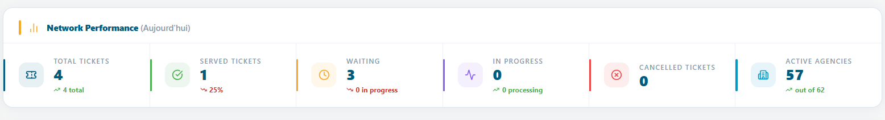
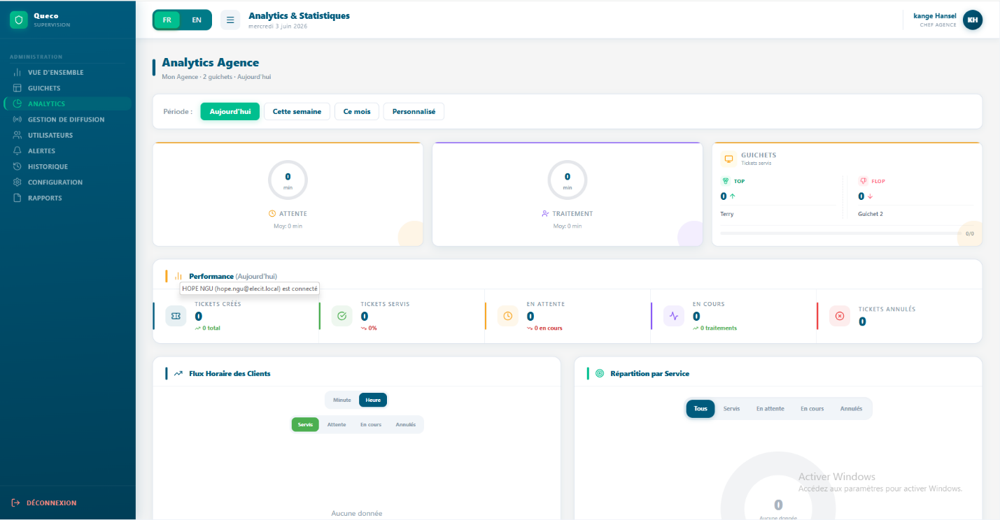
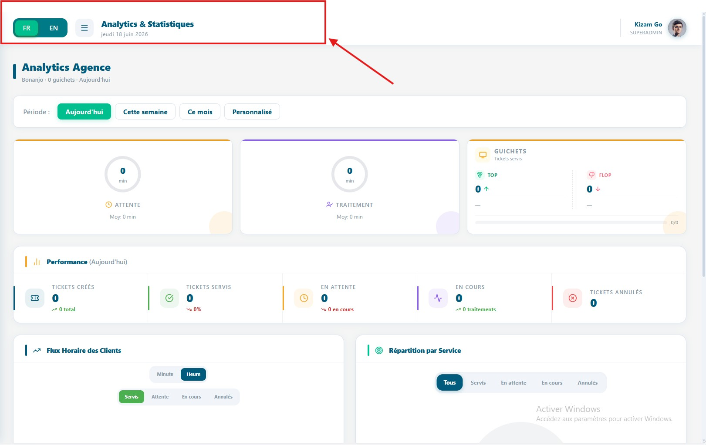
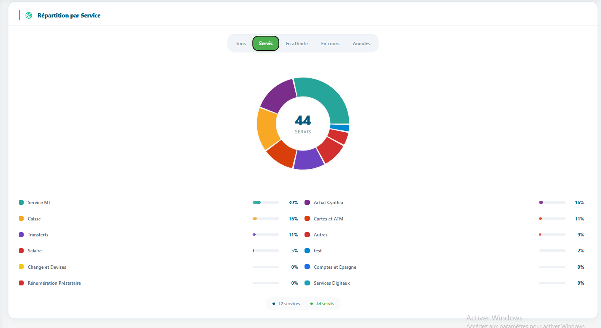

# Analytique & Reports

Comment lire et interpréter les tableaux de bord analytiques de Queco
comprendre les cartes KPI, les indicateurs de performance, les
classements d'agences, les graphiques de flux clients et les
répartitions par service, pour les Super Administrateurs et les
Responsables.

<table>
<colgroup>
<col style="width: 50%" />
<col style="width: 50%" />
</colgroup>
<thead>
<tr class="header">
<th>
<strong>In this chapter</strong>

8.1 Aperçu général 
8.2 Sélecteur de période 
8.3 Analytique Super Admin 
8.4 Analyse approfondie du classement des agences 
8.5 Analytique Responsable 
8.6 Graphiques Flux clients &amp; Répartition par service 
8.7 Référence des KPI 
8.8 Résumé du chapitre
</th>
<th>
<strong>After this chapter you will be able to</strong>

<ul>
<li>
Comprendre la différence entre les vues analytique du super Admin
et les Responsables
</li>
<li>
Utiliser le Sélecteur de période pour filtrer tous les widgets du
tableau de bord par plage de dates
</li>
<li>
Lire et interpréter toutes les cartes récapitulatives des KPI et
les cartes de performance réseau
</li>
<li>
Comprendre le tableau de classement des agences et le système de
médailles
</li>
<li>
Naviguer dans le tableau de bord du Responsable, y compris les
jauges et le widget Compteur Top/Flop
</li>
<li>
Lire le graphique en barres du flux clients et le graphique de
répartition par service
</li>
<li>
Rechercher la définition de n'importe quel indicateur dans le
tableau de référence des KPI
</li>
</ul></th>
</tr>
</thead>
<tbody>
</tbody>
</table>

## 8.1 Aperçu général

Le module Analytique offre aux parties prenantes de la plateforme une
visibilité en temps réel et historique sur les performances du réseau
d'agences. Il répond à trois questions essentielles : Combien de clients
avons-nous servis ? À quelle vitesse les avons-nous servis ? Quelles
agences et quels guichets sont les plus performants ?

L'Analytique est accessible depuis la barre latérale gauche. Le tableau
de bord affiché dépend entièrement de votre rôle le Super Administrateur
et le Responsable voient des vues complètement différentes, adaptées à
leur niveau d'autorité.

### 8.1.1 Accès a l’Analytics selon le role

| **Rôle**        | **Périmètre**                          | **Ce qu'ils voient**                                                                                                                                                             |
|-----------------|----------------------------------------|----------------------------------------------------------------------------------------------------------------------------------------------------------------------------------|
| **Super Admin** | Toute la plateforme toutes les agences | KPI à l'échelle du réseau, classement des agences avec médailles, volumes de tickets inter-agences, graphique de flux clients, répartition des services pour toutes les agences. |
| **Responsable** | Leur agence assignée uniquement        | Jauges de temps d'attente et de traitement, Top/Flop guichets, 5 cartes de performance propres à l'agence.                                                                       |
| **Agent**       | Aucun accès                            | Le module Analytique n'est pas disponible pour les agents. Les agents ne voient que le résumé de leur propre session à la fermeture d'un guichet.                                |

|          |                                                                                                                                                                 |
|----------|-----------------------------------------------------------------------------------------------------------------------------------------------------------------|
| **NOTE** | Le tableau de bord du Responsable est automatiquement limité à l'agence liée à son compte. Un Responsable ne peut pas consulter les données d'une autre agence. |

| *Figure 8.1 — Point d'entrée de l'Analytique dans la barre latérale et titre du tableau de bord selon le rôle*  |
|-----------------------------------------------------------------------------------------------------------------------------------------------------------|

## 8.2 Sélecteur de Période

En haut de chaque tableau de bord analytique pour les Super Admins comme
pour les Responsables se trouve le Sélecteur de Période. Ce filtre
temporel contrôle la plage de dates utilisée pour calculer tous les
widgets, cartes, graphiques et tableaux de la page simultanément.
Modifier la période met à jour toutes les données en une seule fois ; il
n'est pas nécessaire d'actualiser les widgets individuellement.

| *Figure 8.2 — Sélecteur de Période avec toutes les options visibles*  |
|-----------------------------------------------------------------------------------------------------------------|

| **Option de période**   | **Ce qu'elle couvre**                                           | **Utilisation typique**                                                                                          |
|-------------------------|-----------------------------------------------------------------|------------------------------------------------------------------------------------------------------------------|
| **Aujourd’hui**         | De minuit du jour en cours jusqu'au moment présent              | Suivi opérationnel en temps réel comment se passe la journée ?                                                   |
| **Cette semaine**       | Du lundi 00 :00 au moment présent (semaine calendaire en cours) | Bilan de performance hebdomadaire sommes-nous dans les objectifs ?                                               |
| **Ce mois**             | Du premier jour du mois en cours au moment présent              | Révision mensuelle des KPI comment évolue le mois ?                                                              |
| **Cette année**         | Du 1er janvier de l'année en cours au moment présent            | Vue d'ensemble annuelle et totaux depuis le début de l'année                                                     |
| **Plage personnalisée** | Toute date de début et de fin choisie par l'utilisateur         | Investigation ciblée — comparer une période de campagne, une saison festive ou une fenêtre d'incident spécifique |

| **TIP** | Utilisez *Aujourd'hui* pour les décisions opérationnelles en direct. Utilisez *Ce mois* pour les bilans de performance d'équipe. Utilisez *Plage personnalisée* pour les rapports de direction couvrant une période précise. |
|---------|------------------------------------------------------------------------------------------------------------------------------------------------------------------------------------------------------------------------------|

**TIP**

**TI**

**TIP**

| **NOTE** | Le filtre de période s'applique aux horodatages de création des tickets. Un ticket créé le lundi est comptabilisé dans « Cette semaine », même s'il a été clôturé le mardi. |
|----------|-----------------------------------------------------------------------------------------------------------------------------------------------------------------------------|

## 8.3 Tableau de bord Analytique Super Admin

Le tableau de bord Super Admin offre une vue d'ensemble de toute la
plateforme. Il agrège les données de toutes les agences, donnant une
image complète de la santé du réseau, des volumes et des performances à
tout moment.

<table>
<colgroup>
<col style="width: 100%" />
</colgroup>
<thead>
<tr class="header">
<th>

<em>Figure 8.3 — Tableau de bord Analytique Super Admin (vue
complète)</em>
</th>
</tr>
</thead>
<tbody>
</tbody>
</table>

### 8.3.1 Cartes KPI récapitulatives

Quatre cartes récapitulatives apparaissent tout en haut, chacune
affichant un indicateur à l'échelle du réseau pour la période
sélectionnée.

| **Carte**     | **Ce qu'elle affiche**                                                      | **Sous-texte affiché**                                     |
|---------------|-----------------------------------------------------------------------------|------------------------------------------------------------|
| Total Tickets | Tous les tickets créés dans toutes les agences sur la période sélectionnée. | Libellé de la période sélectionnée (ex. : « Aujourd'hui ») |
| Servis        | Tickets au statut TERMINÉ dans toutes les agences.                          | Taux de service % = Servis ÷ Total × 100                   |
| En attente    | Tickets au statut EN_ATTENTE ou EN_COURS dans toutes les agences.           | Nombre En cours affiché séparément                         |
| Annulés       | Tickets au statut ANNULÉ dans toutes les agences.                           | Nombre d'agences actives · agences inactives               |

### 8.3.2 Network Performance Panel 

Sous les cartes récapitulatives se trouve le panneau de performance
réseau 6 cartes de performance détaillées offrant une analyse plus
approfondie de l'ensemble du réseau.

| **Performance Card**   | **What It Measures**                                                            |
|------------------------|---------------------------------------------------------------------------------|
| **Total Tickets**      | Nombre cumulé de tickets sur la période indicateur principal de volume.         |
| **Tickets Servis**     | Tickets ayant atteint le statut TERMINÉ. Mesure principale du débit.            |
| **Tickets En Attente** | Tickets au statut EN_ATTENTE en file, pas encore appelés.                       |
| **Tickets En Cours**   | Tickets en cours de traitement par un agent (EN_COURS).                         |
| **Tickets Annules**    | Tickets annulés avant ou pendant le traitement.                                 |
| **Agences actives**    | Nombre d'agences avec is_active = true. Met en contexte les chiffres de volume. |

| *Figure 8.4 — Panneau de performance réseau avec 6 cartes de performance* |
|-------------------------------------------------------------------------------------------------------------------------------------------------|

| **TIP** | Surveillez *En attente* et *En cours* ensemble. Beaucoup En attente + Peu En cours = les guichets sont peut-être fermés ou en sous-effectif. Les deux élevés = agence à capacité maximale — envisagez d'ouvrir des guichets supplémentaires. |
|---------|----------------------------------------------------------------------------------------------------------------------------------------------------------------------------------------------------------------------------------------------|

## 8.4 Analyse approfondie du classement des agences

Le Classement des agences est la section la plus puissante du tableau de
bord Super Admin. Il présente chaque agence classée par performance,
offrant une vue immédiate des agences qui excellent et de celles qui
nécessitent une attention particulière.

| *Figure 8.5 — Classement des agences avec indicateurs de médailles, barres de progression et détails par agence* |
|----------------------------------------------------------------------------------------------------------------------------------------------------------------------------------------|

### 8.4.1 logique de tri du classement 

Les agences sont triées selon les règles de priorité suivantes :

1.  Les agences **actives** apparaissent toujours avant les agences
    **inactives**, quel que soit le volume de tickets.

2.  Parmi les agences actives : triées par **Tickets Servis**
    (décroissant) le plus grand volume en premier.

3.  Même nombre de Tickets Servis : triées **alphabétiquement** par nom
    d'agence (A→Z).

4.  Les agences inactives suivent les mêmes sous-règles entre elles, en
    bas du classement.

### 8.4.2 Systèmes des médailles 

Les 3 premières agences reçoivent une médaille une distinction visuelle
immédiatement reconnaissable pour les meilleures performances.

| **Position** | **Médaille** | **Style visuel**                                                                                       |
|--------------|--------------|--------------------------------------------------------------------------------------------------------|
| **1st**      | Or (🥇)      | Fond jaune (#FFF3CD), point doré (#F9A825). Surbrillance de ligne or chaud.                            |
| **2nd**      | Argent (🥈)  | Fond gris clair (#F4F4F4), point argenté (#AAB4C0). Surbrillance de ligne argent.                      |
| **3rd**      | Bronze (🥉)  | Fond orange chaud (#FDF0E8), point bronze (#CD7F32). Surbrillance de ligne bronze.                     |
| **4th+**     | Numéroté     | Lignes alternées blanc/bleu clair standard. Numéro de position affiché à la place de l'icône médaille. |

### 8.4.3 Lecture d’une ligne d’agence

| **Élément**            | **Signification**                                                                                                                                   |
|------------------------|-----------------------------------------------------------------------------------------------------------------------------------------------------|
| Icône Wifi / WifiOff   | Wifi vert = agence is_active : true (opérationnelle). WifiOff gris = is_active : false (suspendue).                                                 |
| Nom & Code de l'agence | Nom d'affichage en haut ; code unique de l'agence (ex. : AGC-001) en police monospace en dessous.                                                   |
| Barre de progression   | Remplissage proportionnel : Servis de cette agence ÷ Servis de l'agence en tête × 100. Barre à 100% = agence avec le plus grand volume.             |
| Servis                 | Tickets with FINISHED status for this agency in the selected period.                                                                                |
| En cours               | Tickets en cours de traitement (EN_COURS). Indique l'activité en direct.                                                                            |
| En attente             | Tickets en file non encore appelés (EN_ATTENTE). Des valeurs élevées peuvent signaler des problèmes de capacité.                                    |
| Annulés                | Tickets annulés. Des valeurs persistamment élevées peuvent indiquer des problèmes de processus ou d'effectif.                                       |
| Taux de service %      | Formule : Servis ÷ (Servis + En attente + En cours + Annulés) × 100. Arrondi à l'entier le plus proche. Principal indicateur de qualité par agence. |

| **NOTE** | Le Taux de service % utilise le total de tickets (tous statuts confondus) comme dénominateur. Une agence avec 80 servis et 20 en attente obtient un taux de 80% les 20 tickets en attente pèsent sur le taux même s'ils peuvent encore être traités. |
|----------|------------------------------------------------------------------------------------------------------------------------------------------------------------------------------------------------------------------------------------------------------|

| **TIP** | Un Taux de service élevé combiné à un nombre élevé d'Annulés est un signal d'alerte. Cela peut signifier que des agents annulent des tickets difficiles pour gonfler artificiellement le taux. Examinez toujours les Annulés et les Servis ensemble. |
|---------|------------------------------------------------------------------------------------------------------------------------------------------------------------------------------------------------------------------------------------------------------|

## 8.5 Tableau de bord Analytique Responsable

Le tableau de bord Responsable se concentre sur la qualité
opérationnelle des KPI temporels qui mesurent l'expérience client et
l'efficacité des guichets au sein de l'agence assignée au Responsable.
Contrairement à la vue Super Admin, il privilégie la profondeur à la
largeur.

|                                                                                                                                            |
|--------------------------------------------------------------------------------------------------------------------------------------------|
| *Figure 8.6 — Tableau de bord Analytique Responsable (vue complète)* |

### 8.5.1 Carte 1 : Temps d'attente médian (jauge circulaire)

Une jauge circulaire affichant le temps médian (en minutes) pendant
lequel les clients ont attendu avant que leur ticket soit appelé.

| **Élément**                  | **Explication**                                                                                                                                                                      |
|------------------------------|--------------------------------------------------------------------------------------------------------------------------------------------------------------------------------------|
| Valeur au centre de la jauge | Temps d'attente médian en minutes la valeur centrale lorsque tous les temps d'attente sont triés. La moitié des clients a attendu moins longtemps ; l'autre moitié, plus longtemps.  |
| Couleur de l'arc de la jauge | Ambre (#F59E0B). L'arc se remplit proportionnellement par rapport au maximum parmi : médiane, moyenne ou 60 minutes selon la valeur la plus élevée.                                  |
| Sous-texte sous la jauge     | Affiche le Temps d'attente moyen : « Moyenne : X min ». La moyenne peut être gonflée par des valeurs aberrantes ; la médiane est plus représentative de l'expérience client typique. |

### 8.5.2 Carte 2 : Temps de traitement médian (jauge circulaire)

Une jauge circulaire affichant le temps médian (en minutes) passé par
les agents à traiter un seul ticket, d’En cours à Clôturé.

| **Element**                  | **Explanation**                                                                                                                                                  |
|------------------------------|------------------------------------------------------------------------------------------------------------------------------------------------------------------|
| Valeur au centre de la jauge | Temps de traitement médian en minutes — durée de traitement du ticket central.                                                                                   |
| Couleur de l'arc de la jauge | Violet (#8B5CF6). L'arc se remplit par rapport au maximum parmi : médiane, moyenne ou 30 minutes.                                                                |
| Sous-texte sous la jauge     | Affiche le Temps de traitement moyen pour comparaison. Comparer moyenne et médiane permet de détecter les valeurs aberrantes qui tirent la moyenne vers le haut. |

|          |                                                                                                                                                                                                                                                                                                                        |
|----------|------------------------------------------------------------------------------------------------------------------------------------------------------------------------------------------------------------------------------------------------------------------------------------------------------------------------|
| **NOTE** | Médiane vs Moyenne : Si 9 clients attendent 5 minutes et 1 client attend 60 minutes, la moyenne est de 10,5 min mais la médiane est de 5 min. La médiane reflète la véritable expérience du client typique. Les deux sont affichées afin que les responsables puissent détecter et analyser les situations aberrantes. |

### 8.5.3 Carte 3 : Top / Flop Guichet

Compare le guichet le plus performant et le moins performant selon le
nombre de tickets servis sur la période sélectionnée principal
indicateur de performance des agents pour les responsables.

| **Element**               | **Explanation**                                                                                                                                         |
|---------------------------|---------------------------------------------------------------------------------------------------------------------------------------------------------|
| Guichet Top (gauche)      | Guichet avec le plus grand nombre de tickets au statut TERMINÉ. Nom de l'agent affiché avec une flèche verte vers le haut (↑) et son nombre de tickets. |
| Guichet Flop (droite)     | Guichet avec le plus petit nombre de tickets au statut TERMINÉ. Nom de l'agent affiché avec une flèche rouge vers le bas (↓) et son nombre.             |
| Barre de progression      | Barre de ratio: Tickets Top ÷ (Tickets Top + Tickets Flop). Entièrement verte à gauche = déséquilibre extrême. Centrée = performances similaires.       |
| Identification de l'agent | Nom résolu dans cet ordre : Prénom de l'agent (profil) → Nom du guichet → Préfixe e-mail → ID du guichet (6 premiers caractères).                       |

|         |                                                                                                                                                                                                                                                       |
|---------|-------------------------------------------------------------------------------------------------------------------------------------------------------------------------------------------------------------------------------------------------------|
| **TIP** | Le Guichet Flop n'est pas automatiquement un problème. Il peut gérer des opérations VIP complexes, avoir ouvert tardivement, ou traiter moins de tickets mais plus longs. Analysez toujours le contexte avant d'agir sur les seules données Top/Flop. |

### 8.5.4 Panneau de performance de l'agence

Sous les 3 cartes récapitulatives, le Responsable voit 5 Cartes de
performance identiques en structure au panneau réseau du Super Admin,
mais limitées exclusivement à son agence.

| **Carte de performance** | **Ce qu'elle mesure (périmètre de l'agence)**                         |
|--------------------------|-----------------------------------------------------------------------|
| **Total Tickets**        | Tous les tickets créés pour cette agence sur la période sélectionnée. |
| **Tickets Servis**       | Tickets au statut TERMINÉ pour cette agence.                          |
| **Tickets En attente**   | Tickets au statut EN_ATTENTE pour cette agence.                       |
| **Tickets En Cours**     | Tickets actuellement EN_COURS pour cette agence.                      |
| **Tickets Annules**      | Tickets au statut ANNULÉ pour cette agence.                           |

## 8.6 Graphiques : Flux Clients & Répartition par Service

Les deux tableaux de bord incluent deux graphiques en bas de page le
graphique en barres du Flux clients et la Répartition par service. Ils
apportent le contexte visuel derrière les chiffres KPI.

### 8.6.1 Graphique en barres du Flux Clients

Affiche le volume de tickets dans le temps combien de tickets ont été
créés à chaque intervalle de temps au sein de la période sélectionnée.
C'est l'outil principal pour identifier les heures de pointe, les
périodes creuses et les tendances journalières.

| **Role**        | **Chart Scope**                         | **Time Granularity**                                                |
|-----------------|-----------------------------------------|---------------------------------------------------------------------|
| **Super Admin** | Toutes agences combinées — total réseau | Par heure pour Aujourd'hui/Semaine, par jour pour Mois/Année        |
| **Manager**     | Leur agence uniquement                  | Par heure pour Aujourd'hui, par jour pour les périodes plus longues |

Comment lire le graphique en barres :

- Chaque barre = un intervalle de temps (heure ou jour selon la période
  sélectionnée).

- Hauteur de la barre = nombre de tickets créés sur cet intervalle.

- Barres plus hautes = pic de demande utile pour les décisions de
  planification du personnel.

- Périodes plates ou vides = faible demande bonnes fenêtres pour les
  pauses ou la fermeture de guichets.

|                                                                                                                                                   |
|---------------------------------------------------------------------------------------------------------------------------------------------------|
| *Figure 8.8 — Graphique en barres du Flux Clients (vue Responsable — détail horaire pour Aujourd'hui)*  |

|         |                                                                                                                                                                                               |
|---------|-----------------------------------------------------------------------------------------------------------------------------------------------------------------------------------------------|
| **TIP** | Consultez le graphique de flux le lundi matin pour identifier vos heures les plus chargées. Planifiez les guichets en amont avant le pic pas après que la file d'attente se soit déjà formée. |

### 8.6.2 Répartition par Service

Affiche la distribution du volume de tickets par type de service sur la
période sélectionnée. Répond à la question : lequel de nos services
génère le plus de demande ?

Comment lire la répartition par service :

- Chaque segment représente un service (ex. : Gestion de compte,
  Services de prêt).

- La taille du segment est proportionnelle à la part de ce service dans
  le total des tickets, exprimée en pourcentage.

- Les services dominants indiquent où concentrer les effectifs et les
  ressources de guichet.

- Les services à très faible volume peuvent faire l'objet d'une révision
  sont-ils encore nécessaires ? Les agents savent-ils qu'ils existent ?

|                                                                                                                                                         |
|---------------------------------------------------------------------------------------------------------------------------------------------------------|
| *Figure 8.9 — Répartition par service affichant la distribution proportionnelle entre les types de services*  |

|          |                                                                                                                                                                                                       |
|----------|-------------------------------------------------------------------------------------------------------------------------------------------------------------------------------------------------------|
| **NOTE** | La répartition par service comptabilise tous les statuts de tickets pas seulement les Servis. Cela donne une image fidèle de la demande réelle, y compris les tickets annulés ou toujours en attente. |

## 8.7 Référence des KPI

Ce tableau de référence définit chaque indicateur du module Analytique
Queco sa signification, son mode de calcul et le rôle qui peut le
consulter.

| **KPI Name**                    | **Unit**    | **Definition & Formula**                                                                                                                              | **Who Sees It** |
|---------------------------------|-------------|-------------------------------------------------------------------------------------------------------------------------------------------------------|-----------------|
| **Total Tickets**               | Nombre      | Tous les tickets créés sur la période — tous statuts inclus.                                                                                          | Les deux        |
| **Tickets Servis**              | nombre      | statut = TERMINÉ.                                                                                                                                     | Les deux        |
| **Tickets En attente**          | Nombre      | statut = EN_ATTENTE (en file, pas encore appelé).                                                                                                     | Les deux        |
| **Tickets En cours**            | **Count**   | statut = EN_COURS (agent en cours de traitement).                                                                                                     | Les deux        |
| **Tickets Annulés**             | **Count**   | statut = ANNULÉ.                                                                                                                                      | Les deux        |
| **Taux de service %**           | **%**       | Servis ÷ (Servis + En attente + En cours + Annulés) × 100. Arrondi à l'entier le plus proche.                                                         | Les deux        |
| **Agences Actives**             | **Nombre**  | Agences où is_active = true.                                                                                                                          | **Super Admin** |
| **Agences Inactives**           | **Count**   | Total agencies − Active agencies.                                                                                                                     | **Super Admin** |
| **Barre de progression agence** | **%**       | Servis de l'agence ÷ Servis max (agence en tête du classement) × 100. Comparaison relative pas un indicateur absolu.                                  | **Super Admin** |
| **Temps d'attente médian**      | **Minutes** | 50e percentile de wait_minutes sur tous les tickets de la période. Plus représentatif que la moyenne pour les distributions asymétriques.             | **Responsable** |
| **Temps d'attente moyen**       | **Minutes** | Somme de wait_minutes ÷ nombre de tickets. Peut être gonflé par des temps d'attente aberrants.                                                        | **Responsable** |
| **Temps de traitement médian**  | **Minutes** | 50e percentile de processing_minutes. Durée de traitement du ticket central, de En cours à Clôturé.                                                   | **Responsable** |
| **Temps de traitement moyen**   | **Minutes** | Somme de processing_minutes ÷ nombre de tickets.                                                                                                      | **Responsable** |
| **Guichet Top**                 | **Nombre**  | Guichet avec le plus grand nombre de tickets TERMINÉS sur la période. Identifié par prénom de l'agent → nom du guichet → préfixe e-mail → préfixe ID. | **Responsable** |
| **Flop Counter**                | **Nombre**  | Guichet avec le plus petit nombre de tickets TERMINÉS sur la période.                                                                                 | **Responsable** |

### 8.7.1 Format d'affichage des durées

Les temps d'attente et de traitement sont affichés comme suit sur toute
la plateforme :

| **Valeur brute**       | **Affichage**                       |
|------------------------|-------------------------------------|
| Moins d'1 minute       | « X sec » — ex. : « 45 sec »        |
| **1 to 59 minutes**    | 'X min’ — ex., '12 min'             |
| **60 minutes ou plus** | 'Xh Ymin’ — ex., '1h 30min' or '2h' |
| **Zero or null**       | '0 min'                             |

## 8.8 Résumé du Chapitre

Ce chapitre a couvert l'ensemble du module Analytique & Rapports de
l'accès selon les rôles jusqu'à chaque définition de KPI. Vous devriez
maintenant être en mesure de :

1.  Expliquer la différence entre les tableaux de bord analytiques du
    Super Admin et du Responsable, ainsi que leurs périmètres
    respectifs.

2.  Utiliser le Sélecteur de Période pour filtrer toutes les données du
    tableau de bord par Aujourd'hui, Semaine, Mois, Année ou une plage
    de dates personnalisée.

3.  Lire et interpréter les 4 cartes KPI récapitulatives du Super Admin
    et les 6 cartes de performance réseau.

4.  Comprendre la logique de tri du Classement des agences, le système
    de médailles et comment lire chaque élément d'une ligne d'agence.

5.  Interpréter les jauges circulaires de Temps d'attente médian et de
    Temps de traitement médian du Responsable, y compris la distinction
    médiane/moyenne.

6.  Utiliser le widget Top/Flop Guichet de manière appropriée, en
    comprenant son contexte et ses limites.

7.  Lire le graphique en barres du Flux clients et la Répartition par
    service pour les deux rôles.

8.  Rechercher la définition, la formule et le niveau d'accès de
    n'importe quel KPI dans le tableau de référence de la Section 8.7.
